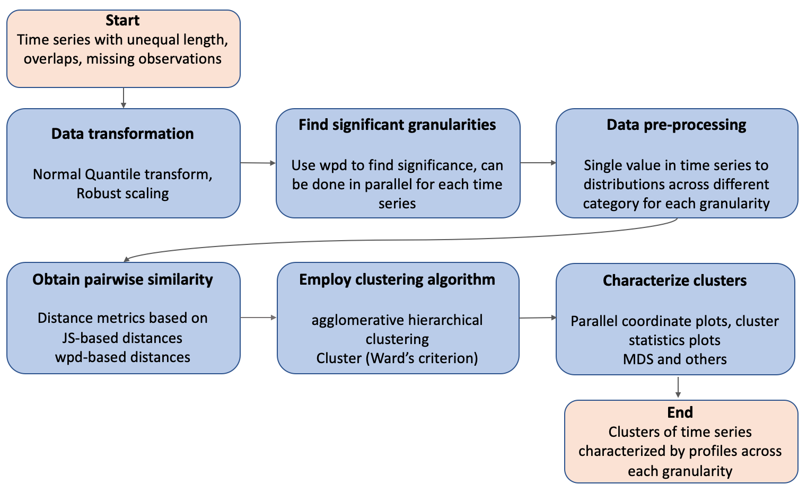

```{r setup, include=FALSE}
knitr::opts_chunk$set(echo = FALSE, cache=TRUE, messages=FALSE, warning=FALSE)
# Make sure you have the latest version of rmarkdown and bookdown
#devtools::install_github("rstudio/rmarkdown")
#devtools::install_github("rstudio/bookdown")
library(ggplot2)
library(gravitas)
library(gracsr)
library(ggdendro)
library(dplyr)
library(readr)
library(visdat)
library(ggplot2)
library(tidyverse)
library(naniar)
library(here)
library(tsibble)
library(knitr)
library(patchwork)
library(GGally)
library(distributional)
library(viridis)
```

```{r external, include = FALSE, cache = FALSE}
knitr::read_chunk(here('script/smart_meter.R'))
```


```{r mytheme}
theme_validation <- function() {
  theme_bw() +
      theme(
    strip.text = element_text(size = 8, margin = margin(b = 0, t = 1)),
    plot.margin = margin(0, 0, 0, 0, "cm"),
    axis.title.y = element_blank(),
    #axis.text.x = element_blank(),
  axis.text.y = element_blank(),
  axis.ticks = element_blank(),
      legend.position = "bottom"
    )
}


theme_characterisation <- function() {
  
  theme_bw() + # seeting theme
    theme(strip.text = element_text(size = 10,
                                    margin = margin(b = 0, t = 0))) + # narrow facet space
   theme(axis.title.y=element_blank(),
        axis.text.y=element_blank(),
        axis.ticks.y=element_blank()) + # no axis ticks 
  theme(panel.spacing =unit(0, "lines")) +  # to ensure no gap between facets
    theme(axis.text.x = element_text(angle=90, hjust=1, size = 10)) + # rotate the x-axis text
    theme(legend.position = "bottom")+
  theme(plot.margin = margin(0, 0, 0, 0, "cm")) +
  theme(axis.text.x = element_text(size=5))
}
```


```{r mytheme-application}
theme_application <- function() {
  
  theme_light() + # setting theme
    #theme(strip.text = element_text(margin = margin(b = 0, t = 0))) + # narrow facet space
   theme(axis.title.y=element_blank(),
        axis.text.y=element_blank(),
        axis.ticks.y=element_blank()) + # no axis ticks 
  theme(panel.spacing =unit(0, "lines")) +  # to ensure no gap between facets
    theme(axis.ticks.x = element_blank(),
        axis.text.x = element_blank()) + # no x-axis labels to further reduce the gap between facets
    #theme(axis.text.x = element_text(angle=90, hjust=1, size = 9)) + # rotate the x-axis text
  theme(plot.margin = margin(0, 0, 0, 0, "cm")) +
  #theme(axis.text.x = element_text(size=5)) +
    theme(strip.background = element_blank(),
  strip.text.x = element_blank())
}
```

# Introduction

<!-- time series clustering and its challenges -->
Time-series clustering is the process of unsupervised partitioning of $n$ time-series data into $k$ ($k<n$) groups such that homogeneous time-series are grouped together based on a certain similarity measure. The time-series features, length of time-series, representation technique, and, of course, the purpose of clustering time-series all influence the suitable similarity measure or distance strategy to a meaningful level. The three primary methods to time series clustering (@liao2005clustering) are algorithms that operate directly with distances or raw data points in the time or frequency domain (distance-based), with features derived from raw data (feature-based), or indirectly with models constructed from raw data (model-based) (model-based). The efficacy of distance-based techniques is highly dependent on the distance measure utilised. Defining an appropriate distance measure for the raw time series may be a difficult task since it must take into account noise, variable lengths of time series, asynchronous time series, different scales, and missing data. Commonly used Distance-based similarity measures as suggested by a review of time series clustering approaches (@Aghabozorgi2015-ct) are Euclidean, Pearson's correlation coefficient and related distances, Dynamic Time Warping, Autocorrelation, Short time series distance, Piecewise regularisation, cross-correlation between time series, or a symmetric version of the Kullback–Liebler distances (@liao2007clustering). Euclidean distance and DTW are often used in time series clustering. When it comes to time-series clustering accuracy, the Euclidean distance beats DTW, but DTW has its own advantages (@corradini2001dynamic).Euclidean distance requires time series of equal length. while DTW can assist cluster time series of varying lengths (@ratanamahatana2005multimedia), only if there are no missing observations.

We are motivated by the residential smart meter data. These long time series are asynchronous, with varying time lengths for different houses and missing observations and characterised by noisy and patchy behavior that can quickly become overwhelming and hard to interpret, requiring summarizing the large number of customers into pockets of similar energy behavior. Choosing probability distributions instead of raw data seems to be a natural way to analyze these types of data sets. Hence this paper proposes a distance metric based on Jensen-Shannon distances between probability distributions across significant cyclic granularities. Cyclic temporal granularities, which are temporal deconstructions of a time period into units such as hour-of-the-day, work-day/weekend, can be useful for measuring repetitive patterns in large univariate time series data. Since cyclic granularities are considered instead of linear granularities, the resulting clusters are expected to group customers that have similar repetitive behaviors.  Below are some of the benefits of our method, which will be detailed in further depth in subsequent sections.

- Some clustering algorithms become problematic with the very high dimensionality of the time series resulting from the frequency at which they are recorded and the length of time for which they are observed. We can efficiently cluster long length time series by reducing dimensionality by characterising through probability distributions;

- By utilising Jensen-Shannon distances, we are evaluating the distance between two distributions rather than raw data, which is less susceptible to missing observations and outliers compared to other traditional distance measures;

- While most clustering algorithms produce clusters similar across just one temporal granularity, this technique takes a broader approach to the problem, attempting to group observations with similar forms across all key cyclic granularities. Because cyclic granularities are used rather than linear granularities, clustering would group consumers who exhibit similar repeating behaviour over many cyclic granularities where patterns are predicted to be important. 

- It is reasonable to define a time series based on its degree of trend and seasonality and to take these characteristics into account while clustering it. The change in data structure by considering probability distributions across cyclic granularities ensures there is no trend and seasonal fluctuations are handled separately. Thus there is no need to de-trend or de-seasonalize the data prior to performing the clustering method. For similar reasons, there is no need to exclude holiday or weekend routines.

<!-- . Often the objective is finding similarities in time (Fourier transforms, Piecewise aggregate approximation), in  shape (Dynamic time Warping (DTW)), in structure, based on global features. -->


<!-- However, the process of determining a similarity measure is challenging since time-series data are naturally noisy and include outliers and missing observations, and the length of time-series changes and can be asynchronous. -->


<!-- Time-series clustering is the most-used approach as an exploratory technique  for discovery of interesting patterns in time-series datasets. However, the process of finding similarity measure is complicated, because time-series data are naturally noisy and include outliers and shifts [18], at the other hand the length of time-series varies and the distance among them needs to be calculated. These common issues have made the -->
<!-- similarity measure a major challenge for data miners. -->


_Background and motivation_


<!-- Description of data available -->

        
<!-- significance of load clustering -->
Large spatio-temporal data sets, both from open and administrative sources, offer up a world of possibilities for research. <!--Beyea (2010) has pointed out, there has been little exploration of the full potential of these data bases and their benefits can reach beyond the original intentions for collecting these data.--> One such data sets for Australia is the Smart Grid, Smart City (SGSC) project (2010–2014) available through [Department of the Environment and Energy](https://data.gov.au/data/organization/doee)<!--and Data61 CSIRO-->. The project provides half-hourly data of over 13,000 household electricity smart meters distributed unevenly from October 2011 to March 2014. <!---The massive amount of data generated in such projects could be overwhelming for analysis.Raw data of these asynchronous time series can quickly become overwhelming and hard to interpret, requiring summarizing the large number of customers into pockets of similar energy behavior. Electricity utilities can utilize the smart meter usage patterns to develop targeted tariffs for individual groups and alleviate the problem of volatility in production by capitalizing on the flexibility of consumers. --><!-- Sources of variation in large data sets --><!-- The enormous quantity of data provides for greater individual level clarity and analysis. However, -->
<!-- due to the growing variety of consumers,  -->. Larger data sets include greater uncertainty about customer behavior due to growing variety of customers. Households vary in size, location, and amenities such as solar panels, central heating, and air conditioning. The behavioural patterns differ amongst customers due to many temporal dependencies. Some households use a dryer, while others dry their clothes on a line. Their weekly profile may reflect this. They may vary monthly, with some customers using more air conditioners or heaters than others, while having equivalent electrical equipment and weather circumstances. Some customers are night owls, while others are morning larks. Day-off energy use varies depending on whether customers stay home or go outside. Age, lifestyle, family composition, building attributes, weather, availability of diverse electrical equipment, among other factors, make the task of properly segmenting customers into comparable energy behaviour a fascinating one. This challenge is worsened when all we know about our consumers is their energy use history (@Ushakova2020-rl). To safeguard the customers' privacy, it is probable that such information is not accessible. Also, energy suppliers may not always update client information, such as property features, in a timely manner. Thus, there is a growing need to have research that examines how much energy usage heterogeneity can be found in smart meter data and what are some of the most common power consumption patterns, rather than explaining why consumption differs.


_Related work_

A multitude of papers have emerged around smart meter time series clustering for deepening our knowledge of consumption patterns. @Tureczek2017-pb conducted a systematic study of over $2100$ peer-reviewed papers on smart meter data analytics. None of the $34$ articles chosen for their emphasis use Australian smart meter data. The most often used algorithm is K-Means. Using K-Means without considering time series structure or correlation results in inefficient clusters. Principal Component Analysis (PCA) or Self-Organizing Maps (SOM) eliminate correlation patterns and decrease feature space, but lose interpretability. To reduce dimensionality, several studies use principal component analysis or factor analysis to pre-process smart-meter data before clustering (@Ndiaye2011-pf). Other algorithms utilised in the literature include k-means variants, hierarchical approaches, and greedy k-medoids. Time series data, such as smart metre data, are not well-suited to any of the techniques mentioned in @Tureczek2017-pb. Only one study [@ozawa2016determining] identified time series characteristics using Fourier transformation, which converts data from time to frequency and then uses K-Means to cluster by greatest frequency . @Motlagh2019-yj suggests that the time feature extraction islimited by the type of noisy, patchy, and unequal time-series common in residential datasets and addresses model-based clustering  by transforming the series into other other objects such as structure or set of parameters which can be more easily characterised and clustered. [@chicco2010renyi] addresses information theory-based clustering such as Shannon or Renyi entropy and its variations. @Melnykov2013-sp disucusses how outliers, noisy observations and scattered observations can complicate estimating mixture model parameters and hence the partitions.

\noindent Given the limitations of the similarity measures in dealing with large volumes of this complicated time series data, we present a similarity measure based on probability distributions that seems to be a more organic option for coping with time series data with aforementioned characteristics. The remainder of the paper is organized as follows: Section&nbsp;\ref{sec:methodology} provides the clustering methodology introducing the features and distance metrics. Section&nbsp;\ref{sec:validation} shows data designs to validate our methods and draw comparisons against several methods.Section&nbsp;\ref{sec:application} discusses the application of the method to a subset of the real data. Finally, we summarize our results and discuss possible future directions in Section&nbsp;\ref{sec:discussion}.


<!-- A typical clustering technique includes the following steps: (a) establishing distance (dissimilarity) and similarity through feature or model extraction and selection; and (b) selecting the clustering algorithm design. Distance measures could be time-domain based or frequency-domain (fast Fourier transform). -->


<!-- A model-based clustering works by transforming the series into other other objects such as structure or set of parameters which can be more easily characterised and clustered (@Motlagh2019-yj). [@chicco2010renyi] addresses information theory-based clustering such as Shannon or Renyi entropy and its variations. The essential temporal characteristics of the curves are defined or extracted using feature-based clustering. -->


<!-- This work -->
<!-- This is similar to a stochastic approach (@Motlagh2019-yj) to clustering, which proposes interpreting electricity demand as a random process and extracting time-series characteristics, or a model of the series, to enable unsupervised clustering. Unsupervised clustering is only as good as the features that are extracted/selected or the distance metrics that were utilized. Well-designed additional features may collect characteristics that default features cannot. Based on the underlying structure of the temporal data, this article offers new distance metric and features for clustering and applies them to actual smart-meter data. Firstly, the distance metric is based on probability distribution, which in our knowledge is the first attempt to cluster smart meter data using probability distributions. These recorded time series are asynchronous, with varying time lengths for different houses and missing observations. Taking probability distributions helps to deal with such data, while helping with dimension reduction in one hand but not losing too much information due to aggregation. Secondly, we recognise that most clustering algorithms only provide hourly energy profiles during the day, but this approach provides a wider approach to the issue, seeking to group consumers with similar shapes over all important cyclic granularities. Since cyclic granularities are considered instead of linear granularities, clustering would group customers that have similar repetitive behavior across more than one cyclic granularities across which patterns are expected to be significant.  -->


<!-- common similarity measures -->

<!-- electricity data structure -->

<!-- common similarity measures used there -->


<!-- lit review -->


# Clustering methodology {#sec:methodology}


<!-- In contrast to models, a feature-based strategy is used to explicitly define or automatically extract the curves’ key time features, for instance by application of PCA on the daily curves [ --


<!-- Most papers discussed in Tureczek2017-pb fail to accept smart meter readings as time series data, a data type which contains a temporal component. The omission of the essential time series features in the analysis leads to the application of methods that are not designed for handling temporal components. K-Means ignores autocorrelation, unless the input data is pre-processed. The clusters identified in the papers are validated by a variety of indices, with the most prevalent -->
<!-- being the cluster dispersion index (CDI) [22–24], the Davies–Bouldin index (DBI) [25,26] and the mean index adequacy (MIA) [8,13]. -->


<!-- The data set solely contains readings from smart meters and no information about the consumers' specific physical, geographical, or behavioural attributes. As a result, no attempt is made to explain why consumption varies. Instead, this work investigates how much energy usage heterogeneity can be found in smart meter data and what some of the most common electricity use patterns are. -->

<!-- Because of this importance, countless approaches to estimate time series similarity have been proposed.  -->


The proposed methodology aim to leverage the intrinsic temporal data structure hidden in time series data. The foundation of our method is unsupervised clustering algorithms based exclusively on the time-series data.The similarity measure is the most essential ingredient of time series clustering. First step is to decide what we mean by similar. The existing work on clustering probability distributions assumes we have an iid sample $f_1(v),\dots,f_n(v)$, where $f_i(v)$ denotes the distribution from observation $i$ over some random variable $v = \{v_t: t = 0, 1, 2, \dots, T-1\}$ observed across $T$ time points. So going back to the smart meter example, $f_i(v)$ is the distribution of customer $i$ and $v$ is electricity demand. In this work, instead of considering the probability distributions of the linear time series, we assume that the measured variables across different categories of any cyclic granularity are from different data generating processes. Hence, we want to be able to cluster distributions of the form $f_{i,A,B \dots, {N_C}}(v)$, where $A, B$ represent the cyclic granularities under consideration such that $A = \{a_j: j=1, 2, \dots J\}$,  $B = \{b_k: k  = 1, 2, \dots K\}$ and so on. We consider individual category of a cyclic granularity ($A$) or combination of categories for interaction of cyclic granularities (for e.g. $A*B$) to have a distribution. For example, let us consider we have two cyclic  granularities of interest, $A = {0, 1, 2, \dots, 23}$ representing hour-of-day and  $B = \{Mon, Tue, Wed, \dots, Sun\}$ representing day-of-week. Each customer $i$ consist of a collection of probability distributions. In case individual granularities ($A$ or $B$) are considered, there are  $J = 24$ distributions of the form $f_{i,j}(v)$ or $K = 7$ distributions of the form $f_{i,k}(v)$ for each customer $i$. In case of interaction, $J*K=168$ distributions of the form $f_{i,j, k}(v)$ could be conceived for each customer $i$. As a result, we need to decide how to measure similarities between these collections of univariate probability distributions. There are multiple ways to measure similarities between time series based on probability distributions, depending on the objective of the problem. This paper focuses on looking at the (dis) similarity between underlying distributions that may have resulted in different patterns across different cyclic temporal granularities, that eventually have resulted in the (dis) similarity between time series. It considers a methodology with two appraoches for  finding distances between time series. Both of these appraoches may be useful in a practical context and, depending on the data set, may or may not propose the same customer classification. The obtained distances could be fed into a clustering algorithm to break large data sets into subgroups that can then be analyzed separately. These clusters may be commonly associated with real-world data segmentation. However, since the data is unlabeled a priori, more information is required to corroborate this. The methodology is explained in the Figure \ref{fig:flowchart} and each element of the pipeline is discussed.


```{r flowchart, fig.cap = "Flow chart illustrating the pipeline for methodology", out.width="100%"}


```

- _Find significant granularities or harmonies_

[@Gupta2021-hakear] proposes a method for choosing significant cyclic granularities and harmonies, which is used in this work. We define "significant" granularities as those with significant distributional differences across categories. It is better to select only those granularities because it is expected that there would be some fascinating repetitive behaviour that we are interested in studying. It is worth noting that not all of the observations in the study may have the same set of important granularities. A method for selecting a list ($S_c$) of significant granularities for all observations may be as follows:

 (a) eliminate from the comprehensive list the granularities that are inconsequential for all observations.

 (b) consider only those granularities which are significant for most observations.

In both circumstances, there will be observations for which one or a few selected granularities are uninteresting. Even in that situation, having this group of observations that show no intriguing patterns over a granularity that frequently detects patterns may be useful. In contrast, if the granularities under consideration are indeed significant for a set of observations, distinct patterns could be detected while clustering them.


- _Data transformation_

Time series often have a somewhat skewed distribution and their ranges might vary greatly. It
is helpful to do a statistical transformation on the data to bring all of them to the same range or normalize each series. For the JS-based approaches, two data transformation techniques are utilised viz, Normal-Quantile Transform (NQT) and Robust scaling. NQT is a built-in transformation for computing $wpd$, which is the foundation of wpd-based distances.
    
_Robust scaling_ The normalised $i^{th}$ observation is denoted by $v_{norm} = \frac{v_t - p_{0.50}}{p_{0.75}-p_{0.25}}$, where $v_t$ is the actual value at the $t^{th}$ time point and $p_{0.25}$, $p_{0.50}$ and $p_{0.75}$ are the $25^{th}$, $50^{th}$ and $75^{th}$ percentile of the time series for the $i^{th}$ observation. $v_{norm}$ has zero mean and median, as well as a standard deviation of one, while the outliers are still there with the same relative connections to other values.

_Normal-Quantile transform_ The raw data for all observations is individually normal-quantile transformed (NQT) [@Krzysztofowicz1997-bv], so that the transformed data follows a standard normal distribution. NQT will make the skewed distributions bell-shaped. As a result, determining which raw distribution was used is difficult using the modified distribution. Also, multimodality is disguised or inverted. This, however, is not a problem for implementation of this methodology as distributions are characterised by quantiles and the order of the quantiles is reserved under NQT.


<!-- First, the original data is ranked in ascending order and the probabilities $P(Y<=y(i)) = i/(n+1)$ are attached to $y(i)$, in terms of their ranking order. A NQT based transformation is applied by computing from a standard normal distribution a variable $\eta(i)$, which corresponds to the same probability $P(\eta< \eta(i)) = i/n+1$.By doing this, the new variables $\eta(i)$ will be marginally distributed according to standard Normal, N(0,1). -->


<!-- It is worth noting that when studying these similarities, a variety of objectives may be pursued. One objective could be to group time series with similar shapes over all relevant cyclic granularities. In this scenario, the variation in customers within each group is in magnitude rather than shape, while the variation between groups is only in shape. There -->
<!-- are distance measures are used for shape-based clustering [Ding et al. 2008; Wang -->
<!-- et al. 2013] and many more but none of them look at the probability distributions while computing similarity. Moreover, most distance measures offer similar shape across just one dimension. For example, we often see "similar" daily energy profiles across hours of the day, but we suggest a broader approach to the problem, aiming to group consumers with similar distributional shape across all significant cyclic granularities. Another purpose of clustering could be to group customers that have similar differences in patterns across all major cyclic granularities, capturing similar jumps across categories regardless of the overall shape. For example, in the first goal, similar shapes across hours of the day will be grouped together, resulting in customers with similar behaviour across all hours of the day, whereas in the second goal, any similar big-enough jumps across hours of the day will be clubbed together, regardless of which hour of the day it is. Both of these objectives may be useful in a practical context and, depending on the data set, may or may not propose the same customer classification. Depending on the goal of clustering, the distance metric for defining similarity would be different. These distance metrics could be fed into a clustering algorithm to break large data sets into subgroups that can then be analyzed separately. These clusters may be commonly associated with real-world data segmentation. However, since the data is unlabeled a priori, more information is required to corroborate this. This section presents the work flow of the methodology:  -->


- _Data preparation_

@wang2020tsibble introduced the tidy "tsibble" data structure to support exploration and modeling of temporal data comprising of an index, optional key(s), and measured variables. <!-- An index is a variable with inherent ordering from past to present and a key is a set of variables that define observational units over time. A linear granularity is a mapping of the index set to subsets of the time domain. For example, if the index of a tsibble is days, then a linear granularity might be weeks, months or years.--> For each key variable, the raw smart meter data is a sequence that is indexed by time and comprises values of several measurement variables at each time point. This sequence, though, could be depicted in a variety of ways. A shuffling of the raw sequence could reflect the distribution of hourly consumption over a single day, while another could indicate consumption over a week or a year. These temporal deconstructions of a time period into units such as hour-of-day, work-day/weekend are called cyclic temporal granularities. All cyclic granularities can be expressed in terms of the index set and could be augmented with the initial tsibble structure (index, key, measurements). It is worthwhile to note that the data structure changes while transporting from linear to cyclic scale of time as multiple observations of the measured variable would correspond to each category of the cyclic granularities. In this paper, quantiles are chosen to characterize the distributions for each category of the cyclic granularity. So, each category of a cyclic granularity corresponds to a list of numbers which is essentially few chosen quantiles of the multiple observations.


- _Distance metrics_

Considering each individual or combined categories of cyclic granularities as a data generating process lead to a collection of conditional distributions for each customer $i$. The (dis) similarity between each pair of customers should be obtained by combining the distances between these collections of conditional distributions such that the resulting metric is a distance metric, which could be fed into the clustering algorithm. Two types of distance metric is considered:

<!-- The choice of distance measures is a critical step in clustering. It defines how the similarity of two elements (x, y) is calculated. -->

**JS-based distances**


This distance metric considers two time series to be similar if the distributions of each category of an individual cyclic granularity or combination of categories for interacting cyclic granularities are similar. In this study, the distribution for each category is characterised using deciles (can potentially consider any list of quantiles), and the distances between distributions are calculated using the Jensen-Shannon distances (@Menendez1997-in), which are symmetric and thus could be used as a distance measure.


\noindent The sum of the distances between two series $x$ and $y$ in terms of cyclic granularity $A$ is defined as $$S^A_{x,y} = \sum_{j} D_{x,y}(A)$$ (sum of distances between each category $j$ of cyclic granularity $A$) or $$S^{A*B}_{x,y} = \sum_j \sum_k D_{x,y}(A, B)$$ (sum of distances between each combination of categories $(j, k)$ of the harmony $(A, B)$. After determining the distance between two series in terms of one granularity, we must combine them to produce a distance based on all significant granularities. When combining distances from individual $L$ cyclic granularities $C_l$ with $n_l$ levels,  $$S_{x, y} = \sum_lS^{C_l}_{x,y}/n_l$$ is employed, which is also a distance metric since it is the sum of JS distances.  In this approach, the variation in time series within each group is in magnitude rather than distributional pattern, while the variation between groups is only in distributional pattern across categories.


**wpd-based distances**

Compute weighted pairwise distances $wpd$ (@Gupta2021-hakear) for all considered granularities for all observations. $wpd$ is designed to capture the maximum variation in the measured variable explained by an individual cyclic granularity or their interaction and is estimated by the maximum pairwise distances between consecutive categories normalised by appropriate parameters. A higher value of $wpd$ indicates that some interesting pattern is expected, whereas a lower value would indicate otherwise.

\noindent Once we have chosen $wpd$ as a relevant feature for characterizing the time series across one cyclic granularity, we have to decide how we combine differences between the multiple features (corresponding to multiple granularities) into a single number. The euclidean distance between them is chosen, with the granularities acting as variables and $wpd$ representing the value under each variable. With this approach, we should expect the observations with similar $wpd$ values to be clustered together. Thus, this approach is useful for grouping observations that have similar significance of patterns across different granularities. Similar significance does not imply similar pattern, which is where this technique varies from JS-based distances, which detect differences in patterns across categories.


<!-- Consider a harmony table consisting of many harmonies, each of the form $(A, B)$, such that $A = \{ a_j: j = 1, 2, \dots, J\}$ and $B = \{ b_k: k = 1, 2, \dots, K\}$. Each household consists of a $J*K$ distributions one harmony. We compute the distributional difference -->
<!-- between $(A, B)$ for the $s^{th}$ household using $wpd_{{s}}(A,B)$. -->
<!-- $wpd_{{s}}(A,B)$ denotes the normalized weighted-pairwise distributional distances between $(A, B)$ and is a feature which measures distributional difference between harmonies. If we have $H_{N_C}$ harmonies in the harmony table, then for each household we have a vector of $wpd_{{s}}$ of $H_{N_C}$ elements with each element corresponding to one harmony. We aim to have pockets of households showing similar periodic behavior by conidering $wpd$ vlaues for different harmonies and some time series features. The features should also characterize probability distributions of different household. -->


<!-- grouping probability distributions across a harmony. This clustering algorithm is adopted to remove or appropriately adjust for auto correlation and unequal length in the data. The method could be further extended by clustering probability distributions conditional on one or more cyclic granularities. The following are some of the advantages of our proposed method. -->


- _Clustering algorithm_

In the analysis of energy smart meter data, K-Means or hierarchical clustering are often employed. These are simple and effective techniques that work well in a range of scenarios. For clustering, both employ a distance measure, and the distance measure chosen has a major influence on the structure of the clusters. We employ agglomerative hierarchical clustering in conjunction with Ward's criteria (XXX reference). The pair of clusters with minimum between-cluster distance are are sequentially merged in this using this agglomerative algorithms. A good comprehensive list of algorithms can be found in @.Xu2015-ja. We can possibly employ any clustering method that supports the given distance metric as input.


- _Characterization of clusters_

\noindent Cluster characterization, both quantitatively and qualitatively, is a crucial aspect in cluster analysis. @Cook2007-qe lists numerous methods for characterising clusters. Listed below are a few techniques and R packages that are utilized in this study.

(a) _Parallel coordinate plots_ (@wegman1990hyperdimensional) are often used to visualise high-dimensional and multivariate data, allowing visual grouping and pattern detection.. A Parallel Coordinates Plot features parallel axes for each variable. Each axis is linked by lines. The axes' arrangement may affect the reader's interpretation of the data. Changing the axes may reveal patterns or relationships between variables for categorical variables. However, for categories with cyclic temporal granularities, preserving the underlying ordering is more desirable.

(b) _Scatterplot matrix_ contains pairwise scatter plots of the p variables. Pairwise scatter plots are useful for figuring out how variables relate to each other and how factors determine the clustering.

(c) _Displaying cluster statistics_ are useful when we have larger problems and it is difficult to read the Parallel coordinate plots due to congestion. (@dasu2005grouping)

(d) _MDS, PCA and t-SNE_ While all of them use a distance or dissimilarity matrix to construct a reduced-dimension space representation, their goals are diverse. PCA seeks to retain data variance. Multidimensional scaling (@borg2005modern) seeks to maintain the distances between pairs of data points, with an emphasis on pairings of distant points in the original space. t-SNE, on the other hand, is concerned with preserving neighbourhood data points. The t-SNE embeddings will compress data points which are close in high-dimensional space.

(e) _Tour_ is a collection of interpolated linear projections of multivariate data into lower-dimensional space. As a result, the viewer may observe the high-dimensional data's shadows from a low-dimensional perspective.

The cluster characterization approach varies depending on the distance metric used. Parallel coordinate plots, scatter plot matrices, MDS or PCA are potentially useful ways to characterize clusters using wpd-based distances. For JS-based distances, plotting cluster statistics is beneficial for characterization and variable importance could be displayed through parallel coordinate plots. This part of the work uses R packages `GGally` (@R-GGally), `Rtsne` (@R-tsne), `ggplot2` (Wickham2009pk), `tour` (@wickham2011tourr), `stats` (@R-language).


<!-- - A random sample  of the original data is taken for clustering analysis and includes missing and noisy observations (detailed description in Appendix) -->

<!-- - All harmonies are computed for each customer in the sample. -->
<!-- Cyclic granularities which are clashes for all customers in the sample are removed. -->

<!-- - It is worth noting that a number of other solutions may be considered at the pre-processing stage of the method. We have considered a) Normal-Quantile Transform and b) Robust transformation. -->

<!-- - Two methods are considered for computing dissimilarity between two customers. The first one involves computing according to one granularity is computed as the sum of the JS distances between distribution of all the categories of the granularity. When we consider more than one granularity, we consider the sum of the  average distances for all the granularity so that the combined metric is also a distance. -->

<!-- - Given the scale of dissimilarity among the energy readings, the model chooses optimal number of clusters -->

<!-- - Once clusters have been allocated, the groups are explored visually. -->

<!-- - Results are reported and compared. -->

<!-- Two methods are used for computing distances between subjects and then hierarchical clustering algorithm is used. -->

<!-- The existing work on clustering probability distributions assumes we have an iid sample $f_1(v),\dots,f_n(v)$, where $f_i(v)$ denotes the probability distribution from observation $i$ over some random variable $v = \{v_t: t = 0, 1, 2, \dots, T-1\}$ observed across $T$ time points. In our work, we are using $i$ as denoting a customer and the underlying variable as the electricity demand. So $f_i(v)$ is the distribution of household $i$ and $v$ is electricity demand. -->

<!-- We want to cluster distributions of the form $f_{i,j,k}(v)$, where $i$ and $j$ denote  -->

<!-- Consider a harmony table consisting of many harmonies, each of the form $(A, B)$, such that $A = \{ a_j: j = 1, 2, \dots, J\}$ and $B = \{ b_k: k = 1, 2, \dots, K\}$. Each household consists of a $J*K$ distributions one harmony. We compute the distributional difference -->
<!-- between $(A, B)$ for the $s^{th}$ household using $wpd_{{s}}(A,B)$. -->
<!-- $wpd_{{s}}(A,B)$ denotes the normalized weighted-pairwise distributional distances between $(A, B)$ and is a feature which measures distributional difference between harmonies. If we have $H_{N_C}$ harmonies in the harmony table, then for each household we have a vector of $wpd_{{s}}$ of $H_{N_C}$ elements with each element corresponding to one harmony. We aim to have pockets of households showing similar periodic behavior by conidering $wpd$ vlaues for different harmonies and some time series features. The features should also characterize probability distributions of different household. -->


<!-- ### Notations -->

<!-- Consider an iid sample $f_1(v),\dots,f_n(v)$, where $f_i(v)$ denotes the probability distribution from observation $i$ over some random variable $v = \{v_t: t = 0, 1, 2, \dots, T-1\}$ observed across $T$ time points. In our work, we are using $i$ as denoting a household and the underlying variable as the electricity demand. Further consider a cyclic granularity of the form $B = \{ b_k: k = 1, 2, \dots, K\}$. Each customer consists of collection of probability distributions. -->


<!-- So $f_i(v)$ is the distribution of household $i$ and $v$ is electricity demand. We want to cluster distributions of the form $f_{i,j,k}(v)$, where $i$ and $j$ denote $i^{th}$ and $j^{th}$ customer respectively. -->


<!-- a harmony table consisting of many harmonies, each of the form $(A, B)$, such that $A = \{ a_j: j = 1, 2, \dots, J\}$ and $B = \{ b_k: k = 1, 2, \dots, K\}$.  -->


<!-- ### A single or pair of granularities together (change names) -->

<!-- The methodology can be summarized in the following steps: -->

<!-- - _Pre-processing step_ -->

<!-- Robust scaling method or NQT used for each customer. -->


<!-- - _NQT_ -->


<!-- - _Treatment to outliers_ -->


<!-- ### Many granularities together (change names) -->

<!-- The methodology can be summarized in the following steps: -->


<!-- 1. Compute quantiles of distributions across each category of the cyclic granularity -->
<!-- 2. Compute JS distance between households for each each category of the cyclic granularity -->
<!-- 3. Total distance between households computed as sum of JS distances for all hours -->
<!-- 4. Cluster using this distance with hierarchical clustering algorithm (method "Ward.D") -->

<!-- _Pro:_   -->
<!-- - distance metric makes sense to group different shapes together   -->
<!-- - simulation results look great on typical designs   -->
<!-- _Cons:_   -->
<!-- - Can only take one granularity at once   -->
<!-- - Clustering a big blob of points together whereas the aim is to groups these big blob into smaller ones   -->

<!-- ### Multiple-granularities -->

<!-- _Description:_   -->

<!-- Choose all significant granularities and compute wpd for all these granularities for all customers. Distance between customers is taken as the euclidean distances between them with the granularities being the variables and wpd being the value under each variable for which Euclidean distance needs to be measured.   -->
<!-- _Pro:_   -->
<!-- - Can only take many granularities at once -->
<!-- - can apply variable selection PCP and other interesting clustering techniques -->
<!-- - simulation results look great on typical designs -->
<!-- - splitting the data into similar sized groups   -->
<!-- _Cons:_   -->
<!-- - distance metric does not make sense to split the data into similar shaped clusters  -->

# Validation {#sec:validation}

To validate the clustering approaches, we create data designs that replicate prototype behaviors that might be seen in electricity data contexts. We spiked several attributes in the data to see where one method works better than the other and where they might give us the same outcome or the effect of missing data <!---and trends--> on the proposed methods. Three circular granularities $g1$, $g2$ and $g3$ are considered with categories denoted by $\{g10,g11\}$, $\{g20, g21, g22\}$ and $\{g30, g31, g32, g33, g34\}$ and levels $l_{g_1}=2$, $l_{g_2}=3$ and $l_{g_3}=5$. These categories could be integers or some more meaningful labels. For example, the granularity "day-of-week" could be either represented by ${0, 1, 2, \dots, 6}$ or ${Mon, Tue, \dots, Sun}$. Here categories of $g1$, $g2$ and $g3$ are represented by  $\{0, 1\}$, $\{0, 1, 2\}$ and $\{0, 1, 2, 3, 4\}$ respectively. A continuous measured variable $v$ of length $T$ indexed by $\{0, 1, \dots T-1\}$ is simulated such that it follows the structure across $g1$, $g2$ and $g3$. We constructed independent replications of all data designs $R = 25, 250, 500$ to investigate if our proposed clustering method can discover distinct designs in small, medium, and big number of series. All designs employ $T=300, 1000, 5000$ sample sizes to evaluate small, medium, and large sized series. Variations in method performance may be due to different jumps between categories. So a mean difference of $diff = 1, 2, 5$ is examined. The approaches' performance varies with the number of significant granularities. So all, few, and one major granularity scenarios are considered. Please see the Supplementary section (https://github.com/Sayani07/paper-gracsR) for the code and findings.


<!-- The results for $T=300$ and $R=25$ is shown, that means we have $25$ time series each with length $300$. The rest of the results could be found in the supplementary paper. -->


## Data generating processes

<!-- An ARMA (p,q) process is used to generate series, where $p$ and $q$ are selected at random such that the series is stationary. The various designs on $g1$, $g2$, and $g3$ are introduced by adding matching designs to this series' innovations. The innovations are considered to have a normal distribution, although they follow the same pattern as the designs. To eliminate the effect of starting values, the first 500 observations in each series are discarded. -->

Each category or combination of categories from $g1$, $g2$ and $g3$ are assumed to come from the same distribution, a subset of them from the same distribution, a subset of them from separate distributions, or all from different distributions, resulting in various data designs. As the methods ignore the linear progression of time, there is little value in adding time dependency in the data generating process. The data type is set to be "continuous," and the setup is assumed to be Gaussian. When the distribution of a granularity is "fixed", it means distributions across categories do not vary and are considered to be from N (0,1). The mean of different categories are altered in the "varying" designs, leading to varying distributions across categories.


<!-- An ARMA (p,q) process is used to generate series, where $p$ and $q$ are selected at random such that the series is stationary. The various designs on $g1$, $g2$, and $g3$ are introduced by adding matching designs to this series' innovations. The innovations are considered to have a normal distribution, although they follow the same pattern as the designs. To eliminate the effect of starting values, the first 500 observations in each series are discarded. -->

<!-- It is often reasonable to construct a time series using properties such as trend, seasonality, and auto-correlation. However, when examining distributions across categories of cyclic granularities, these time series features are lost or addressed independently by considering seasonal fluctuations through cyclic granularities. Because the time span during which an entity is observed in order to ascertain its behavior is not very long, -->
<!-- the behavior of the entity will not change drastically and hence the time series can be assumed to remain stationary throughout the observation period. If the observation period is very long (for e.g more than 3 years), property, physical or geographical attributes might change leading to a non-stationary time series. But such a scenario is not considered here and the resulting clusters are assumed to be time invariant in the observation period.  -->


## Data designs  

### Individual granularities

_Scenario (a): All signifiant granularities_

<!-- Consider a case where all the three granularities $g1$, $g2$ and $g3$ would be responsible for making the designs distinct. That would mean, the pattern for each of $g1$, $g2$ and $g3$ will change for at least one design. We consider a situation with all the null cases corresponding to no difference in distribution across categories, that is, all categories follow the same distribution N(0,1). -->

\noindent Consider the instance where $g1$, $g2$, and $g3$ all contribute to design distinction. Meaning that at least one of the designs to be categorized will have significantly different patterns for each granularity. In Table \ref{tab:tab-dist-design} (top), we explore various distributions across categories (as shown in Table Table \ref{tab:tab-dist-design} (bottom). Figure \ref{fig:plot-3gran-new} shows the simulated variable's linear and cyclic representations for each of these five designs. The structural difference in the time series variable is impossible to discern from the linear view. The shift in structure may be seen clearly in the distribution of cyclic granularities (Figure \ref{fig:plot-3gran-new} (right)). The following scenarios use solely graphical displays across cyclic granularities to highlight distributional differences in categories.

_Scenario (b): Few significant granularities_

\noindent This is the case where one granularity will remain the same across all designs. We consider the case where the distribution of $v$ would vary across levels of $g2$ for all designs, across levels of $g3$ for few designs and $g1$ does not change across designs. The proposed design is shown in Figure \ref{fig:gran2and1-clubbed}(left).

_(c) One signifiant granularity_

\noindent Only one granularity is responsible for identifying the designs in this case. This is depicted in Figure \ref{fig:gran2and1-clubbed} (right) where only $g3$ affects the designs significantly.

```{r tab-distribution}
```


```{r tab-design}
```


```{r tab-dist-design}
```


```{r generate-design-3change}

```

```{r plot-3gran-new, out.width="100%", fig.cap="The linear (left) and cyclic (right) representation of the measured variable is shown. In this scenario, all of $g1$, $g2$ and $g3$ changes across at least one design. Also, it is not possible to comprehend these patterns across cyclic granularities or group similar series just by looking at the linear plots."}

```


```{r generate-design-new}

```


```{r generate-design-2gran-data}

```


```{r generate-design-2gran-plot}

```


```{r generate-design-1gran-data}

```


```{r generate-design-1gran-plot}

```


```{r gran2and1-clubbed, fig.cap=" For the left scenario $g1$, $g2$ would change across atleast one design but $g3$ change remains same across all design. For the right one, only $g3$ changes across different designs."}
#gran2_change  + gran1_change + plot_layout(widths = c(1,1))
#ggpubr::ggarrange(gran1_change, gran2_change, labels = c("a", "b"))
```

### Interaction of granularities

The proposed methods could be extended when two granularities of interest interact and we want to group subjects based on the interaction of the two granularities. Consider a group that has a different weekday and weekend behavior in the summer but not in the winter. This type of combined behaviour across granularities  can be discovered by evaluating the distribution across combinations of categories for different interacting granularities (wknd-wday and month-of-year in this example). As a result, in this scenario, we analyse a combination of categories generated from different distributions. Consider a case in which there are only two interacting granularities of interest, $g1$ and $g2$. In contrast to the previous situation, when we could study distributions across $l_{g_1} + l_{g_2} = 5$ separate categories, with interaction, we must evaluate the distribution of the $l_{g_1}*l_{g_2}=6$ combination of categories. Consider the $4$ designs in Figure \ref{fig:interaction-gran}, where various distributions are assumed for different combinations of categories, resulting in different designs. Design-1 exhibits no change in distributions across $g1$ or $g2$, whereas Design-2 and Design-3 alter across only $g1$ and $g2$, respectively. Design-4 varies across both $g1$ and $g2$ categories. Design-3 and Design-4 appear similar based on their relative difference across consecutive categories, however Design-4 also changes across facets, unlike Design-3, which has all facets look the same.

```{r interaction-gran, fig.cap = "Design-1 (a) has no change in distributions across different categories of $g1$ or $g2$, while Design-2 (b) and Design-3 (c) change across only $g1$ and $g2$ respectively. Design-4 (d) changes across categories of both $g1$ and $g2$."}

```


<!-- When two granularities of interest interact, the connection between a granularity and the measured variable is determined by the value of the other interacting granularity. This happens when the effects of the two granularities on the measured variable are not additive. For simplicity, consider a case with just two interacting granularities $g1$ and $g2$ of interest. As opposed to the last case, where we could play with the distribution of $5$ individual categories, with interaction we can play with the distribution of $6$ combination of categories. Consider $4$ designs in Figure \ref{fig:} where different distributions are assumed for different designs to get some distinction across designs. For example, in application, think about the scenario when customers need to grouped basis their joint behavior across hour-of-day and month-of-year. -->

<!-- | Granularity type                                                   	| # Significant 	| # Replications 	| -->
<!-- |--------------------------------------------------------------------	|---------------	|----------------	| -->
<!-- | **Individual**  <br><br># obs: 300, 500, 2000  <br># clusters: 4/5 	| 1/2/3         	| 25, 100, 200   	| -->
<!-- | **Interaction**  <br><br># obs: 500, 2000  <br># clusters: 4       	| 2           	| 25, 100, 200   	| -->


## Visual exploration of findings

All of the approaches were fitted to each data design and for each combination of the considered parameters. The formed clusters have to match the design, be well separated, and have minimal intra-cluster variation. It is possible to study these desired clustering traits visually in a more comprehensive way than just looking at index values. So we use MDS and parallel coordinate graphs to demonstrate the findings:

- In Figure \ref{fig:mds-plot-validation}, we tried to see how separated our clusters are. We observe that in all scenarios and for different mean differences, cluster is separated. However, the separation increases with increase in mean differences across scenarios. This is intuitive because with increasing difference between categories, it gets easier for the methods to correctly distinguish the designs. Results corresponding to Scenario (a) is shown here.

- Figure \ref{fig:parcoord-sim} depicts a parallel coordinate plot with the vertical bar showing total inter-cluster distances with regard to granularities $g1$, $g2$, and $g3$. For all simulation settings and scenarios, values are represented as a sequence of lines connected across each axis. One line in the figure, for example, shows the inter-cluster distances for one simulation scenario. The lines are not coloured by group since the purpose is to highlight the contribution of the factors to categorization rather than class separation. The first plot shows that no variable stands out in the clustering, but the following two designs show that {g1} and {g1, g2} have very low inter cluster distances, meaning that they did not contribute to the clustering. It is worth noting that these facts correspond to our original assumptions when developing the scenarios, which incorporate distributional differences over three (a), two (b), and one (c) significant granularities. Hence, Figure \ref{fig:parcoord-sim} (a), (b), and (c) validate the construction of scenarios (a), (b), and (c) respectively.

 - The js-robust and wpd methods perform worse for $nT=300$, then improve for higher $nT$ evaluated in the study. Although, with the type of residential load data sets, a complete year of load is the minimum requirement to capture predicted differences in winter and summer profiles, for example. Even if the data is only available for a month, $nT$ is expected to be at least $1000$ with half-hourly data. Hence, practically this is not a challenge as long as the performance is promising for higher $nT=300$.

- For smaller difference between categories, it is seen that method js-nqt would preform better js-robust in our study sample. In our study sample, method js-nqt outperforms method js-robust for smaller differences between categories. More testing, however, is required to corroborate this.

For more detailed plots and tables, please refer to the supplementary paper.


```{r  parcoord-sim, fig.cap="The parallel coordinate plot illustrates the total inter-cluster distances for granularities $g1$, $g2$, and $g3$. One line in the figure depicts the inter-cluster distances for a single simulation scenario. While the first plot indicates that no variable stands out during clustering, the next two designs demonstrate that {g1} and {g1, g2} have extremely low inter-cluster distances, indicating that they did not contribute to clustering. It is worth emphasising that these facts are consistent with our initial assumptions when designing the scenarios. "}

```


```{r mds-plot-validation, fig.cap = "Cases are projected through MDS and the first two dimensions are shown to display the relative position of clusters for different simulation parameters. The rows of the grid represent the different mean differences in designs and the columns represent different designs. It can be observed that clusters become more compact and separated for higher distributional differences between categories."}

```


<!-- "Parallel coordinate plots are used to identify key variables for classification. Each line in this figure represents a formed group for a certain set of simulated parameters. (a), (b) and (c) corresponds to Scenarios (a), (b) and (c). The cyclic granularities $g1$, $g2$, and $g3$ are plotted on the x-axis, while total inter-cluster distances are plotted on the y-axis. Each line in this figure represents a group for a certain configuration of the various parameters ($nT$, $diff$, $R$). (c) demonstrates that intercluster distances are only significant for the variable $g3$, meaning that the clusters formed are primarily due to $g3$. This corresponds to our design in Scenario (c), in which distributional differences were implemented solely for g3. (b) demonstrates the role of g2 and g3 in clustering. (a) depicts a heterogeneous pattern of inter-cluster distances across variables, indicating that no single variable is to account for the clusters." -->

<!-- A confusion table can come alive with linked brushing, so that mismatches and agreements between methods can be explored. -->


```{r, eval=FALSE}
# code in append_3gran_change.R
table <- read_rds("data/append_3gran_change.rds")
table %>% kable()
```


<!-- starts getting better with increasing difference and get worse with increasing number of replications. Length of series do not show to have any effect on the performance of the methods. It does not depend on if time series is ar or arma. -->


<!-- - confusion matrix could be used for showing results if proper labeling is used -->

<!-- - write about features that we have spiked into the data set -->
<!-- - write about you incorporated noise -->
<!-- - What is the additional structure you can incorporate that will lead to failing of method1 and method2? -->
<!-- - And both gives the same result? Basically say when method 1 works better than method 2 and vice versa! -->

<!-- - -->

# Application {#sec:application}

The use of our methodology is illustrated on smart meter energy usage for a sample of customers from [SGSC consumer trial data](https://data.gov.au/data/dataset/smart-grid-smart-city-customer-trial-data) which was available through [Department of the Environment and Energy](https://data.gov.au/data/organization/doee) and Data61 CSIRO. It contains half-hourly general supply in KwH for 13,735 customers, resulting in 344,518,791 observations in total. In most cases, electricity data is expected to have multiple seasonal patterns like daily, weekly or annual. We do not learn about these repetitive behaviors from the linear view because too many measurements all squeezed in that representation. Hence we transition into looking at cyclic granularities, that can potentially provide more insight on their repetitive behavior. The raw data for these consumers is of unequal length, with varying start and finish dates. Because our proposed methods evaluate probability distributions rather than raw data, neither of these data features would pose any threat to our methodology unless they contained any structure or systematic patterns. Additionally, there were missing values in the database but further investigation revealed that there is no structure in the missingness (see Supplementary paper for raw data features and missingness). The study begins by subsetting a data set along all dimensions of interest using data filtering and prototyping. By grouping the prototypes using our methods and assessing their meaning, the study hopes to unravel some of the heterogeneities observed in energy usage data. Because our application does not employ additional customer data, we cannot explain why consumption varies, but rather try to identify how it varies.

_Data filtering and variable selection_

- Choose a smaller subset of randomly selected $600$ customers with no implicit missing values for 2013.

- Obtain $wpd$ for all cyclic granularities considered for these customers. It was found that `hod` (hour-of-day), `moy` (month-of-year) and `wkndwday` (weeknd/weekday) are coming out to be significant for most customers. We use these three granularities while clustering.

- Remove customers whose data for an entire category of a significant granularity is empty. For example, a customer who does not have data for an entire month is excluded because their monthly behaviour cannot be analyzed.

- Remove customers whose energy consumption is 0 in all deciles. These are the clients whose consumption is likely to remain essentially flat and with no intriguing repeated patterns that we are interested in studying.


_Prototype selection_

<!-- Why instance selection -->
Supervised learning uses a training set of known information to categorize new events through instance selection. Instance selection (@olvera2010review) is a method of rejecting instances that are not helpful for classification. This is analogous to subsampling the population along all dimensions of interest such that the sampled data represents the primary features of the underlying distribution. Instance selection in unsupervised learning has received little attention in the literature, yet it could be a useful tool for evaluating model or method performance. There are several ways to approach the prototype selection.
Following @Fan2021-bq's idea of picking related examples (neighbours) for each instance (anchor), we can first use any dimensionality reduction techniques like MDS or PCA to project the data into a 2D space. Then pick a few "anchor" customers who are far apart in 2D space and pick a few neighbors for each. Unfortunately, this does not ensure that consumers with significant patterns across all variables are chosen. Tours can reveal variable separation that was hidden in a single variable display better than static projections. Hence we perform a linked tour with t-SNE layout using the R package `liminal` (@R-liminal) to identify customers who are more likely to have distinct patterns across the variables studied. Please see the Supplementary article for further details on how the prototypes are chosen. Figure \ref{fig:hod-ind-group} (a, b, c) shows the raw time plot, distribution across `hod`, `moy` and `wkndwday` for the set of chosen $24$ customers. Few of these customers have similar distribution across `moy` and some are similar in their `hod` distribution. 

```{r prototype-data-pick}
quantile_prob_graph <- c(0.25, 0.5, 0.75)

# data_pick_one <- c(8618759, 8291696, 10357256, 8290374) %>% as_tibble %>% set_names("customer_id")
# data_pick_two <- c(9044864, 8642053, 10534367, 9021526,11162275) %>% as_tibble %>% set_names("customer_id")
# data_pick_three <- c(8221762, 8273636, 10359424, 8232822)%>% as_tibble %>% set_names("customer_id")


data_pick_one <- c(8541744, 9355808, 8603880, 8619309, 10542667) %>% as_tibble %>% set_names("customer_id")
#data_pick_two <- c(8688242, 8643837, 8184707, 10534355, 8684420) %>% as_tibble%>% set_names("customer_id")
data_pick_three <- c(9792072, 8589936, 8454235, 10692366, 8603828)%>% as_tibble%>% set_names("customer_id")
data_pick_four <- c(8618759, 8291696, 10357256, 8290374) %>% as_tibble %>% set_names("customer_id")
data_pick_five <- c(9044864, 8642053, 10534367, 9021526,11162275) %>% as_tibble %>% set_names("customer_id")
data_pick_six <- c(8221762, 8273636, 10359424, 8232822, 11450499)%>% as_tibble %>% set_names("customer_id")

```

```{r assemble}
data_pick_cust <- bind_rows(
data_pick_one, 
#data_pick_two, 
data_pick_three,
data_pick_four,
data_pick_five, 
data_pick_six,
.id = "design") %>% 
  mutate(customer_id = as.character(customer_id))

```

```{r data-pick}
data_pick <- read_rds(here::here("data/elec_nogap_2013_clean_356cust.rds")) %>%
  mutate(customer_id = as.character(customer_id)) %>% 
  dplyr::filter(customer_id %in% data_pick_cust$customer_id) %>% 
  gracsr::scale_gran( method = "robust",
                      response = "general_supply_kwh")
```

<!-- - can be done in several ways -->

<!-- - show raw data of moy, hod, wkndwday patterns for them -->


```{r hod-moy-wkndwday plots, fig.cap="The distribution across moy, hod and wkndwday for the selected designs. Few are similar in their hod pattern, while others are similar in moy behavior. Some customers have distinct behavior as compared to all other customers.For example, although patterns across wkndwday do not look distinctly different for most households, there is one household for whom weekend behavior is standing out from the rest."}

data_hod <- quantile_gran(data_pick,
                                  "hour_day",
                                  quantile_prob_val = quantile_prob_graph) %>% 
  pivot_wider(names_from = quantiles,
              values_from = quantiles_values) %>% 
  left_join(data_pick_cust, by = c("customer_id")) 
  
#data_heatmap_hod$customer_id = factor(data_heatmap_hod$customer_id, levels = data_pick_cust$value)
data_hod$category <- factor(data_hod$category, levels = 0:23)

hod_ind_design <- data_hod %>% 
  ggplot(aes(x = category)) + 
  geom_ribbon(aes(ymin = `25%`, 
                  ymax = `75%`,
                  group=customer_id),
              alpha = 0.5) +
  geom_line(aes(y = `50%`,
                group=customer_id), 
            size = 1) +
  facet_wrap(~customer_id, 
             scales = "free_y",
             nrow = 24) + 
 theme_application() +
  xlab("hod") +
  scale_fill_viridis_d()+
  scale_color_viridis_d()+
  scale_x_discrete(breaks = seq(0, 23, 3))

data_moy <- quantile_gran(data_pick,
                                  "month_year", 
                                  quantile_prob_val = quantile_prob_graph) %>% 
  pivot_wider(names_from = quantiles, 
              values_from = quantiles_values) %>% 
  left_join(data_pick_cust, by = c("customer_id"))
  
data_moy$category <- factor(data_moy$category, levels = c("Jan", "Feb", "Mar", "Apr", "May", "Jun", "Jul", "Aug", "Sep", "Oct", "Nov", "Dec"))

moy_ind_design <- data_moy %>% 
  ggplot(aes(x = category)) + 
  geom_ribbon(aes(ymin = `25%`, 
                  ymax = `75%`, 
                  group=customer_id), 
              alpha = 0.5) +
  geom_line(aes(y = `50%`, group=customer_id), size = 1) +
  facet_wrap(~customer_id, 
             scales = "free_y", 
             nrow = 24) +
    ylab("demand (in Kwh)") +
    xlab("moy")  +
  theme_application() 

data_wkndwday <- data_pick  %>%
   create_gran("wknd_wday")  %>% 
  left_join(data_pick_cust, by = c("customer_id"))

ylim1 = boxplot.stats(data_wkndwday$general_supply_kwh)$stats[c(1, 5)]

wkndwday_ind_design <- data_wkndwday%>% 
  ggplot(aes(x=wknd_wday, y = general_supply_kwh)) +
  #lvplot::geom_lv(aes(fill = as.factor(design), 
   #                   color = as.factor(design)), k=5, alpha = 0.5) +
  geom_boxplot(alpha = 0.5, fill = "black")+
  #geom_boxplot(outlier.shape = NA) + 
  coord_cartesian(ylim = ylim1*1.05)+
  facet_wrap(~customer_id, 
             scales = "free_y", 
             labeller = "label_value",
              nrow = 24)  +
  stat_summary(
    fun = median,
    geom = 'line',
    aes(group = 1), size = 1, color = "black")+
  xlab("wdwn")+
  theme_application()


```

## Clustering

Cluster characterization is a crucial aspect of cluster analysis. The $24$ prototypes <!--and the data subset consisting of $353$ customers--> are clustered using the methodology described in \ref{sec:methodology} and results are reported below. In the following plots, the median is shown by a line, and the shaded region shows the area between the  $25^{th}$ and $75^{th}$. All customers with the same color represent same clustered groups. Groups by JS-based distances and wpd-based distances are colored differently as they represent different groupings. The plotting scales are not displayed since we want to emphasize comparable shapes rather than scales. The idea is that a customer in a cluster may have low total energy usage, but their behavior may be quite similar to a customer with high usage with respect to shape or significance across cyclic granularities.

### JS-based distances

For clustering based on JS-based distances, we chose the optimal number of clusters using (@Hennig2014-ah) as $5$. The distribution of electricity demand for the selected $24$ customers across hod, moy and wdwn are shown in Figure \ref{fig:hod-ind-group} (d, e, f). Our methodology is useful for grouping similar distributions over hod and moy and they are placed closely for easy comparison. Of course, certain customers in each group have distributions that differ from other members in the same group. However, it appears that the aim of grouping comparable distributions over considered variables has been accomplished to some extent. Figure \ref{fig:combined-groups-js} shows the summarized distributions across $5$ groups and assists us in characterizing each cluster. Figure \ref{fig:combined-groups-js} shows Groups $2$ and $5$ show a stronger hod pattern with a typical morning and evening peak, whereas groups 1, 3, and 5 show a moy pattern  with higher usage in winter months. Differences in wknd-wday between groups are not discernible, implying that it may not be a relevant variable in distinguishing various clusters.

```{r all-data}
data_pick <- read_rds(here::here("data/elec_nogap_2013_clean_356cust.rds")) %>%
  mutate(customer_id = as.character(customer_id)) %>% 
  dplyr::filter(customer_id %in% data_pick_cust$customer_id) %>% 
  gracsr::scale_gran( method = "nqt",
                      response = "general_supply_kwh")
```


```{r clustering}
hod <- suppressMessages(data_pick %>% 
  dist_gran(gran1 = "hour_day", response = "general_supply_kwh"))

moy <- suppressMessages(data_pick %>% 
  dist_gran(gran1 = "month_year", response = "general_supply_kwh"))

wkndwday <- suppressMessages(data_pick %>% 
  dist_gran(gran1 = "wknd_wday", response = "general_supply_kwh"))

distance <- wkndwday/2 + moy/12 + hod/24

f = as.dist(distance)

```


```{r opt-clusters}
library(fpc)
library(cluster)
k = array()
for(i in 2:20)
{
group <- f %>% hclust (method = "ward.D") %>% cutree(k=i)
p <- cluster.stats(f, clustering = group, silhouette = TRUE)
k[i]=p$sindex
}
# 
# ggplot(k %>% as_tibble %>% mutate(k = row_number()), aes(x=k, y = value)) + geom_line() + scale_x_continuous(breaks = seq(2, 20, 1))
```

```{r groups-24}
cluster_result <- suppressMessages(f %>% 
  clust_gran(kopt = 5)) %>% 
  rename("customer_id" = "id") %>% 
  mutate(group = as.factor(group))
```


```{r hod-ind-group, fig.cap="The distribution of selected consumers over hod (a, d), moy (b, e), and wkndwday (d, f). In each case, the same colour denotes the same group in plots (d), (e), (f) and are placed together to facilitate comparison. That means the customer orderings are different for (a, b, c) and (d, e, f). Our clustering methodology is useful for grouping similar distributions over hod and moy. Of course, certain customers in each group have distributions that differ from those of other members in the same group. However, it appears that the aim of grouping comparable distributions over considered variables has been accomplished to some extent." }

hod_ind_group <- data_hod %>% 
  left_join(cluster_result, by = c("customer_id")) %>% 
  ggplot(aes(x = category)) + 
  geom_ribbon(aes(ymin = `25%`, 
                  ymax = `75%`,
                  group=customer_id, fill = group),
              alpha = 0.5) +
  geom_line(aes(y = `50%`,
                group=customer_id, 
                color = group), size = 1) +
  facet_wrap(group~customer_id, 
             scales = "free_y",
              nrow=24) + 
  theme_application()+
  scale_fill_manual(values = c("#E69F00", "#009E73","#0072B2", "#D55E00","#CC79A7"))+
  scale_color_manual(values = c("#E69F00", "#009E73","#0072B2", "#D55E00", "#CC79A7")) +    xlab("hod")  +
  scale_x_discrete(breaks = seq(0, 23, 3))+ theme(legend.position = "bottom")
# + scale_y_continuous(breaks = NULL) 

moy_ind_group <- data_moy %>% 
  left_join(cluster_result, by = c("customer_id")) %>% 
  ggplot(aes(x = category)) + 
  geom_ribbon(aes(ymin = `25%`, 
                  ymax = `75%`, 
                  group=customer_id, fill = group), alpha = 0.5) +
  geom_line(aes(y = `50%`, group=customer_id, color = group), size = 1) +
  facet_wrap(group~customer_id, 
             scales = "free_y", 
             nrow=24) +
    ylab("demand (in Kwh)") +
    xlab("moy")  +
  theme_application() +
  scale_fill_manual(values = c("#E69F00", "#009E73","#0072B2", "#D55E00","#CC79A7"))+
  scale_color_manual(values = c("#E69F00", "#009E73","#0072B2", "#D55E00", "#CC79A7")) + theme(legend.position = "bottom")


wkndwday_ind_group <- data_wkndwday%>% 
  left_join(cluster_result, by = c("customer_id")) %>% 
  mutate(group  = as.factor(group)) %>% 
  ggplot(aes(x=wknd_wday, y = general_supply_kwh)) +
  #lvplot::geom_lv(aes(fill = as.factor(group), 
          #            color = as.factor(group)), k=5, alpha = 0.5) +
  geom_boxplot(aes(color = group, fill = group),alpha = 0.5)+
  #geom_boxplot(outlier.shape = NA) + 
  coord_cartesian(ylim = ylim1*1.05)+
  facet_wrap(group~customer_id, 
             scales = "free_y", 
             labeller = "label_value",
             nrow=24)  +
  theme_application()+
  scale_fill_manual(values = c("#E69F00", "#009E73","#0072B2", "#D55E00","#CC79A7"))+
  scale_color_manual(values = c("#E69F00", "#009E73","#0072B2", "#D55E00", "#CC79A7"))  + theme(legend.position = "none")+
  xlab("wdwn")

hod_ind_design + moy_ind_design + wkndwday_ind_design + hod_ind_group + moy_ind_group + wkndwday_ind_group +  plot_layout(guides = "collect", ncol = 6) + plot_annotation(tag_levels = 'a', tag_prefix = '(', tag_suffix = ')') & theme(legend.position = 'none')
```


```{r data-heatmap-hod-group}
legend_title <- "group"

data_group <- data_pick  %>% 
  left_join(cluster_result, by = c("customer_id"))

data_heatmap_hod_group <- quantile_gran(data_group,
                                  gran1="hour_day",
                                  quantile_prob_val = c(0.25, 0.5, 0.75),
                                  group="group") %>% 
  pivot_wider(names_from = quantiles, values_from = quantiles_values) 

  
data_heatmap_hod_group$category <- factor(data_heatmap_hod_group$category, levels = 0:23)

data_heatmap_hod_group$group <- paste("group", data_heatmap_hod_group$group, sep = "-")

hod_group <- data_heatmap_hod_group %>% 
  ggplot(aes(x = category)) + 
  geom_ribbon(aes(ymin = `25%`, 
                  ymax = `75%`,
                  group=group,
                  fill = as.factor(group), alpha = 0.5),
              alpha = 0.5) +
  geom_line(aes(y = `50%`,
                group=group, 
                color = as.factor(group)), size = 1)+
  facet_wrap(~group, 
             scales = "free_y",  
             nrow = 5) + 
              #labeller = labeller(xfacet = c(`1` = "Group 2", `2` = "Group 4",`3` = "Group 1",`4` = "Group 3"))
    theme(strip.text = element_text(size = 10, margin = margin(b = 0, t = 0))) + xlab("hour-of-day") + 
  ylab("demand (in Kwh)") + 
  theme_bw()  +
  scale_x_discrete(breaks = seq(1, 24, 3))+ 
  #theme(strip.text = element_text(size = 8, margin = margin(b = 0, t = 0)))+
  theme_application() +
  scale_fill_manual(values = c("#E69F00", "#009E73","#0072B2", "#D55E00","#CC79A7"))+
  scale_color_manual(values = c("#E69F00", "#009E73","#0072B2", "#D55E00", "#CC79A7")) +
  theme(legend.position = "bottom") 

```

```{r data-heatmap-moy-group}
data_heatmap_moy_group <- quantile_gran(data_group,
                                  gran1="month_year",
                                  quantile_prob_val = c(0.25, 0.5, 0.75),
                                  group="group") %>% 
  pivot_wider(names_from = quantiles, values_from = quantiles_values) 

data_heatmap_moy_group$category <- factor(data_heatmap_moy_group$category, levels = c("Jan", "Feb", "Mar", "Apr", "May", "Jun", "Jul", "Aug", "Sep", "Oct", "Nov", "Dec"))


data_heatmap_moy_group$group <- paste("group", data_heatmap_moy_group$group, sep = "-")


moy_group <- data_heatmap_moy_group %>% 
  ggplot(aes(x = category)) + 
  geom_ribbon(aes(ymin = `25%`, 
                  ymax = `75%`, group=group, fill = as.factor(group)), alpha = 0.5) +
  geom_line(aes(y = `50%`, group=group, color = as.factor(group)), size = 1 ) +
  facet_wrap(~group, 
             scales = "free_y", 
             labeller = "label_value",
             nrow = 5) +
    theme(strip.text = element_text(size = 10, margin = margin(b = 0, t = 0))) + xlab("month-of-year") + 
  ylab("demand (in Kwh)") +
  theme_bw() + theme_application() +
  scale_fill_manual(values = c("#E69F00", "#009E73","#0072B2", "#D55E00","#CC79A7"))+
  scale_color_manual(values = c("#E69F00", "#009E73","#0072B2", "#D55E00", "#CC79A7")) +
  theme(legend.position = "bottom") 
```


```{r}
wkndwday_data <- data_group %>% create_gran("wknd_wday") %>% 
  create_gran("hour_day")

ylim1 = boxplot.stats(wkndwday_data$general_supply_kwh)$stats[c(1, 5)]

wkndwday_group <- wkndwday_data%>% 
  ggplot(aes(x=hour_day, y = general_supply_kwh)) +
  #lvplot::geom_lv(aes(fill = as.factor(group)), k=5) +
  geom_boxplot(aes(fill = group, color = group),alpha = 0.5, outlier.alpha = 0.05)+
  #geom_boxplot(outlier.size = 1) + 
  coord_cartesian(ylim = ylim1*1.05)+
  #ggridges::geom_density_ridges2(aes(x = general_supply_kwh, y = wknd_wday,fill = as.factor(group))) + coord_flip() +
#geom_boxplot(aes(fill = as.factor(group))) +
  #scale_fill_lv() +
 xlab("wknd-wday") + 
  ylab("demand (in Kwh)") +
   facet_grid(group~wknd_wday, 
             scales = "free_y", 
             labeller = "label_both") + 
  theme_bw() + theme_application() +
  scale_fill_manual(values = c("#E69F00", "#009E73","#0072B2", "#D55E00","#CC79A7"))+
  scale_color_manual(values = c("#E69F00", "#009E73","#0072B2", "#D55E00", "#CC79A7")) +
  theme(legend.position = "none") 
```


```{r combined-groups-js, fig.cap = "The distribution of electricity demand for the clusters across hod (a), moy (b) and wkndwday (c). It seems like group 2 and 5 have a hod pattern across its members, while group 1, 3, 5 have a moy pattern. Wknd-wday variations across groups are not distinguishable, indicating that it is not a critical variable for clustering. It is helpful to compare the summarised distributions of groups to that of individuals to confirm that the most of individuals in the group have the same characterisation."}

 (hod_group + moy_group + wkndwday_group) +
  plot_annotation(tag_levels = 'a', tag_prefix = '(', tag_suffix = ')')+
  plot_layout(guides = "collect")& theme(legend.position = 'bottom')
```


### wpd-based distances

We chose the optimal number of clusters using (@Hennig2014-ah) as $3$. A parallel coordinate plot with the three significant cyclic granularities used for wpd-based clustering. The variables are sorted according to their separation across classes (rather than their overall variation between classes). This means that $moy$ is the most important variable in distinguishing the designs followed by $hod$ and $wkndwday$. There is only one customer who has significant $wpd$ across $wkndwday$ and stands out from the rest of the customers. Group 3 has a higher wpd for hod than moy or wkndwday. Group 2 has the most distinct pattern across moy. Group 1 is a mixed group that has strong patterns on at least one of the three variables. The findings vary from js-based clustering, yet it is a helpful grouping.


```{r data-pick-wpd}
elec_600_wpd <- read_rds(here::here("data/algo2-cust600-wpd-rawdata.rds"))

elec_pick <- elec_600_wpd %>% 
  filter(customer_id %in% data_pick_cust$customer_id)

elec_pick_wide <- elec_pick %>% pivot_wider(-c(1, 2), names_from = "x_variable", values_from = wpd)

scaled_var <- elec_pick_wide

f <- elec_pick_wide[-1] %>% dist() 

k = array()
for(i in 2:20)
{
group <- f %>% hclust (method = "ward.D") %>% cutree(k=i)
p <- cluster.stats(f, clustering = group, silhouette = TRUE)
k[i]=p$sindex
}
# ggplot(k %>% as_tibble %>% mutate(k = row_number()), aes(x=k, y = value)) + geom_line() + scale_x_continuous(breaks = seq(2, 20, 1))

group <- f%>% hclust (method = "ward.D") %>% cutree(k=3)


cluster_result_wpd <- bind_cols(id = elec_pick_wide$customer_id, group = group) 

data_pcp <- scaled_var %>% 
  #bind_cols(customer_id =  elec_pick_wide$customer_id) %>%
  left_join(cluster_result_wpd , by = c("customer_id" = "id")) %>% 
  select(customer_id, group, everything()) %>% 
  mutate(group = as.factor(group))

data_table <- data_pcp %>% group_by(group) %>% 
  summarise(nobs = n(),
            moy = round(median(month_year),2),
            hod = round(median(hour_day),2),
            wdwn = round(median(wknd_wday),2)) %>% 
  select(-group)

rownames(data_table) <- c("group-1", "group-2", "group-3")

```


```{r parcoord, fig.cap="Each of the 24 customers is represented by a parallel coordinate plot (a) with three wpd-based groupings. The plot shows that moy is the most important variable in identifying clusters, whereas wkdn-wday is the least significant and has the least fluctuation. One particular customer with high wpd across wknwday stands out in this display. Group 3 has a higher wpd for hod than moy or wkndwday. Group 2 has most discernible pattern across moy. Group 1 is a mixed group with strong patterns on atleast one of the three variables. All of these could be observed from the plot or the table (b) which shows median wpd values for each group.", message=FALSE, warning=FALSE}

parcoord <- GGally::ggparcoord(data_pcp ,
                   columns = 3:ncol(data_pcp),
                   groupColumn = "group",
                   showPoints = FALSE, 
                   alphaLines = 0.8,
                   order = "anyClass",
                   scale = "globalminmax"
) + 
  ggplot2::theme(
    plot.title = ggplot2::element_text(size=10)
  )+
  ggplot2::theme(axis.text.x = ggplot2::element_text(angle = 10)) +
  theme(legend.position = "bottom") +
  xlab("") +
  ylab("wpd") + scale_fill_viridis_d(direction = 1) +
  scale_color_viridis_d(direction = 1) + theme_light()

(parcoord + gridExtra::tableGrob(data_table))+ plot_annotation(tag_levels = 'a', tag_prefix = '(', tag_suffix = ')') & theme(legend.position = "bottom")

```

Things become far more complicated when we consider a larger data set with more uncertainty, as they do with any clustering problem. Summarizing distributions across clusters with varied or outlying customers can result in a shape that does not represent the group. Furthermore, combining hetergeneous customers may result in similar-looking final clusters that are not effective for visually differentiating them. It is also worth noting that the wknd-wday behavior in the given case does not characterize any cluster. This, however, will not be true for all of the customers in the data set. If more extensive prototype selection is used, resulting in more comprehensive prototypes in the data set, this method might be used to classify the entire data set into these prototype behaviors. However, the goal of this section was to have a few customers that have significant patterns over one or more cyclic granularities, apply our clustering methodology to cluster them, and demonstrate that the method produces useful clusters.

# Discussion {#sec:discussion}

We propose different clustering methodology for grouping noisy, patchy time series data available at a fine temporal scale. Depending on the aim of clustering, they produce different clustering. The clustering is done based on probability distributions of the time series variable measured across several cyclic granularirties. There is issue with scaling it up to many customers as anomalies need to be removed before such classification would be useful.


<!-- This section will cover some drawback of this clustering method and potential extensions of this work. -->

<!-- There are many cluster analysis methods that can produce quite different clusterings on the same dataset. Cluster validation is about the evaluation of the quality of a clustering; “relative cluster validation” is about using such criteria to compare clusterings. This can be used to select one of a set of clusterings from different methods, or from the same method ran with different parameters such as different numbers of clusters. There are many cluster validation indexes in the literature. Most of them attempt to measure the overall quality of a clustering by a single number, but this can be inappropriate. There are various different characteristics of a clustering that can be relevant in practice, depending on the aim of clustering, such as low within-cluster distances and high between-cluster separation. In this paper, a number of validation criteria will be introduced that refer to different desirable characteristics of a clustering, and that characterise a clustering in a multidimensional way. In specific applications the user may be interested in some of these criteria rather than others. A focus of the paper is on methodology to standardise the different characteristics so that users can aggregate them in a suitable way specifying weights for the various criteria that are relevant in the clustering application at hand. -->


