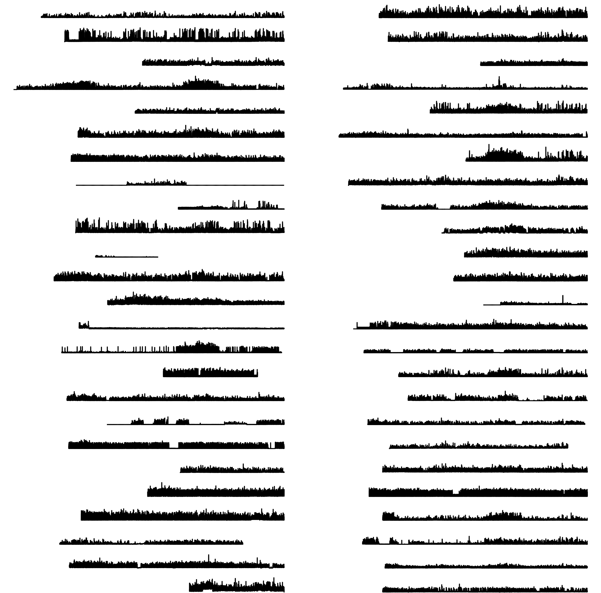
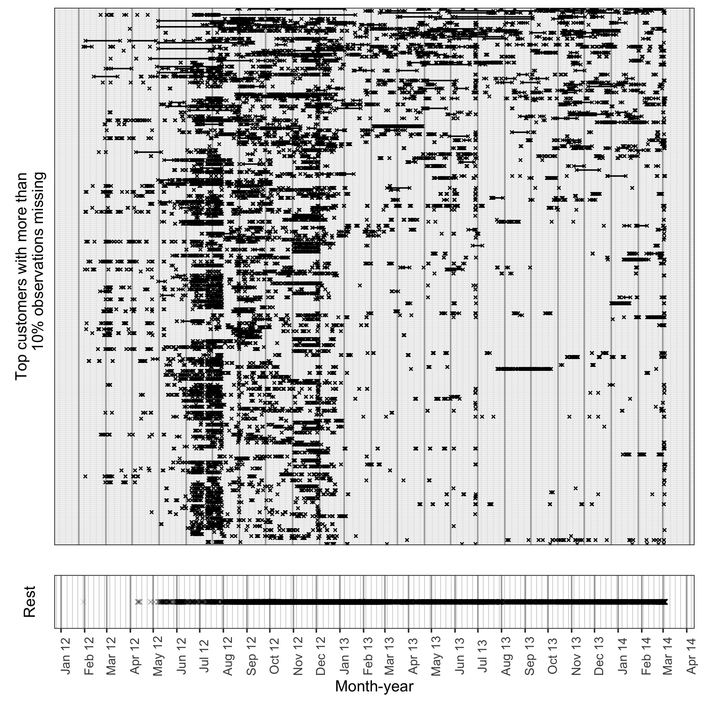
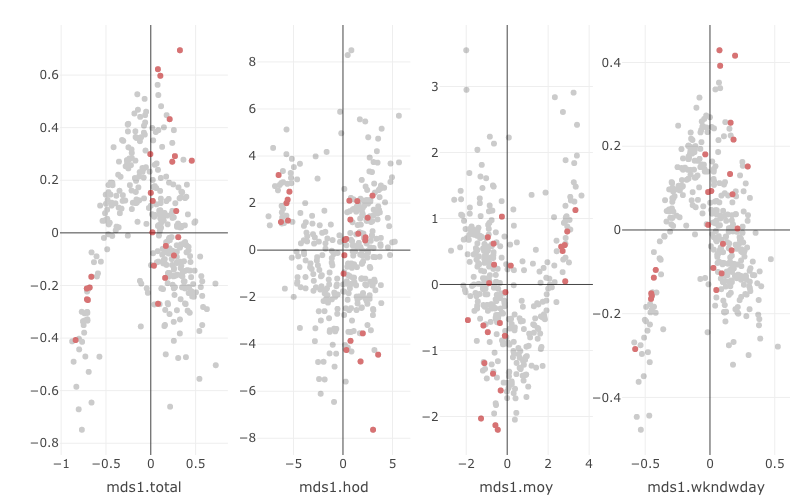

```{r setup, include=FALSE}
knitr::opts_chunk$set(echo = FALSE, cache=TRUE, messages=FALSE, warning=FALSE)
# Make sure you have the latest version of rmarkdown and bookdown
#devtools::install_github("rstudio/rmarkdown")
#devtools::install_github("rstudio/bookdown")
library(ggplot2)
library(gravitas)
library(gracsr)
library(ggdendro)
library(dplyr)
library(readr)
library(visdat)
library(ggplot2)
library(tidyverse)
library(naniar)
library(here)
library(tsibble)
library(knitr)
library(patchwork)
library(GGally)
library(distributional)
library(viridis)
```

```{r external, include = FALSE, cache = FALSE}
knitr::read_chunk(here('script/smart_meter.R'))
```


```{r mytheme}
theme_validation <- function() {
  theme_bw() +
      theme(
    strip.text = element_text(size = 8, margin = margin(b = 0, t = 1)),
    plot.margin = margin(0, 0, 0, 0, "cm"),
    axis.title.y = element_blank(),
    #axis.text.x = element_blank(),
  axis.text.y = element_blank(),
  axis.ticks = element_blank(),
      legend.position = "bottom"
    )
}


theme_characterisation <- function() {
theme_bw() + 
      theme(strip.text = element_text(size = 7, margin = margin(b = 0, t = 0))) +  + theme_bw() +
   theme(axis.title.y=element_blank(),
        axis.text.y=element_blank(),
        axis.ticks.y=element_blank()) +
  theme(panel.spacing =unit(0, "lines")) + 
    theme(axis.text.x = element_text(angle=90, hjust=1, size = 7)) + theme(legend.position = "bottom")+ theme(
    strip.text = element_text(size = 8, margin = margin(b = 0, t = 0)))+
  theme(plot.margin = margin(0, 0, 0, 0, "cm")) +
  scale_fill_manual(values = c("#E69F00", "#009E73","#0072B2", "#D55E00"))+
  scale_color_manual(values = c("#E69F00", "#009E73","#0072B2", "#D55E00"))+
  theme(legend.position = "bottom")
}
```


# Introduction

<!-- Description of data available -->


<!-- significance of load clustering -->
Large spatio-temporal data sets, both from open and administrative sources, offer up a world of possibilities for research. <!--Beyea (2010) has pointed out, there has been little exploration of the full potential of these data bases and their benefits can reach beyond the original intentions for collecting these data.--> One such data sets for Australia is the Smart Grid, Smart City (SGSC) project (2010–2014) available through [Department of the Environment and Energy](https://data.gov.au/data/organization/doee)<!--and Data61 CSIRO-->. The project provides half-hourly data of over 13,000 household electricity smart meters distributed unevenly from October 2011 to March 2014. <!---The massive amount of data generated in such projects could be overwhelming for analysis.--> Raw data of these asynchronous time series can quickly become overwhelming and hard to interpret, requiring summarizing the large number of customers into pockets of similar energy behavior. Electricity utilities can utilize the smart meter usage patterns to develop targeted tariffs for individual groups and alleviate the problem of volatility in production by capitalizing on the flexibility of consumers. 

<!-- Sources of variation in large data sets -->
<!-- The enormous quantity of data provides for greater individual level clarity and analysis. However, -->
<!-- due to the growing variety of consumers,  -->

\noindent Larger data sets include greater uncertainty about customer behavior due to growing variety of customers. Households are distributed geographically, and have different demographic properties such as the existence of solar panels, central heating or air conditioning. Multiple temporal dependencies define the behavioral patterns, which vary from customer to customer. Some families, for example, use a dryer to dry their clothing, while others hang them to dry on a line. This may be reflected in their weekly profile. They may have monthly variations where some customers are more prone to use air conditioners or heaters than others despite the existence of comparable electrical equipment and being subjected to similar weather conditions. The variations in behavior may occur on a regular basis, with some consumers being night owls and others being morning larks. Day-off energy usage may vary depending on whether consumers choose to remain at home or engage in outdoor activities. These various causes of variations in energy behavior, ranging from age, lifestyle, and family composition to building characteristics, weather, presence of various electrical equipments and others, make the problem of effectively segmenting consumers into similar energy behavior a particularly intriguing one. 

<!-- unsupervised clustering -->
\noindent This problem becomes more difficult when there is no other information on the customers besides their time series of energy usage. It is likely that such additional information is not available in order to protect the customers' confidentiality. Furthermore, it is not guaranteed that energy providers would always update customer profiles, such as property characteristics, in a timely manner whenever they change.
So this study does not attempt to explain why consumption differs. Instead, the work looks at how much energy-use heterogeneity can be uncovered in smart meter data and what are some of the most typical electricity use patterns by simply using the time series. 


<!-- This work -->
This is similar to a stochastic approach (@Motlagh2019-yj) to clustering, which proposes interpreting electricity demand as a random process and extracting time-series characteristics, or a model of the series, to enable unsupervised clustering. Unsupervised clustering is only as good as the features that are extracted/selected or the distance metrics that were utilized. Well-designed additional features may collect characteristics that default features cannot. Based on the underlying structure of the temporal data, this article offers new distance metric and features for clustering and applies them to actual smart-meter data. Firstly, the distance metric is based on probability distribution, which in our knowledge is the first attempt to cluster smart meter data using probability distributions. These recorded time series are asynchronous, with varying time lengths for different houses and missing observations. Taking probability distributions helps to deal with such data, while helping with dimension reduction in one hand but not losing too much information due to aggregation. Secondly, we recognise that most clustering algorithms only provide hourly energy profiles during the day, but this approach provides a wider approach to the issue, seeking to group consumers with similar shapes over all important cyclic granularities. Since cyclic granularities are considered instead of linear granularities, clustering would group customers that have similar repetitive behavior across more than one cyclic granularities across which patterns are expected to be significant. 


<!-- lit review -->
_Related work_

A typical clustering technique includes the following steps: (a) establishing distance (dissimilarity) and similarity through feature or model extraction and selection; and (b) selecting the clustering algorithm design. Distance measures could be time-domain based or frequency-domain (fast Fourier transform). A model-based clustering works by transforming the series into other other objects such as structure or set of parameters which can be more easily characterised and clustered (@Motlagh2019-yj). [@chicco2010renyi] addresses information theory-based clustering such as Shannon or Renyi entropy and its variations. The essential temporal characteristics of the curves are defined or extracted using feature-based clustering. @Tureczek2017-pb conducted a systematic study of over $2100$ peer-reviewed papers on smart meter data analytics. None of the $34$ articles chosen for their emphasis use Australian smart meter data. The most often used algorithm is K-Means. Using K-Means without considering time series structure or correlation results in inefficient clusters. Principal Component Analysis (PCA) or Self-Organizing Maps (SOM) eliminate correlation patterns and decrease feature space, but lose interpretability. To reduce dimensionality, several studies use principal component analysis or factor analysis to pre-process smart-meter data before clustering (@Ndiaye2011-pf). Other algorithms utilised in the literature include k-means variants, hierarchical approaches, and greedy k-medoids. Time series data, such as smart metre data, are not well-suited to any of the techniques mentioned in @Tureczek2017-pb. Only one study [@ozawa2016determining] identified time series characteristics using Fourier transformation, which converts data from time to frequency and then uses K-Means to cluster by greatest frequency .


<!-- Most clustering algorithms offer only daily energy profiles throughout the hours of the day, but we suggest a broader approach to the problem, aiming to group consumers with similar shapes across all significant cyclic granularities -->


<!-- There are two reasons why any additional consumer level data would not be available. Customer profiles, like property features, vary over time and are not always updated in a timely manner by energy suppliers. Also such data might not be available when the anonymity of the customers are of utmost importance.  -->


<!-- Segmenting unlabeled time series patterns has received little attention in the literature. This is a situation when there is no additional information on the socio-economic charactertistics, property types or family size of the customers. There are two reasons why any additional consumer level data would not be available. Customer profiles, like property features, vary over time and are not always updated in a timely manner by energy suppliers. Also such data might not be available when the anonymity of the customers are of utmost importance. So this study does not explain why consumption differs. Instead, this work investigates how much energy usage heterogeneity can be found in smart meter data and what some of the most common electricity use patterns are. -->


<!-- These recorded time series are asynchronous, with varying time lengths for different houses and missing observations. -->


<!-- An aggregation approach to reduce the data size is not exactly ideal when dealing with highly heterogeneous profiles -->


<!-- lit review and limitations if any -->
<!-- _Common load clustering techniques of smart meter data_ -->

<!-- A lot of work has been done in the literature on clustering customers by their load characeristics. Customers should be clustered uniquely, with behaviors represented with distinctive profile patterns. Approaches could be deterministic or stochastic. Deterministic approaches are hard to generalize due to the need for detailed knowledge of occupancy, appliances, and their time of use. In contrast, stochastic load analysis does not require extensive data collection other than the time series itself [13,14]. This technique -->
<!-- suggests viewing load as a random process, where extracting time-series features, or a model of the series, facilitates unsupervised clustering. Any standard clustering methodology consists of the following steps: (a) defining distance (dissimilarity) and similarity mostly through feature extraction and selection; and (b) choosing the clustering algorithm design. -->
<!-- Popular distance measures could be time-domain based or frequency-domain (fast Fourier transform). Any model based extraction works by transforming the series into other other objects such as structure or set of parameters which can be more easily characterised and clustered. A type of clustering based on information theory such as Shannon or Renyi entropy and their variants are addressed in [42].In contrast to models, a feature-based extraction is used to explicitly define or automatically extract the curves’ key time features, for instance by application of PCA on the daily curves. @Tureczek2017-pb presented a systematic review of the current state of the art in smart meter data analytics, which evaluates approximately 2100 peer-reviewed papers and summarizes the main findings. None of the $34$ selected papers which focus on clustering consumption are based on Australian smart meter data. -->
<!-- The algorithm most ubiquitously employed is K-Means. But the omission of the time series structure or correlation in the analysis while employing K-Means leads to inefficient clusters. Principal Component Analysis or Self-Organizing Maps removes correlation structures and transitions the data to a reduced feature space, but it comes at a cost of interpretability of the final results. Some papers present pre-processing of the smart-meter data before clustering through principal component analysis or factor analysis for dimensionality reduction or self-organizing maps for 2-Dimensional representation of the data (@Ndiaye2011-pf). Other algorithms used in the literature include k-means variations, hierarchical methods and k-medoids based on a greedy algorithm have been designed to select typical periods in the time series. -->


<!-- Time-domain analysis is preferred to specify time characteristics, while methods such as fast Fourier transform are used to reveal frequencies that highlight recurrent daily and annual load variations [27]. Popular time-domain techniques, such as principal component analysis -->
<!-- (PCA), detect key features of daily curves and reasonably link them to -->
<!-- distinctive demand behaviours [28,29]. For instance, PCA can help -->
<!-- reduce diurnal dimensions, e.g., 48 half-hourly power measurements, down to a few orthogonal components. @Tureczek2017-pb presented a systematic review of the current state of the art in smart meter data analytics, which evaluates approximately 2100 peer-reviewed papers and summarizes the main findings. None of the $34$ selected papers which focus on clustering consumption are based on Australian smart meter data. -->
<!-- The algorithm most ubiquitously employed is K-Means. But the omission of the time series structure or correlation in the analysis while employing K-Means leads to inefficient clusters. Principal Component Analysis or Self-Organizing Maps removes correlation structures and transitions the data to a reduced feature space, but it comes at a cost of interpretability of the final results. Some papers present pre-processing of the smart-meter data before clustering through principal component analysis or factor analysis for dimensionality reduction or self-organizing maps for 2-Dimensional representation of the data (@Ndiaye2011-pf). Other algorithms used in the literature include k-means variations, hierarchical methods and k-medoids based on a greedy algorithm have been designed to select typical periods in the time series. -->


<!-- The clustering is frequently applied directly to the raw data without scrutinizing for auto correlation and periodicity. -->


<!-- The key challenge is the application of appropriate processes to reduce the extreme dimensionality of load time series to facilitate unique clusters. Time feature extraction is a potential remedy, however, it is limited by the type of noisy, patchy, and unequal time-series common in residential datasets.  -->

<!-- The literature -->
<!-- suggests the clustering of residential customers by their load characteristics. The key challenge is the application -->
<!-- of appropriate processes to reduce the extreme dimensionality of load time series to facilitate unique clusters. -->
<!-- Time feature extraction is a potential remedy, however, it is limited by the type of noisy, patchy, and unequal -->
<!-- time-series common in residential datasets. In this paper we propose a strategy to alleviate these limitations by -->
<!-- converting any types of load time series into map models that can be readily clustered. -->


<!--Unlabelled data -->
<!-- While forecasting techniques for extremely granular temporal data are readily accessible, -->


<!-- The basic idea behind the clustering algorithm based on distribution is that the data, generated from the same distribution, belongs to the same cluster if there exists several distributions in the original data.  -->

<!-- Segmenting unlabeled time series patterns has received little attention in the literature. This is a situation when there is no additional information on the socio-economic charactertistics, property types or family size of the customers. There are two reasons why any additional consumer level data would not be available. Customer profiles, like property features, vary over time and are not always updated in a timely manner by energy suppliers. Also such data might not be available when the anonymity of the customers are of utmost importance. So this study does not explain why consumption differs. Instead, this work investigates how much energy usage heterogeneity can be found in smart meter data and what some of the most common electricity use patterns are. -->


<!-- lit review and limitations if any -->
<!-- _Common load clustering techniques of smart meter data_ -->

<!-- An aggregation approach to reduce the data size is not exactly ideal when dealing with highly heterogeneous profiles, as (XXX big data to the rescue example) demonstrates. -->
<!-- The foundation for this study is Tureczek2017-pb, which conducts a systematic review of the current state of the art in smart meter data analytics, which evaluates approximately 2100 peer-reviewed papers and summarizes the main findings. None of the 34 selected papers which focus on clustering consumption are based on Australian smart meter data. The clustering is frequently applied directly to the raw data without scrutinizing for auto correlation and periodicity. The algorithm most ubiquitously employed is K-Means. But the omission of the time series structure or correlation in the analysis while employing K-Means leads to inefficient clusters. Principal Component Analysis or Self-Organizing Maps removes correlation structures and transitions the data to a reduced feature space, but it comes at a cost of interpretability of the final results. @Tureczek2018-ha has shown that a transformation of data to incorporate autocorrelation before K-Means clustering can improve performance and enable K-Means to deliver smaller clusters with less within-cluster variance. However, it does not explain the cluster composition by combining it with external data. Some papers present pre-processing of the smart-meter data before clustering through principal component analysis or factor analysis for dimensionality reduction or self-organizing maps for 2-Dimensional representation of the data (@Ndiaye2011-pf). Other algorithms used in the literature include k-means variations, hierarchical methods and k-medoids based on a greedy algorithm have been designed to select typical periods in the time series. As the methods are often situation specific,  -->
<!-- it makes sense to compare them on the performance rather than any standard performance metric. A type of clustering based on information theory such as Shannon or Renyi entropy and their variants are addressed in , which differs from typical methods adopted for electricity consumer classification, based on the Euclidean distance notion. @Motlagh2019-yj presents strategy to address the problems on patchy, and unequal time-series common in residential data sets by converting load time series into map models. Most time-series clustering models are limited to handling time domain with same start and end date and time. Most of the solutions to handle this like longest common subsequence, dynamic time warping are prone to computational limit with increased length of the series. -->


<!-- our approach and contribution -->
<!-- probability distribution AND cyclic granularities -->


<!-- Large data sets -->
<!-- On one hand, the sheer volume of data enables greater clarity and analysis at the individual level. On the contrary, it also provides challenges as larger data sets have greater uncertainty about customer behavior due to increased variety of customers. Additionally, when using big data, there is often a temptation to aggregate the data to reduce its volume so it is easy to manage and computationally feasible to analyse but (XXX big data to the rescue example) show that such a strategy may not always be an optimal choice especially if we are to consider highly heterogeneous profiles that have a dimension of human behaviour. -->


<!-- how looking at probability and cyclic granularity helps -->


<!-- how is your work different from the rest of the literature -->


<!-- \noindent The massive amount of data generated in such projects could be overwhelming for analysis. Electricity utilities can utilize the consumption patterns of customers to develop targeted tariffs for individual groups and alleviate the problem of volatility in production by capitalizing on the flexibility of consumers. Beyea (2010) has pointed out, there has been little discussion or exploration of the full potential of these data bases and their benefits can reach beyond the original intentions for collecting these data. Thus, there is a scope to investigate and analyze these data in various ways for a greater understanding of consumption patterns and how they correlate with other economic, physical or geographical factors. In this work, we are interested to see how we can utilize this dataset to group different customers with similar periodic behavior.  -->

<!-- Towards this goal, this chapter aims to: (a) describe the contents of the data set in SGSC database that we can utilize, and (b) propose a clustering algorithm to group customers with similar periodic behaviors. The distance metric introduced in Chapter 2 will be the inputs for this cluster analysis. One of the advantages of using our  -->
<!-- approach is that the technique is based on probability distributions instead of raw data. Many clustering approaches are limited by the type of noisy, patchy, and unequal time-series common in residential data sets. Since the distance measure considered is based on differences in probability distribution of time series, it is likely to be less sensitive to missing or noisy data. -->

<!-- _Themes_ -->

<!-- - Dimension reduction: If each $P_{i, j, k}$ be considered to be a point in the space, key $i$ would have $mp$ dimensions as opposed to $n_i$ dimensions in case of considering raw data. Hence for a large number of observations ($n_i>>mp$), this approach benefits by transitioning to a lower dimension. -->

<!--  - Avoid loss of information due to aggregation: This approach ensures key characteristic information of the data is not lost due to averaging or aggregation measures in an attempt to transition to a lower dimension. Hence, this approach could be thought to somehow balance the drawback of considering raw data or aggregated data. -->

<!-- - Robustness to outliers: This approach could be adapted to be robust to outliers and extreme behaviors by trimming the tails of the probability distributions. -->

<!-- - Non-synchronized observed time periods: Considering probability distribution would imply the clustering process can handle keys that are observed over periods of time that are overlapping but don't necessarily coincide. -->

<!-- - Similar periodic behavior: Since cyclic granularities are considered instead of linear granularities, clustering would group keys that have similar behavior across these cyclic granularities. This implies they will be grouped according to their periodic behavior and not on the linear stretch of time over which they are observed. -->

<!-- The following contributions are made through the following chapter: -->

<!--  * Present a cluster analysis of SGSC dataset to group households with similar periodic behavior -->
<!--  * Cluster validation by relating to external data -->


<!-- Electricity smart meter technology is increasingly being deployed in residential and commercial buildings. For example, in the state of Victoria, Australia, it is a state government policy that all households have a smart meter fitted (Victoria State Government, 2015), which has resulted in 97% of the approximately 2.1 million households in Victoria having a smart meter installed in their home. These smart meters collect energy usage information at half-hourly intervals, resulting in over 35 billion half-hourly observations per year across all households in the state. Clustering electricity consumption patterns can enable electricity utilities to develop targeted tariffs for individual groups alleviating the problem of volatility in production by capitalizing on the flexibility of consumers. -->

<!-- Clustering households using only smart meter consumption data could also provide value in a societal setting by combining the findings and external data like weather conditions, socio-economic or other demographic factors of those households. -->

<!-- Background literature and shortcomings -->


<!-- # Preliminary exploratoration -->

<!-- ## Electricity demand data -->

<!-- _Electricity use interval reading data_   -->
<!-- The data from [SGSC consumer trial data](https://data.gov.au/data/dataset/smart-grid-smart-city-customer-trial-data) is available through [Department of the Environment and Energy](https://data.gov.au/data/organization/doee). -->


<!-- ### Data source -->

<!-- The entire data is procured from CSIRO. A subset of this data is also available from [SGSC consumer trial data](https://data.gov.au/data/dataset/smart-grid-smart-city-customer-trial-data) is available through [Department of the Environment and Energy](https://data.gov.au/data/organization/doee). It consists of the following data sets.  -->
<!-- _1. CustomerData:_ 78720 customers with 62 variables about them  -->
<!-- _2. EUDMData:_ 300 billion half-hourly consumption level data   -->
<!-- _3. OffersData:_ Method of contact to customer to join SGSC customer trial, either door-to-door (D2D) or via Telesales   -->
<!-- _4. PEResponseData:_ Peak Events response customer wise   -->
<!-- _5. PETimesData:_ Peak Events time stamps   -->

<!-- Only _CustomerData_ and _EUDMData_ are relevant for the clustering goals of this paper. _EUDMData_ contains half-hourly general supply in KwH for 13,735 customers, resulting in 344,518,791 observations in total. `CustomerData` provides demographic data for 78,720 customers with information about their Local Government Area amongst others. -->


<!-- ## LGA and weather data -->

<!-- Since the smart meters have been installed at different dates for each household, it is reasonable to assume that the records are obtainable for different time lengths -->
<!-- for each household. Since, general supply is available for only 13,735 customers, we will restrict ourselves to look at the LGA information for these customers only. We find that there are only 26 LGA that is covered for these customers. -->


<!-- _Weather data_   -->
<!-- This data is obtained through [Australian Government Bureau of Meteorology](BOM)(http://www.bom.gov.au/) and provides hourly data for nearest weather stations for all the LGAs -->


<!-- This section familiarizes the 13,000 SGSC households through visualization and provide a detailed layout of data structures (like missing observations/number of customers/number of observations) and also the external data that needs to be utilized for validating the clustering process. The [ABS TableBuilder](https://www.abs.gov.au/websitedbs/censushome.nsf/home/tablebuilder) has census data from 2011 and 2016. The data is at SA2 and LGA levels. However, some of the LGA in NSW changed between 2011 and 2016 and hence there would not be a one-to-one correspondence between the LGAs. Weather, notably temperature (and humidity) can be the main driver(s) for energy usage. In NSW many households have electric heaters so their use can impact winter energy use and air-conditioners can impact summer energy use. Relevant weather data could be obtained from the [Bureau of Meteorology](www.bom.gov.au). Some weather stations have 30 minute (sometimes even smaller interval) weather data. Potentially, there could be lag effects of weather on energy usage which should be considered. -->


The remainder of the paper is organized as follows: Section&nbsp;\ref{sec:methodology} provides the clustering methodology introducing the features and distance metrics.
Section&nbsp;\ref{sec:validation} shows data designs to validate our methods and draw comparisons against several methods. Section&nbsp;\ref{sec:application} discusses the application of the method to a subset of the real data. Finally, we summarize our results and discuss possible future directions in Section&nbsp;\ref{sec:discussion}.

# Clustering methodology {#sec:methodology}


<!-- In contrast to models, a feature-based strategy is used to explicitly define or automatically extract the curves’ key time features, for instance by application of PCA on the daily curves [ -->


<!-- Most papers discussed in Tureczek2017-pb fail to accept smart meter readings as time series data, a data type which contains a temporal component. The omission of the essential time series features in the analysis leads to the application of methods that are not designed for handling temporal components. K-Means ignores autocorrelation, unless the input data is pre-processed. The clusters identified in the papers are validated by a variety of indices, with the most prevalent -->
<!-- being the cluster dispersion index (CDI) [22–24], the Davies–Bouldin index (DBI) [25,26] and the mean index adequacy (MIA) [8,13]. -->


<!-- The data set solely contains readings from smart meters and no information about the consumers' specific physical, geographical, or behavioural attributes. As a result, no attempt is made to explain why consumption varies. Instead, this work investigates how much energy usage heterogeneity can be found in smart meter data and what some of the most common electricity use patterns are. -->


The proposed methodology aim to leverage the intrinsic temporal data structure hidden in time series data. The foundation of our method is unsupervised clustering algorithms based exclusively on time-series features. First, we study the underlying distributions that may have resulted in different patterns across temporal granularities in order to identify a mechanism to classify them based on the similarity of those distributions. It is worth noting that when studying these similarities, a variety of objectives may be pursued. One objective could be to group consumers with similar shapes over all relevant cyclic granularities. In this scenario, the variation in customers within each group is in magnitude rather than shape, while the variation between groups is only in shape. Most clustering algorithms offer only daily energy profiles throughout the hours of the day, but we suggest a broader approach to the problem, aiming to group consumers with similar shapes across all significant cyclic granularities. Another purpose of clustering could be to group customers that have similar differences in patterns across all major cyclic granularities, capturing similar jumps across categories regardless of the overall shape. For example, in the first goal, similar shapes across hours of the day will be grouped together, resulting in customers with similar behaviour across all hours of the day, whereas in the second goal, any similar big-enough jumps across hours of the day will be clubbed together, regardless of which hour of the day it is. Both of these objectives may be useful in a practical context and, depending on the data set, may or may not propose the same customer classification.

Depending on the goal of clustering, the distance metric for defining similarity would be different. These distance metrics could be fed into a clustering algorithm to break large data sets into subgroups that can then be analyzed separately. These clusters may be commonly associated with real-world data segmentation. However, since the data is unlabeled a priori, more information is required to corroborate this. This section presents the work flow of the methodology: 


- _Data preparation_

@wang2020tsibble introduced the tidy "tsibble" data structure to support exploration and modeling of temporal data comprising of an index, optional key(s), and measured variables. <!-- An index is a variable with inherent ordering from past to present and a key is a set of variables that define observational units over time. A linear granularity is a mapping of the index set to subsets of the time domain. For example, if the index of a tsibble is days, then a linear granularity might be weeks, months or years.--> For each key variable, the raw smart meter data is a sequence that is indexed by time and comprises values of several measurement variables at each time point. This sequence, though, could be depicted in a variety of ways. A shuffling of the raw sequence could reflect the distribution of hourly consumption over a single day, while another could indicate consumption over a week or a year. These temporal deconstructions of a time period into units such as hour-of-day, work-day/weekend are called cyclic temporal granularities. All cyclic granularities can be expressed in terms of the index set and could be augmented with the initial tsibble structure (index, key, measurements). It is worthwhile to note that the data structure changes while transporting from linear to cyclic scale of time as multiple observations of the measured variable would correspond to each category of the cyclic granularities. In this paper, quantiles are chosen to characterize the distributions for each category of the cyclic granularity. So, each category of a cyclic granularity corresponds to a list of numbers which is essentially few chosen quantiles of the multiple observations.


- _Finding significant cyclic granularities or harmonies_

\noindent These cyclic granularities are useful for exploring repetitive patterns in time series data that get lost in the linear representation of time. It is advantageous to consider only those cyclic granularities across which there is a significant repetitive pattern for the majority of customers or noteworthy in an electricity-behavior context. In that case, when the customers are grouped, we can expect to observe some interesting patterns across the categories of the cyclic granularities considered. [XXX reference 2nd chapter] proposes a way to select significant cyclic granularities and harmonies which is used for this paper.


- _Individual or combined categories of cyclic granularities as DGP_

The existing work on clustering probability distributions assumes we have an iid sample $f_1(v),\dots,f_n(v)$, where $f_i(v)$ denotes the distribution from observation $i$ over some random variable $v = \{v_t: t = 0, 1, 2, \dots, T-1\}$ observed across $T$ time points. In our work, we are using $i$ as denoting a customer and the underlying variable as the electricity demand. So $f_i(v)$ is the distribution of household $i$ and $v$ is electricity demand. In this work, instead of considering the probability distributions of the linear time series, we assume that the measured variables across different categories of any cyclic granularity are from different data generating processes.
Hence, we want to be able to cluster distributions of the form $f_{i,A,B \dots, {N_C}}(v)$, where $A, B$ represent the cyclic granularities under consideration such that $A = \{a_j: j=1, 2, \dots J\}$,  $B = \{b_k: k  = 1, 2, \dots K\}$ and so on. We consider individual category of a cyclic granularity ($A$) or combination of categories for interaction of cyclic granularities (for e.g. $A*B$) to have a distribution. For example, let us consider we have two cyclic  granularities of interest, $A = {0, 1, 2, \dots, 23}$ representing hour-of-day and  $B = \{Mon, Tue, Wed, \dots, Sun\}$ representing day-of-week. 
Each customer $i$ consist of a collection of probability distributions. In case individual granularities ($A$ or $B$) are considered, there are  $J = 24$ distributions of the form $f_{i,j}(v)$ or $K = 7$ distributions of the form $f_{i,k}(v)$ for each customer $i$. In case of interaction,  $J*K=168$ distributions of the form $f_{i,j, k}(v)$ could be conceived for each customer $i$. 

\noindent As a result, a distance between collections of these univariate probability distributions is required. Depending on the objective of the problem, there could be many approaches to considering such distances. This paper considers two approaches, which are explained in the next segment.


- _Distance metrics_

Considering each individual or combined categories of cyclic granularities as a data generating process lead to a collection of conditional distributions for each customer $i$. The (dis) similarity between each pair of customers should be obtained by combining the distances between these collections of conditional distributions such that the resulting metric is a distance metric, which could be fed into the clustering algorithm. Two types of distance metric is considered:

<!-- The choice of distance measures is a critical step in clustering. It defines how the similarity of two elements (x, y) is calculated. -->

**JS-based distances**

This distance matrix considers two objects to be similar if every category of an individual cyclic granularity or combination of categories for interacting cyclic granularities have similar distributions. In this study, the distribution for each category is characterized using deciles and the distances between distributions are computed by using the Jensen-Shannon distance, which is symmetric and hence could be used as a distance measure. 


\noindent The total distance between two elements $x$ and $y$ is then defined as $$S^A_{x,y} = \sum_{j} D_{x,y}(A)$$ (sum of distances between each category $j$ of cyclic granularity A) or  $$S^{A*B}_{x,y} = \sum_j \sum_k D_{x,y}(A, B)$$ (sum of distances between each combination of categories $(j, k)$ of the harmony $(A, B)$. When combining distances from individual $L$ cyclic granularities $C_l$ with $n_l$ levels, $$S_{x, y} = \sum_lS^{C_l}_{x,y}/n_l$$ is used, which is also a distance metric being the sum of JS distances. 

**wpd-based distances**

Compute weighted pairwise distances ($wpd$) for all considered granularities for all objects. $wpd$ is designed to capture the maximum variation in the measured variable explained by an individual cyclic granularity or their interaction and is estimated by the maximum pairwise distances between consecutive categories normalized by appropriate parameters. A higher value of $wpd$ indicates that some interesting pattern is expected, whereas a lower value would indicate otherwise. 

\noindent Distance between elements is then taken as the euclidean distances between them with the granularities being the variables and $wpd$ being the value under each variable. Since Euclidean distance is chosen, the observations with high values of features ($wpd$ values) will be clustered together. The same holds true for observations with low values of features. Thus this distance matrix would be useful to group customers that have similar significance of patterns across different granularities.


<!-- Consider a harmony table consisting of many harmonies, each of the form $(A, B)$, such that $A = \{ a_j: j = 1, 2, \dots, J\}$ and $B = \{ b_k: k = 1, 2, \dots, K\}$. Each household consists of a $J*K$ distributions one harmony. We compute the distributional difference -->
<!-- between $(A, B)$ for the $s^{th}$ household using $wpd_{{s}}(A,B)$. -->
<!-- $wpd_{{s}}(A,B)$ denotes the normalized weighted-pairwise distributional distances between $(A, B)$ and is a feature which measures distributional difference between harmonies. If we have $H_{N_C}$ harmonies in the harmony table, then for each household we have a vector of $wpd_{{s}}$ of $H_{N_C}$ elements with each element corresponding to one harmony. We aim to have pockets of households showing similar periodic behavior by conidering $wpd$ vlaues for different harmonies and some time series features. The features should also characterize probability distributions of different household. -->


<!-- grouping probability distributions across a harmony. This clustering algorithm is adopted to remove or appropriately adjust for auto correlation and unequal length in the data. The method could be further extended by clustering probability distributions conditional on one or more cyclic granularities. The following are some of the advantages of our proposed method. -->


- _Pre-processing steps_

<!--Handling trend, seasonality, non-stationarity and auto-correlation:** Trend and seasonality are fundamental characteristics of time series data, and it is reasonable to define a time series according to its degree of trend and seasonality. These characteristics of the time series are lost or handled independently by considering probability distributions ( trend is lost) across categories of cyclic granularities (by independently modeling all seasonal fluctuations), and so there is no need to de-trend or de-seasonalize the data before conducting the clustering method. There is no need to omit holiday or weekend patterns for similar reasons-->


Practically most problems will have a very skewed distribution, it is often helpful to bring them to a normal-like shape before clustering. Two data transformation techniques are employed for the JS-based methods and NQT is built-in transformation used for computation of $wpd$, which forms the basis of wpd-based distances.  
    
_Robust scaling_ Standardizing is a common scaling method that subtracts the mean from values and divides by the standard deviation, resulting in a conventional Gaussian probability distribution for an input variable (zero mean and unit variance). If the input variable includes outlier values, standardisation may become skewed or prejudiced. To address this, robust scaling methods could be utilized  (value – median) / (p75 – p25)) which results in a variable with a zero mean and median, as well as a standard deviation of one, while the outliers are still there with the same relative connections to other values.
    
_Normal-Quantile transform_  First as a data pre-processing step to make all assymetrical real world variables more symmetric, we perform a quantile-normal transform on the data. This makes sure that the CDF of the resulting variable in Gaussian. The original data is ranked in ascending order and the probabilities $P(Y<=y(i)) = i/(n+1)$ are attached to $y(i)$, in terms of their ranking order. A NQT based transformation is applied by computing from a standard normal distribution a variable $\eta(i)$, which corresponds to the same probability $P(\eta< \eta(i)) = i/n+1$. By doing this, the new variables $\eta(i)$ will be marginally distributed according to standard Normal, N(0,1). NQT will transform the positively and negatively skewed distribution to a similar bell-shaped. From the transformed distribution, it is difficult to understand that raw distribution was of which shape. Also, multimodality gets hidden or magnitude get reversed with NQT. But deciles from the distribution will move in a similar manner as the raw distribution and hence the final distance matrix seem to be unaffected. Hence, this could be used. 


- _Clustering algorithm_

In the analysis of energy smart metre data, K-Means or hierarchical clustering are often employed. These are simple and effective techniques that work well in a range of scenarios. For clustering, both employ a distance measure, and the distance measure chosen has a major influence on the structure of the clusters. We employ agglomerative hierarchical clustering in conjunction with Ward's criteria (XXX reference). Individual entities with the highest similarity computed using the desired distance metrics are sequentially merged using agglomerative algorithms. We can possibly employ any clustering method that supports the given distance metric as input.

- _Characterization of clusters_

Depending on the distance measure utilized for the study, the cluster characterization technique will differ. Clusters that utilise intra-category distances are characterised using multi-dimensional scaling and parallel coordinate displays. For inter-category distances, the distribution across major granularities may be presented to ensure that the goal of similar shapes within clusters and distinct shapes across clusters is met. This technique may potentially make advantage of multi-dimensional scaling.


\noindent Multidimensional scaling (MDS) (XXX reference) refers to a family of methods that analyse a matrix of distances or dissimilarities to provide a representation of the data points in a reduced-dimension space. There are many kinds of MDS, but they all solve the same fundamental issue: Given a $n*n$ matrix of dissimilarities and a distance measure, identify a configuration of $n$ points $x_1, x_2, \dots, x_n$ in the reduced dimension space $R^q$ ($q<p$) where the distance between the points is near to the dissimilarity between the points. All techniques must determine the coordinates of the points as well as the space dimension, $q$. Metric and nonmetric MDS are the two main kinds of MDS. Metric MDS methods presume a functional connection between the interpoint distances and the supplied dissimilarities and assume that the data are quantitative. We use metric MDS.

\noindent Parallel coordinate plots (XXX reference) Parallel coordinates have been extensively used to display high-dimensional and multivariate data, allowing for the detection of patterns within the data via visual grouping.


<!-- - A random sample  of the original data is taken for clustering analysis and includes missing and noisy observations (detailed description in Appendix) -->

<!-- - All harmonies are computed for each customer in the sample. -->
<!-- Cyclic granularities which are clashes for all customers in the sample are removed. -->

<!-- - It is worth noting that a number of other solutions may be considered at the pre-processing stage of the method. We have considered a) Normal-Quantile Transform and b) Robust transformation. -->

<!-- - Two methods are considered for computing dissimilarity between two customers. The first one involves computing according to one granularity is computed as the sum of the JS distances between distribution of all the categories of the granularity. When we consider more than one granularity, we consider the sum of the  average distances for all the granularity so that the combined metric is also a distance. -->

<!-- - Given the scale of dissimilarity among the energy readings, the model chooses optimal number of clusters -->

<!-- - Once clusters have been allocated, the groups are explored visually. -->

<!-- - Results are reported and compared. -->

<!-- Two methods are used for computing distances between subjects and then hierarchical clustering algorithm is used. -->

<!-- The existing work on clustering probability distributions assumes we have an iid sample $f_1(v),\dots,f_n(v)$, where $f_i(v)$ denotes the probability distribution from observation $i$ over some random variable $v = \{v_t: t = 0, 1, 2, \dots, T-1\}$ observed across $T$ time points. In our work, we are using $i$ as denoting a customer and the underlying variable as the electricity demand. So $f_i(v)$ is the distribution of household $i$ and $v$ is electricity demand. -->

<!-- We want to cluster distributions of the form $f_{i,j,k}(v)$, where $i$ and $j$ denote  -->

<!-- Consider a harmony table consisting of many harmonies, each of the form $(A, B)$, such that $A = \{ a_j: j = 1, 2, \dots, J\}$ and $B = \{ b_k: k = 1, 2, \dots, K\}$. Each household consists of a $J*K$ distributions one harmony. We compute the distributional difference -->
<!-- between $(A, B)$ for the $s^{th}$ household using $wpd_{{s}}(A,B)$. -->
<!-- $wpd_{{s}}(A,B)$ denotes the normalized weighted-pairwise distributional distances between $(A, B)$ and is a feature which measures distributional difference between harmonies. If we have $H_{N_C}$ harmonies in the harmony table, then for each household we have a vector of $wpd_{{s}}$ of $H_{N_C}$ elements with each element corresponding to one harmony. We aim to have pockets of households showing similar periodic behavior by conidering $wpd$ vlaues for different harmonies and some time series features. The features should also characterize probability distributions of different household. -->


<!-- ### Notations -->

<!-- Consider an iid sample $f_1(v),\dots,f_n(v)$, where $f_i(v)$ denotes the probability distribution from observation $i$ over some random variable $v = \{v_t: t = 0, 1, 2, \dots, T-1\}$ observed across $T$ time points. In our work, we are using $i$ as denoting a household and the underlying variable as the electricity demand. Further consider a cyclic granularity of the form $B = \{ b_k: k = 1, 2, \dots, K\}$. Each customer consists of collection of probability distributions. -->


<!-- So $f_i(v)$ is the distribution of household $i$ and $v$ is electricity demand. We want to cluster distributions of the form $f_{i,j,k}(v)$, where $i$ and $j$ denote $i^{th}$ and $j^{th}$ customer respectively. -->


<!-- a harmony table consisting of many harmonies, each of the form $(A, B)$, such that $A = \{ a_j: j = 1, 2, \dots, J\}$ and $B = \{ b_k: k = 1, 2, \dots, K\}$.  -->


<!-- ### A single or pair of granularities together (change names) -->

<!-- The methodology can be summarized in the following steps: -->

<!-- - _Pre-processing step_ -->

<!-- Robust scaling method or NQT used for each customer. -->


<!-- - _NQT_ -->


<!-- - _Treatment to outliers_ -->


<!-- ### Many granularities together (change names) -->

<!-- The methodology can be summarized in the following steps: -->


<!-- 1. Compute quantiles of distributions across each category of the cyclic granularity -->
<!-- 2. Compute JS distance between households for each each category of the cyclic granularity -->
<!-- 3. Total distance between households computed as sum of JS distances for all hours -->
<!-- 4. Cluster using this distance with hierarchical clustering algorithm (method "Ward.D") -->

<!-- _Pro:_   -->
<!-- - distance metric makes sense to group different shapes together   -->
<!-- - simulation results look great on typical designs   -->
<!-- _Cons:_   -->
<!-- - Can only take one granularity at once   -->
<!-- - Clustering a big blob of points together whereas the aim is to groups these big blob into smaller ones   -->

<!-- ### Multiple-granularities -->

<!-- _Description:_   -->

<!-- Choose all significant granularities and compute wpd for all these granularities for all customers. Distance between customers is taken as the euclidean distances between them with the granularities being the variables and wpd being the value under each variable for which Euclidean distance needs to be measured.   -->
<!-- _Pro:_   -->
<!-- - Can only take many granularities at once -->
<!-- - can apply variable selection PCP and other interesting clustering techniques -->
<!-- - simulation results look great on typical designs -->
<!-- - splitting the data into similar sized groups   -->
<!-- _Cons:_   -->
<!-- - distance metric does not make sense to split the data into similar shaped clusters  -->

# Validation {#sec:validation}

To validate the clustering approaches, we create data designs that replicate prototype behaviors that might be seen in electricity data contexts. We spiked several attributes in the data to see where one method works better than the other and where they might give us the same outcome or the effect of missing data <!---and trends--> on the proposed methods. Three circular granularities $g1$, $g2$ and $g3$ are considered with categories denoted by ${g10,g11}$, ${g20, g21, g22}$ and ${g30, g31, g32, g33, g34}$ and levels $l_{g_1}=2$, $l_{g_2}=3$ and $l_{g_3}=5$. These categories could be integers or some more meaningful labels. For example, the granularity "day-of-week" could be either represented by ${0, 1, 2, \dots, 6}$ or ${Mon, Tue, \dots, Sun}$. Here categories of $g1$, $g2$ and $g3$ are represented by  $\{0, 1\}$, $\{0, 1, 2\}$ and $\{0, 1, 2, 3, 4\}$ respectively. A continuous measured variable $v$ of length $T$ indexed by $\{0, 1, \dots T-1\}$ is simulated such that it follows the structure across $g1$, $g2$ and $g3$. We created independent replications $R = \{25, 250, 500\}$ of all data designs to see if our proposed clustering approaches can detect distinct designs in various groups for small, medium and large number of series. A sample size of $T=\{300, 1000, 5000\}$ is used in all designs to test small, medium and large sized series. The methods could preform differently with different jumps between consecutive categories. So a mean difference of $diff = \{1, 2, 5\}$ for corresponding categories are also considered. The performance of the methods can vary with different number of significant granularities. So scenarios with all, few and just one significant granularities are considered. The code for creating these designs and the detailed results can be found in the Supplementary section (link to github repo). 


<!-- The results for $T=300$ and $R=25$ is shown, that means we have $25$ time series each with length $300$. The rest of the results could be found in the supplementary paper. -->


## Data generating processes

<!-- An ARMA (p,q) process is used to generate series, where $p$ and $q$ are selected at random such that the series is stationary. The various designs on $g1$, $g2$, and $g3$ are introduced by adding matching designs to this series' innovations. The innovations are considered to have a normal distribution, although they follow the same pattern as the designs. To eliminate the effect of starting values, the first 500 observations in each series are discarded. -->

Each category or combination of categories from $g1$, $g2$ and $g3$ are assumed to come from the same distribution, a subset of them from the same distribution, a subset of them from separate distributions, or all from different distributions, resulting in various data designs. As the methods ignore the linear progression of time, there is little value in adding time dependency in the data generating process. It is often reasonable to construct a time series using properties such as trend, seasonality, and auto-correlation. However, when examining distributions across categories of cyclic granularities, these time series features are lost or addressed independently by considering seasonal fluctuations through cyclic granularities. Because the time span during which an entity is observed in order to ascertain its behavior is not very long,
the behavior of the entity will not change drastically and hence the time series can be assumed to remain stationary throughout the observation period. If the observation period is very long (for e.g more than 3 years), property, physical or geographical attributes might change leading to a non-stationary time series. But such a scenario is not considered here and the resulting clusters are assumed to be time invariant in the observation period. The data type is set to be "continuous," and the setup is assumed to be Gaussian. When the distribution of a granularity is "fixed", it means distributions across categories do not vary and are considered to be from N (0,1). The mean of different categories are altered in the "varying" designs, leading to varying distributions across categories.


<!-- An ARMA (p,q) process is used to generate series, where $p$ and $q$ are selected at random such that the series is stationary. The various designs on $g1$, $g2$, and $g3$ are introduced by adding matching designs to this series' innovations. The innovations are considered to have a normal distribution, although they follow the same pattern as the designs. To eliminate the effect of starting values, the first 500 observations in each series are discarded. -->


## Data designs  

### Individual granularities


  _Scenario (a): All signifiant granularities_

<!-- Consider a case where all the three granularities $g1$, $g2$ and $g3$ would be responsible for making the designs distinct. That would mean, the pattern for each of $g1$, $g2$ and $g3$ will change for at least one design. We consider a situation with all the null cases corresponding to no difference in distribution across categories, that is, all categories follow the same distribution N(0,1). -->

\noindent Consider the scenario when all three granularities $g1$, $g2$, and $g3$ are responsible for distinguishing the designs. This implies that the patterns across each granularity will change significantly for at least one among the to-be-grouped designs. We consider different distributions across categories (as in Table \ref{tab:tab-dist-design} top) that will lead to different designs (as in Table \ref{tab:tab-dist-design} below). Figure \ref{fig:plot-3gran-new} shows the linear and cyclic representation of the simulated variable under these five designs. As could be seen from the plot, it is impossible to decipher the structural difference in the time series variable just by looking at the linear view. The difference in structure becomes quite clear when we see the distribution across cyclic granularities. Hence, for the consequent scenarios, only graphical displays across cyclic granularities are provided to emphasize the difference in structure.

_Scenario (b): Few significant granularities_

\noindent This is the case where one granularity will remain the same across all designs. We consider the case where the distribution of $v$ would vary across levels of $g2$ for all designs, across levels of $g1$ for few designs and $g3$ does not change across designs. So $g3$ is not responsible for distinguishing across designs. Figure
\ref{#fig:plot-linear}(left) shows the considered design. 

_(c) One signifiant granularity_

\noindent Here only one granularity is responsible for distinguishing the designs. Designs change significantly only for the granularity $g3$. Figure \ref{fig:plot-1gran}(right) shows this.


```{r tab-distribution}
```


```{r tab-design}
```


```{r tab-dist-design}
```


```{r generate-design-3change}

```

```{r plot-3gran-new, out.width="100%", fig.cap="The linear (left) and cyclic (right) representation of the measured variable is shown. In this scenario, all of $g1$, $g2$ and $g3$ changes across at least one design. Also, it is not possible to comprehend these patterns across cyclic granularities or group similar series just by looking at the linear plots."}

```


```{r}
generate_design <- function(t, mu21, mu22, mu23){
  
t <- seq(0, t, 1)
g1 <- t %%2
g2 <- t %%3
g3 <- t %%5

# null design
g1_dnull <- rep( rep(0, each = length(unique(g1))), length.out= length(t))
g2_dnull <- rep( rep(0, each = length(unique(g2))), length.out= length(t))
g3_dnull <- rep( rep(0, each = length(unique(g3))), length.out= length(t))
 
# mean changing across categories in varying ways

g1_dvary <- rep(0, length.out= length(t))
g21_dvary <- rep(mu21, length.out= length(t))
g22_dvary <- rep(mu22, length.out= length(t))
g23_dvary <- rep(mu23, length.out= length(t))
g3_dvary <- rep(0, length.out= length(t))

design1 = distributional::dist_normal(g1_dnull + g2_dnull + g3_dnull)
design2 = distributional::dist_normal(g1_dnull + g21_dvary + g3_dnull)
design3 = distributional::dist_normal(g1_dnull + g22_dvary + g3_dnull)
design4 = distributional::dist_normal(g1_dnull + g23_dvary + g3_dnull)

data_bind <- tibble::tibble(
index = t,
g1 = g1,
g2 = g2,
g3 = g3,
design1 = distributional::generate(design1, times = 1) %>% unlist(),
design2 = distributional::generate(design2, times = 1) %>% unlist(),
design3 = distributional::generate(design3, times = 1) %>% unlist(),
design4 = distributional::generate(design4, times = 1) %>% unlist(),
#design5 = distributional::generate(design5, times = 1) %>% unlist()
) %>% 
  pivot_longer(-c(1, 2, 3, 4), names_to = "design", values_to = "sim_data")

data_bind
}

mu21= c(2, 0, 0)
mu22 = c(0, 2, 0)
mu23 = c(0, 0, 2)
mu3 = c(0, 0, 0, 0, 0)
data_bind <- generate_design(t, mu21, mu22, mu23)

```


```{r plot-gran, out.width="100%"}

p1 <- ggplot(data_bind,
             aes(x = index, y = sim_data)) + 
  geom_line() +
  xlab("index")+
  facet_wrap(~design, scales = "free_y",ncol =1) +
  theme_validation()

p2 <- ggplot(data_bind,
             aes(x = as.factor(g1), y = sim_data)) + 
  geom_boxplot(alpha =0.5) + xlab("g1") + 
  facet_wrap(~design, scales = "free_y", ncol = 1)+ stat_summary(
    fun = median,
    geom = 'line',
    aes(group = 1), size = 0.8, color = "blue") +
  theme_validation()


p3 <- ggplot(data_bind, aes(x = as.factor(g2), y = sim_data)) + geom_boxplot(alpha =0.5) + xlab("g2") + theme_bw() +
  facet_wrap(~design, scales = "free_y",ncol = 1)+ stat_summary(
    fun = median,
    geom = 'line',
    aes(group = 1), size = 0.8, color = "blue") + ylab("")+
  theme_validation()

p4 <- ggplot(data_bind, aes(x = as.factor(g3), y = sim_data)) + geom_boxplot(alpha =0.5) +
  xlab("g3") + theme_bw()+
  facet_wrap(~design, scales = "free_y", ncol = 1)+ stat_summary(
    fun = median,
    geom = 'line',
    aes(group = 1), size = 0.8, color = "blue")+ ylab("")+
  theme_validation()

gran2_change <- (p2 + p3 + p4) *
  theme_validation()
```


<!-- When we move from the linear to the cyclic world of temporal granularities, we can see patterns across different categories of the granularities which gets lost in the linear representation. Populations are modeled by a collection of these cyclic granularities. Each cyclic granularity might or might not have patterns across its categories. Each cluster is characterized by similar patterns across one or more of these cyclic granularities. -->


<!-- A small example is given to setup the problem. -->

<!-- We constructed the simulation parameters to represent common patterns in electricity data. 50, 200 and 500 time series were chosen for different simulation designs with different granularities and patterns changing across different granularities. -->
<!-- The data type is fixed to be "continuous".We generated independent replications of all combinations of the simulation parameters. -->

<!-- Consider a continuous time series variable $y$ of length $T$ indexed by ${0, 1, \dots T-1}$. Three circular granularities $g1$, $g2$ and $g3$ are considered with 2, 3 and 5 levels respectively. Categories of g1, g2 and g3 are represented by ${0,1}$, ${0, 1, 2}$ and ${0, 1, 2, 3, 4}$. These categories could be integers or some more meaningful labels. For example, the granularity "day-of-week" could be either represented by $\{0, 1, 2, \dots, 6\}$ or $\{Mon, Tue, \dots, Sun\}$. -->

<!-- Consider the case where distribution of $y$ would vary across levels of $g1$ and g2$ but will not vary across levels of $g3$ as described in Figure .Figure \ref shows four designs where $g3$ acts as a nuisance variable, and $g1$ and $g2$ varies in both  Design 2 and 3, and $g2$ varies in all designs. -->


<!-- Consider a case where distribution of $y$ would vary across levels of $g2$ -->
<!-- for all designs, across levels of $g1$ for few designs and $g3$ does not change across designs. Figure \ref{#fig:plot-linear} shows the linear and cyclic representation of $y$. The first panel shows raw plot of $y$ in a linear scale and the second panel shows distribution of $y$ across cyclic granularities namely $g1$, $g2$ and $g3$. As could be seen from the plots, it is impossible to decipher from the raw time plot that the time series variable shows such pattern across different granularities. -->


```{r change-var, echo=FALSE}
t = 300
n <- seq(0, t, 1)
g1 <- n %%2
g2 <- n %%3
g3 <- n %%5
mu11 = c(0, 5)
mu12 = c(3, 0)
mu21= c(2, 0, 0)
mu22 = c(0, 2, 0)
mu23 = c(0, 0, 2)
mu3 = c(0, 0, 0, 0, 0)
```

```{r generate-design} 
generate_design <- function(t, mu21, mu22, mu23){
  
t <- seq(0, t, 1)
g1 <- t %%2
g2 <- t %%3
g3 <- t %%5

# null design
g1_dnull <- rep( rep(0, each = length(unique(g1))), length.out= length(t))
g2_dnull <- rep( rep(0, each = length(unique(g2))), length.out= length(t))
g3_dnull <- rep( rep(0, each = length(unique(g3))), length.out= length(t))
 
# mean changing across categories in varying ways

g11_dvary <- rep(mu11, length.out= length(t))
g12_dvary <- rep(mu12, length.out= length(t))
g21_dvary <- rep(mu21, length.out= length(t))
g22_dvary <- rep(mu22, length.out= length(t))
g23_dvary <- rep(mu23, length.out= length(t))
g3_dvary <- rep(0, length.out= length(t))

design1 = distributional::dist_normal(g1_dnull + g2_dnull + g3_dnull)
design2 = distributional::dist_normal(g11_dvary + g21_dvary + g3_dnull)
design3 = distributional::dist_normal(g12_dvary + g22_dvary + g3_dnull)
design4 = distributional::dist_normal(g1_dnull + g23_dvary + g3_dnull)

data_bind <- tibble::tibble(
index = t,
g1 = g1,
g2 = g2,
g3 = g3,
design1 = distributional::generate(design1, times = 1) %>% unlist(),
design2 = distributional::generate(design2, times = 1) %>% unlist(),
design3 = distributional::generate(design3, times = 1) %>% unlist(),
design4 = distributional::generate(design4, times = 1) %>% unlist(),
#design5 = distributional::generate(design5, times = 1) %>% unlist()
) %>% 
  pivot_longer(-c(1, 2, 3, 4), names_to = "design", values_to = "sim_data")

data_bind
}

data_bind <- generate_design(t, mu21, mu22, mu23)

#data_bind

```


```{r plot-2gran, out.width="100%", fig.cap = "The linear (left) and cyclic (right) representation of the measured variable is shown. In this scenario, $g1$, $g2$ would change across atleast one design but $g3$ change remains same across all design. Thus $g3$ is not an important variable to distinguish these designs."}


# plot_linear_data <- function(data){
# ggplot(data,
#              aes(x = index, y = sim_data)) + 
#   geom_line() +
#   xlab("index")+
#   theme_bw() 
# }

p1 <- ggplot(data_bind,
             aes(x = index, y = sim_data)) + 
  geom_line() +
  xlab("index")+
  facet_wrap(~design, scales = "free_y",ncol =1) +
  theme_validation()

p2 <- ggplot(data_bind,
             aes(x = as.factor(g1), y = sim_data)) + 
  geom_boxplot(alpha =0.5) + xlab("g1") + 
  facet_wrap(~design, scales = "free_y", ncol = 1)+ stat_summary(
    fun = median,
    geom = 'line',
    aes(group = 1), size = 0.8, color = "blue") +
  theme_validation()


p3 <- ggplot(data_bind, aes(x = as.factor(g2), y = sim_data)) + geom_boxplot(alpha =0.5) + xlab("g2") + theme_bw() +
  facet_wrap(~design, scales = "free_y",ncol = 1)+ stat_summary(
    fun = median,
    geom = 'line',
    aes(group = 1), size = 0.8, color = "blue") + ylab("")+
  theme_validation()

p4 <- ggplot(data_bind, aes(x = as.factor(g3), y = sim_data)) + geom_boxplot(alpha =0.5) +
  xlab("g3") + theme_bw()+
  facet_wrap(~design, scales = "free_y", ncol = 1)+ stat_summary(
    fun = median,
    geom = 'line',
    aes(group = 1), size = 0.8, color = "blue")+ ylab("")+
  theme_validation()

gran1_change <- (p2 + p3 + p4) *
  theme_validation()
# 
# plot_cyclic_data( data_bind %>% filter(design=="design2"))
# plot_data( data_bind %>% filter(design=="design3"))
# plot_data( data_bind %>% filter(design=="design4"))
# plot_data( data_bind %>% filter(design=="design5"))
```

<!-- A subset of many possible designs are shown in Figure \ref{fig: plot-linear }. For the parameter space (XXX unique  combinations shown in table YYY), 100, 500 independent replications of all possible combination of simulation parameters were generated. The clustering methodologies were run all these unique combinations and subsets of these to verify if the methodologies work as expected. -->

```{r generate-design-new}

```


```{r generate-design-2gran-data}

```


```{r generate-design-2gran-plot}

```


```{r generate-design-1gran-data}

```


```{r generate-design-1gran-plot}

```


```{r gran2and1-clubbed, fig.cap=" For the left scenario $g1$, $g2$ would change across atleast one design but $g3$ change remains same across all design. For tthe right one, only $g3$ changes across different designs."}
#gran2_change  + gran1_change + plot_layout(widths = c(1,1))
#ggpubr::ggarrange(gran1_change, gran2_change, labels = c("a", "b"))
```

### Interaction of granularities

The proposed methods could be extended when two granularities of interest interact and we are interested to group subjects based on the interaction of the two granularities. For example, consider a group having a different weekday, weekend behavior in summer months, but not across winter. This type of joint behavior across granularities wknd-wday and month-of-year can be discovered by examining the distribution across combination of categories for different interacting granularities. Hence, in this scenario, we consider combination of categories to be generated from different distributions. For simplicity, consider a case with just two interacting granularities $g1$ and $g2$ of interest. As opposed to the last case, where we could examine distributions across $l_{g_1} + l_{g_2} = 5$ individual categories, with interaction, we need to examine the distribution of $l_{g_1}*l_{g_2}=6$ combination of categories. Consider $4$ designs in Figure \ref{fig:interaction-gran} where different distributions are assumed for different combination of categories resulting in different designs. Design-1 has no change in distributions across $g1$ or $g2$, while Design-2 and Design-3 change across only $g1$ and $g2$ respectively. Design-4 changes across categories of both $g1$ and $g2$. Design-3 and Design-4 looks similar according to their relative difference between consecutive categories, but Design-4 also changes across facets, unlike Design-3 where all facets look the same.


```{r interaction-gran, fig.cap = "Design-1 has no change in distributions across different categories of $g1$ or $g2$, while Design-2 and Design-3 change across only $g1$ and $g2$ respectively. Design-4 changes across categories of both $g1$ and $g2$."}
## ----designs

sim_null_normal <- function(nxj, nfacetj, mean, sd, w1 = 0, w2=0) {
  rep(distributional::dist_normal(mu = mean, sigma = sd),
      times = nxj * nfacetj
  )
}

sim_varf_normal <- function(nx, nfacet, mean, sd, w1, w2) {
  rep(dist_normal((mean + seq(0, nfacet - 1, by = 1) * w1),
                  (sd + seq(0, nfacet - 1, by = 1) * w2)), each = nx)
}

sim_varx_normal <- function(nx, nfacet, mean, sd, w1, w2) {
  rep(dist_normal((mean + seq(0, nx - 1, by = 1) * w1),
                  (sd + seq(0, nx - 1, by = 1) * w2)), nfacet)
}

sim_varall_normal <- function(nx, nfacet, mean, sd, w1, w2) {
  dist_normal((mean + seq(0, (nx *nfacet - 1), by = 1) * w1),
              (sd + seq(0,  (nx *  nfacet - 1), by = 1) * w2))
}


## ----data

library(hakear)

nx_val = 2 # number of x-axis levels
nfacet_val = 3 # number of facet levels
w1_val = 1 # increment in mean
w2_val = 0 # increment in sd
mean_val = 0 # mean of normal distribution of starting combination
sd_val = 2 # sd of normal distribution of starting combination
quantile_prob_val = seq(0.1, 0.9, 0.1)
ntimes_val = 300

sim_panel_varall <- sim_panel(
  nx = nx_val, nfacet =  nfacet_val,
  ntimes = ntimes_val,
  # sim_dist = sim_varall_normal(2, 3, 5, 10, 5, -1.5)
  sim_dist = sim_varall_normal(nx_val, nfacet_val, mean_val, sd_val, w1_val, w2_val)
) %>% unnest(data)  %>% 
  rename( "g2" = "id_facet",
          "g1" = "id_x")

sim_panel_varx <- sim_panel(
  nx = nx_val, nfacet =  nfacet_val,
  ntimes = ntimes_val,
  # sim_dist = sim_varx_normal(2, 3, 5, 10, 5, -1.5)
  sim_dist = sim_varx_normal(nx_val, nfacet_val, mean_val, sd_val, w1_val, w2_val)
) %>% unnest(data)  %>% 
  rename( "g2" = "id_facet",
          "g1" = "id_x")

sim_panel_varf <- sim_panel(
  nx = nx_val, nfacet =  nfacet_val,
  ntimes = ntimes_val,
  # sim_dist = sim_varf_normal(2, 3, 5, 10, 5, 5)
  sim_dist = sim_varf_normal(nx_val, nfacet_val, mean_val, sd_val, w1_val, w2_val)
) %>% unnest(data)  %>% 
  rename( "g2" = "id_facet",
          "g1" = "id_x")

sim_panel_null <- sim_panel(
  nx = nx_val,
  nfacet =  nfacet_val,
  ntimes = ntimes_val,
  sim_dist = distributional
  ::dist_normal(mean_val, sd_val)
) %>% unnest(c(data)) %>% 
  rename( "g2" = "id_facet",
          "g1" = "id_x")


## ----category-plots

p_null <- sim_panel_null %>%
  ggplot(aes(x = as.factor(g1), y = sim_data)) +
  facet_wrap(~g2, labeller = "label_both") +
  geom_boxplot() +
  ylab("") +
  #ggtitle(paste("(a)", round(null, 2))) +
  xlab("") +
  theme_bw()+ stat_summary(
    fun = median,
    geom = 'line',
    aes(group = 1), size = 0.8, color = "blue") +
  #ggtitle("design1")+
  theme_validation() +ylab("")  +
  theme(panel.spacing =unit(0, "lines"))+ theme(
    strip.text = element_text(size = 8, margin = margin(b = 0, t = 0)))+
  theme(plot.margin = margin(0, 0, 0, 0, "cm") ) +ggtitle("Design-1")

p_varf <- sim_panel_varf %>%
  ggplot(aes(x = as.factor(g1), y = sim_data)) +
  facet_wrap(~g2, labeller = "label_both") +
  geom_boxplot() +
  ylab("") +
  #ggtitle(paste("(b)", round(varf, 2))) +
  xlab("")+
  theme_bw()+ stat_summary(
    fun = median,
    geom = 'line',
    aes(group = 1), size = 0.8, color = "blue") +
  #ggtitle("design2")+
  theme_validation()+ylab("") +
  theme(panel.spacing =unit(0, "lines"))+ theme(
    strip.text = element_text(size = 8, margin = margin(b = 0, t = 0)))+
  theme(plot.margin = margin(0, 0, 0, 0, "cm") )+ggtitle("Design-2")

p_varx <- sim_panel_varx %>%
  ggplot(aes(x = as.factor(g1), y = sim_data)) +
  facet_wrap(~g2, labeller = "label_both") +
  geom_boxplot()+
  ylab("")  +
  #ggtitle(paste("(c)", round(varx, 2))) +
  xlab("")+
  theme_bw()+ stat_summary(
    fun = median,
    geom = 'line',
    aes(group = 1), size = 0.8, color = "blue") +
  #ggtitle("design3")+
  theme_validation()+ylab("") +
  theme(panel.spacing =unit(0, "lines"))+ theme(
    strip.text = element_text(size = 8, margin = margin(b = 0, t = 0)))+
  theme(plot.margin = margin(0, 0, 0, 0, "cm") )+ggtitle("Design-3")

p_varall <- sim_panel_varall %>%
  ggplot(aes(x = as.factor(g1), y = sim_data)) +
  facet_wrap(~g2, labeller = "label_both") +
  geom_boxplot() +
  ylab("") +
  #ggtitle(paste("(d)", round(varall, 2))) +
  xlab("")+
  theme_bw()+ stat_summary(
    fun = median,
    geom = 'line',
    aes(group = 1), size = 0.8, color = "blue") +
  #ggtitle("design4") +
  theme_validation()+ylab("") +
  theme(panel.spacing =unit(0, "lines"))+ theme(
    strip.text = element_text(size = 8, margin = margin(b = 0, t = 0)))+
  theme(plot.margin = margin(0, 0, 0, 0, "cm") )+ggtitle("Design-4")


change_index <- function(data){

index_new <- map(seq_len(ntimes_val), function(i){
  map((seq_len(nx_val*nfacet_val)), function(j)
    {
value = i + (j-1)*ntimes_val
})
  }) %>% unlist()

data_new = data %>%
  ungroup() %>%
  mutate(index_old = row_number(),
         index_new = index_new)

y = data_new[match(index_new, data_new$index_old),]

y <- y %>%
  mutate(time = row_number())

return(y)
}

endbreaks<- nrow(sim_panel_null)

p1 <- change_index(sim_panel_null) %>%
  ggplot(aes(x = time,
             y = sim_data)) +
  geom_line() +
  scale_x_continuous(breaks = seq(1, endbreaks, 200))+
  theme_bw() +
  #geom_point(alpha = 0.5, color = "blue")
  #theme(panel.grid.major.x =  element_line(colour = "#A9A9A9"),
    #    panel.grid.minor.x =  element_blank())+
  ylab("")+
  xlab("")


p2 <- change_index(sim_panel_varf) %>%
  ggplot(aes(x = time,
             y = sim_data)) +
  geom_line() +
  scale_x_continuous(breaks = seq(1, endbreaks, 200))+
  theme_bw() +
  #geom_point(alpha = 0.5, color = "blue") +
  #theme(panel.grid.major.x =  element_line(colour = "#A9A9A9"),
     #   panel.grid.minor.x =  element_blank())+
  ylab("")+
  xlab("")

p3 <- change_index(sim_panel_varx) %>%
  ggplot(aes(x = time,
             y = sim_data)) +
  geom_line() +
  scale_x_continuous(breaks = seq(1, endbreaks, 200))+
  theme_bw() +
  #geom_point(alpha = 0.5, color = "blue")+
  #theme(panel.grid.major.x =  element_line(colour = "#A9A9A9"),
   #     panel.grid.minor.x =  element_blank())+
  ylab("")+
  xlab("")


p4 <- change_index(sim_panel_varall) %>%
  ggplot(aes(x = time,
             y = sim_data)) +
  geom_line() +
  scale_x_continuous(breaks = seq(1, endbreaks, 200))+
  theme_bw() +
  #geom_point(alpha = 0.5, color = "blue") +
  theme(panel.grid.major.x =  element_line(colour = "#A9A9A9"),
  panel.grid.minor.x =  element_blank())+
  ylab("")+
  xlab("") 


#((p1 + p_null)/( p2 + p_varf)/(p3 + p_varx)/(p4 + p_varall)) 
#p_null+ p_varf + p_varx + p_varall
ggpubr::ggarrange(p_null, p_varf, p_varx, p_varall)

#labels = c("Design-1", "Design-2", "Design-3", "Design-4"))

```


<!-- When two granularities of interest interact, the connection between a granularity and the measured variable is determined by the value of the other interacting granularity. This happens when the effects of the two granularities on the measured variable are not additive. For simplicity, consider a case with just two interacting granularities $g1$ and $g2$ of interest. As opposed to the last case, where we could play with the distribution of $5$ individual categories, with interaction we can play with the distribution of $6$ combination of categories. Consider $4$ designs in Figure \ref{fig:} where different distributions are assumed for different designs to get some distinction across designs. For example, in application, think about the scenario when customers need to grouped basis their joint behavior across hour-of-day and month-of-year. -->

<!-- | Granularity type                                                   	| # Significant 	| # Replications 	| -->
<!-- |--------------------------------------------------------------------	|---------------	|----------------	| -->
<!-- | **Individual**  <br><br># obs: 300, 500, 2000  <br># clusters: 4/5 	| 1/2/3         	| 25, 100, 200   	| -->
<!-- | **Interaction**  <br><br># obs: 500, 2000  <br># clusters: 4       	| 2           	| 25, 100, 200   	| -->


## Results

All the methods were fitted to each data designs and results are reported through confusion matrices. With increasing difference between categories, it gets easier for the methods to correctly distinguish the designs. For $mean_diff=1$, the performances are pretty bad for js-robust methods and wpd method for lower nT. Although, with the kind of residential load datasets, a full year of load is the minimal requirement to capture expected variations in winter and summer profiles, for example. It is likely that $nT$ would be at least $1000$ with half-hourly data, even if data is only available just for a month. The performance is promising except when the number of observations for a customer is really small. For smaller difference between categories, it is expected that method js-nqt would preform better than the other two.


```{r, eval=FALSE}
# code in append_3gran_change.R
table <- read_rds("data/append_3gran_change.rds")
table %>% kable()
```


<!-- starts getting better with increasing difference and get worse with increasing number of replications. Length of series do not show to have any effect on the performance of the methods. It does not depend on if time series is ar or arma. -->


<!-- - confusion matrix could be used for showing results if proper labeling is used -->

<!-- - write about features that we have spiked into the data set -->
<!-- - write about you incorporated noise -->
<!-- - What is the additional structure you can incorporate that will lead to failing of method1 and method2? -->
<!-- - And both gives the same result? Basically say when method 1 works better than method 2 and vice versa! -->

<!-- - -->


# Application {#sec:application}

The use of our methodology is illustrated on smart meter energy usage for a sample of customers from [SGSC consumer trial data](https://data.gov.au/data/dataset/smart-grid-smart-city-customer-trial-data) which was available through [Department of the Environment and Energy](https://data.gov.au/data/organization/doee) and Data61 CSIRO. It contains half-hourly general supply in KwH for 13,735 customers, resulting in 344,518,791 observations in total. It also provides demographic data for these customers most of which are missing and not utilized for the purpose of this paper. To maintain anonymity, the energy patterns could not be recognised at the person level, but rather by the geographical location of their dwelling and information about their Local Government Area.


<!-- ## Data source -->

<!-- The entire data is procured from CSIRO. A subset of this data is also available from [SGSC consumer trial data](https://data.gov.au/data/dataset/smart-grid-smart-city-customer-trial-data) is available through [Department of the Environment and Energy](https://data.gov.au/data/organization/doee). It consists of the following data sets.  -->
<!-- _1. CustomerData:_ 78720 customers with 62 variables about them  -->
<!-- _2. EUDMData:_ 300 billion half-hourly consumption level data   -->
<!-- _3. OffersData:_ Method of contact to customer to join SGSC customer trial, either door-to-door (D2D) or via Telesales   -->
<!-- _4. PEResponseData:_ Peak Events response customer wise   -->
<!-- _5. PETimesData:_ Peak Events time stamps   -->

<!-- Only _CustomerData_ and _EUDMData_ are relevant for the clustering goals of this paper. _EUDMData_ contains half-hourly general supply in KwH for 13,735 customers, resulting in 344,518,791 observations in total. `CustomerData` provides demographic data for 78,720 customers most of which are missing and not utilized for the purpose of this paper. To meet the requirements for anonymity preservation, the energy patterns could not be identified at the individual level, but rather by the geographical location of their residence information about their Local Government Area. -->

<!-- ## Characteristics of raw data -->

In Figure \ref{fig:raw-data-50}, the time series of energy consumption is plotted along the y-axis against time from past to future for $50$ sampled households. Each of these series correspond to a single customer. For each customer, the energy consumption is available at fine temporal resolution (every 30 minutes) for a long period of time (~ 2 years) resulting in 27,000 (median) observations for each customer. Some customers' electricity use may be unavailable owing to power outages or improper recording, resulting in implied missing numbers in the database. For this data set it was found that out of 13,735 customers in total, 8,685 customers do not have any implicit missing observations, while the rest 5,050 customers had missing values. With further exploration, it was found that there is no structure in the missing-ness, that is missing observations can occur at any time point (see Appendix). Moreover, the data for these customers are characterized by unequal length, different start and end dates. Since our proposed methods consider probability distribution instead of raw data, both of these characteristics would not pose any threat to our methodology unless of course there is any structure or systematic patterns in them.  


\noindent It can be expected that energy consumption vary substantially between customers, which is a reflection of their varied  behavior owing to differences in profession, family size, geographical or physical characteristics. Since the linear time series plot has too many measurements all squeezed in this linear representation, it hinders us to discern any repetitive behavioral pattern for even one customers (let alone many customers together). In most cases, electricity data will have multiple seasonal patterns like daily, weekly or annual. We do not learn about these repetitive behaviors from the linear view. Hence we transition into looking at cyclic granularities, that can potentially provide more insight on their repetitive behavior.    


```{r raw-data-50, out.width = "100%", fig.cap="The raw data for 50 households are shown. It looks like there is a lot of missing values and unequal length of time series along with asynchronous periods for which data is observed. No insightful behavioral pattern could be discerned from this view other than when the customer is not at home."}

 # look at smart-meter.R for the code
```


<!-- ### Missing Data -->

<!-- Electricity usage for some customers may become unavailable due to power outage or not recording their usage properly, thus resulting in implicit missing values in the database. It is interesting to explore where missing-ness occurs or if there is a relationship between the underlying missing patterns. We use the R package `tsibble` to do this.  -->

```{r missing-data, out.width="100%", eval = FALSE}

```


<!-- - if there is any systematic missing patterns in the data -->
<!-- - this missing plot can go in the supplementary -->
<!-- - how to add missing values (should be added in data pre-processing) -->
<!-- - instance learning -->
<!-- - types of summary techniques to use ( -->
<!-- generally multivariate means and sd are used, I can't use that in a time series context, you can show across different granularity? -->
<!-- within-group sum of squares and between-group sum of squares -->

<!-- ) -->

<!-- 13735 customers in elec_ts -->
<!-- 8685 customers in elec_nogap -->
<!-- 5050 customers in count_na_df -->

<!-- Then is the graph of missing observations even interesting. -->
<!-- You can show two graphs, one to show that missingness do not have a pattern -->
<!-- another to show even if no missing, they start and end at different times. (A sample of 50 customers).  -->

<!-- \noindent A dataset of 100 SGSC homes has been used to lay out the structure to be used for analyzing the big dataset. The smaller dataset contains half-hourly kwh values form 2012 to 2014 and has asynchronous time series distributed evenly over the observation period (Figure \ref{fig:elec-raw}), similar to the bigger data set. Figure \ref{fig:count-gaps} can be used to interpret missingness in the data, where the customers are arranged from maximum to minimum missing. It looks like data is most missing before 2013 and for a particular date in 2014. -->


```{r miss-data}
empty_as_na <- function(x){
    if("factor" %in% class(x)) x <- as.character(x) ## since ifelse wont work with factors
    ifelse(as.character(x)!="", x, NA)
}

```


 <!-- - Handling autocorrelation: Autocorrelation in the time series is likely to get removed from considering probability distributions and cyclic granularities in the clustering algorithm. -->

<!-- At this stage, we need to define the aim of clustering as there could be various aims of clustering like between-cluster separation, within cluster homogeneity: low distances, within-cluster homogeneous distributional shape, good representation of data by centroids, little loss of information, high density without cluster gaps, uniform cluster sizes, stability and others. Finally, how distinct they are and how can we summarize the main features of the cluster would be discussed here. -->


## Prototype selection

<!-- A clean data set is obtained by carefully choosing customers which shows similar shapes across one or more cyclic granularity. Since this is unlabeled data, there is no way to do external validation of our methodologies. Thus, we chose this way to see how well our methodology works in a cleaner data set as this one. -->


<!-- Why instance selection -->
In supervised learning, a training set containing previously known information is used to categorize new occurrences. Acceptable classification rates may be obtained by discarding instances which are not helpful for classification; this process is known as instance selection (@olvera2010review). This is similar to subsetting the population along all dimensions of importance such that the sampled data is representative of the main characteristics of the underlying distribution. Instance selection in unsupervised learning has received limited attention in the literature, but could serve as an useful way to sample evaluation data set to measure the performance of a model or method. One such procedure is suggested in @Fan2021-bq that selects similar instances (neighbors) for each instance (anchor) and treats the anchor and its neighbors as the same class. In this section, a similar idea is used to select customers with prototype behaviors
that serves as evaluation data sets for our proposed methodology.

First, we select the customers which do not have any implicit missing values and filtered their data for the year 2013. From this set, we randomly sample a set of $600$ customers. We obtain the $wpd$ for all cyclic granularities considered for these customers and found that `hod` (hour-of-day), `moy` (month-of-year) and `wkndwday` (weeknd/weekday) are coming out to be significant for most customers. This implies that for most customers, there is some interesting pattern across these three granularities. Potentially this could be done for the entire data set. This step is time consuming and hence has been only run for the $600$ sampled customers. As a second step, we remove customers for which data in any category for the significant granularities are empty. For example, in this data set, if a customer do not have data for an entire month, they have been removed as their monthly behavior could not be studied in that case. Further, we also remove customers for which all the deciles of the energy consumption is zero. These are the customers whose consumption remain mostly flat and is expected to have no interesting repetitive patterns that is our interest of study. Finally, we are left with $356$ customers. From this set we select $4$ "anchor" customers which are far apart from each other and $5$ neighboring customers for each of these anchors. These selections were done using the granularity $hod$ space. It is important to note that when we use our proposed methodologies, it is based on all dimensions `hod`, `moy` and `wkndwday`.Fig \ref{fig:mds} shows the MDS of these 356 customers in a 2D space basis their distance on individual granularities and when all of them are combined. Our methodolgies are run on these $24$ customers, which act as a way to evaluate the proposed methodologies.


```{r mds, out.width="100%", fig.cap="Instance selection with respect to `hod` such that there are two distinct group and two overlapping groups."}

```


<!-- However, if `hod` is and not only `hod`, but if `hod` is significant we can expect that the grouping would be similar to how we have initially chosen the set of customers. -->

<!-- from which we wanted to do instance selection. Since this is unlabeled data, there is no way to do external validation of our methodologies. Thus, we chose this way to see how well our methodology works in a cleaner data set as this one to classify customers who have similar behavior across all significant granularities. Next we select $4$ customers which are far apart from each other and $5$ customers which are lying closest in distance to each of these $4$ customers. These selection was done using the granularity $hod$. When we use our methodologies, it is based on all significant granularities and not only hod, but if $hod$ is significant we can expect that the grouping would be similar to how we have initially chosen the set of customers.  -->

<!-- . Instances may be distributed in the representation space in a reasonable manner, revealing their similarities, using this instance wise discriminative learning. A dual-level progressive similar instance selection (DPSIS) approach could also be used -->


<!-- Fig \ref{fig:data-heatmap-hod}, \ref{fig:} and \ref{fig:} shows the distribution of 24 customers across hour-of-day, month-of-year and wknd-wday respectively. Every row in \ref{fig:} shows different shapes across hour-of-day and across columns show similar shapes for each row. We use our methodology to see if the customers are allocated to same group have similar shapes across one or more significant granularity. -->


```{r data-pick}

quantile_prob_graph <- c(0.25, 0.5, 0.75)

wkndwday <- read_rds(here("data/dist_gran_wkndwday_356cust_robust.rds")) 
#%>% broom::tidy()

moy <- read_rds(here("data/dist_gran_moy_356cust.rds")) 
#%>% broom::tidy()

hod <- read_rds(here("data/dist_gran_hod_356cust_robust.rds")) 
#%>% broom::tidy()

distance <- wkndwday %>% 
  left_join(moy, by = c("item1", "item2")) %>% 
  left_join(hod, by = c("item1", "item2")) %>% 
  rename("wkndwday" ="distance.x",
         "moy" = "distance.y",
         "hod" = "distance") %>%
  mutate(item1 = as.integer(as.character(item1)),
         item2 = as.integer(as.character(item2))) 

total_distance <- distance %>% 
  mutate(total = hod)
  #mutate(total = wkndwday/2 + moy/12 + hod/24) 

  
# 8454221 10420689
data_pick_one <- total_distance %>% filter(item1 %in% 
                            c(8454221)) %>% 
  #group_by(item1) %>%
  arrange(total) %>% 
  head(5) %>% 
  mutate(item1 = as.integer(as.character(item1)),
         item2 = as.integer(as.character(item2)))

data_pick_ch <-  total_distance %>% filter(item1 %in% 
                            c(9393696)) %>% group_by(item1) %>% arrange(total) %>% head(5) %>% 
  mutate(item1 = as.integer(as.character(item1)),
         item2 = as.integer(as.character(item2)))


#11013154  8181071 11048034
data_pick_two <- total_distance %>% filter(item1 %in% 
                            c(8181071)) %>% group_by(item1) %>% arrange(total) %>% head(5)%>% 
  mutate(item1 = as.integer(as.character(item1)),
         item2 = as.integer(as.character(item2)))


data_pick_three <- total_distance %>% filter(item1 %in% 
                            c(11013154)) %>%
  #group_by(item1) %>%
  arrange(total) %>% head(5)%>% 
  mutate(item1 = as.integer(as.character(item1)),
         item2 = as.integer(as.character(item2)))

# data_pick_three <- total_distance %>% filter(item1 %in%
#                             c(11013154)) %>% group_by(item1) %>% arrange(total) %>% head(5)%>%
#   mutate(item1 = as.integer(as.character(item1)),
#          item2 = as.integer(as.character(item2)))

# 8653709
data_pick_four <- total_distance %>% filter(item1 %in%
                            c(8184707)) %>% 
  #group_by(item1) %>% 
  arrange(total) %>% head(5)%>%
  mutate(item1 = as.integer(as.character(item1)),
         item2 = as.integer(as.character(item2)))


# c(11013154, 8495194, 8627007,10109182,10677705,8952846)

data_pick_cust <- bind_rows(
unique(c(data_pick_one$item1,data_pick_one$item2)) %>% as_tibble(),    unique(c(data_pick_two$item1,data_pick_two$item2)) %>% as_tibble(), 
c(11013154, 9345642, 8328008, 8636035,8627007,8454235) %>% as_tibble(),
unique(c(data_pick_four$item1,data_pick_four$item2)) %>% as_tibble(),
.id = "design")

data_pick_cust$design <- paste("design", data_pick_cust$design, sep = "-")

data_pick <- read_rds(here::here("data/elec_nogap_2013_clean_356cust.rds"))%>%
  filter(customer_id %in% data_pick_cust$value) %>% 
  gracsr::scale_gran( method = "robust", response = "general_supply_kwh")


```


<!-- # ```{r} -->
<!-- # data_pick %>% ggplot() + geom_line(aes(x=reading_datetime, y = general_supply_kwh)) + -->
<!-- #   facet_wrap(~customer_id, ncol= 2) +  -->
<!-- # ``` -->


```{r clustering}
filtered_distance <- distance %>% filter(item1 %in% data_pick_cust$value) %>% 
  filter(item2 %in% data_pick_cust$value)


total_distance <- filtered_distance %>% 
mutate(total = wkndwday/2 + moy/12 + hod/24) 
#mutate(total = hod) 

total_distance_wide <- total_distance %>% pivot_wider(-c(2:5), 
                               names_from = item2,
                               values_from = total)
#total_distance_wide$`11013154` <- NA

rownames(total_distance_wide) <- total_distance_wide$item1

mds_data <- total_distance_wide %>% 
  mutate_all(~replace(., is.na(.), 0)) %>%
   tibble::rownames_to_column() %>%  
   select(-item1) %>% 
   pivot_longer(-rowname) %>% 
   pivot_wider(names_from=rowname, values_from=value) 

rownames(mds_data) <- total_distance_wide$item1

# group <- mds_data[-1] %>% clust_gran(kopt=4)
# 

df <- mds_data[-1] %>% as.matrix()
DM <- matrix(0, ncol(mds_data), ncol(mds_data))
DM[lower.tri(DM)] = df[lower.tri(df, diag=TRUE)]

f = as.dist(DM)

#f %>% hclust %>% cutree(k=4)


first_lot <- mds_data %>% names()
# because distance matrix is such  that 1:23 appears in columns and 2:24 appears in rows such that 1st customer is missing from row and last customer is missing from variables
id <- c(first_lot[-1], mds_data$name[nrow(mds_data)])

group <- f %>% hclust (method = "ward.D") %>% cutree(k=4)

cluster_result <- bind_cols(id = id, group = group) 

mds  = cmdscale(f)
rownames(mds) = id
colnames(mds) = c("mds1", "mds2")

# ggplot(data = mds %>% as_tibble() %>% mutate(group = cluster_result$group), 
#        aes(x = mds1, y = mds2, color = as.factor(group))) +
#   geom_point() +
#   geom_text(aes(label = id))

# cluster_result %>% filter(group==1)
# cluster_result %>% filter(group==2)
# cluster_result %>% filter(group==3)
# cluster_result %>% filter(group==4)

  #x = ~mds1.hod, y = ~ mds2.hod, text = ~customer_id
```
```{r heatmap-hod}

data_heatmap_hod <- quantile_gran(data_pick,
                                  "hour_day", quantile_prob_val = c(0.25, 0.5, 0.75)) %>% 
  pivot_wider(names_from = quantiles, values_from = quantiles_values) %>% 
  left_join(data_pick_cust, by = c("customer_id"="value"))
  
#data_heatmap_hod$customer_id = factor(data_heatmap_hod$customer_id, levels = data_pick_cust$value)
data_heatmap_hod$category <- factor(data_heatmap_hod$category, levels = 0:23)

```


```{r data-heatmap-hod-new, fig.cap="The distribution of electricity demand for the selected 24 customers across hour-of-day. The median is represented by a line and shaded region represents the area between $25^{th}$ and $75^{th}$ percentile. According to our prototype selection method, each row represents a distinct shape of daily load, and all customers in the same row should have similar daily profile.After clustering these consumers, all customers with the same colour represent the same group. Except for customer id 8269176, there is unanimity across design and groups. Even though their daily form resembles Group 2, our clustering approach places them in Group 3 (which is design 4 in our case). Because our method uses hod, moy, and wkndwday, there may be some mismatches depending on only one variable."}

legend_title <- "group"

data_heatmap_hod %>% 
  mutate(customer_id = as.character(customer_id)) %>% 
  left_join(cluster_result, by = c("customer_id" = "id")) %>% 
  ggplot(aes(x = category)) + 
  geom_ribbon(aes(ymin = `25%`, 
                  ymax = `75%`,
                  group=customer_id,
                  fill = as.factor(group)),
              alpha = 0.5) +
  geom_line(aes(y = `50%`,
                group=customer_id, 
                color = as.factor(group)), size = 1) +
  facet_wrap(design~customer_id, 
             scales = "free_y", 
             labeller = "label_value",
             ncol = 6) +
    theme_bw() +
   theme(axis.title.y=element_blank(),
        axis.text.y=element_blank(),
        axis.ticks.y=element_blank()) +
    theme(strip.text = element_text(size = 10,
                                    margin = margin(b = 0, t = 0))) +
  ylab("demand (in Kwh)")  + 
  theme(panel.spacing =unit(0, "lines")) + 
  theme(axis.text.x = element_text(angle=90, hjust=1, size = 7)) + theme(legend.position = "bottom")+ 
  #theme() strip.text = element_text(size = 8, margin = margin(b = 0, t = 0)))+
  theme(plot.margin = margin(0, 0, 0, 0, "cm") ) +
  scale_x_discrete(breaks = seq(0,23, 4)) +
  scale_color_manual(legend_title, values = c("#E69F00", "#009E73","#0072B2", "#D55E00")) +
  scale_fill_manual(legend_title, values = c("#E69F00", "#009E73","#0072B2", "#D55E00")) +
  xlab("hour-of-day") 
```


```{r data-heatmap-moy, fig.cap = "The distribution of electricity demand for the selected 24 customers across month-of-year. The median is represented by a line and shaded region represents the area between $25^{th}$ and $75^{th}$ percentile. Intriguingly, customer id 8269176 appears to be in the appropriate group (Group 3) because its monthly profile is more similar to Group 3 than Design 4. So, while our clustering approach failed to place the customer in the correct hour-of-day group, it did so for month-of-year. When contrasting the moy to hod profile, there are greater behavioural differences across customers within a group."}

data_heatmap_moy <- quantile_gran(data_pick, "month_year", quantile_prob_val = c(0.25, 0.5, 0.75)) %>% 
  pivot_wider(names_from = quantiles, values_from = quantiles_values) %>% 
  left_join(data_pick_cust, by = c("customer_id"="value"))
  
data_heatmap_moy$category <- factor(data_heatmap_moy$category, levels = c("Jan", "Feb", "Mar", "Apr", "May", "Jun", "Jul", "Aug", "Sep", "Oct", "Nov", "Dec"))


data_heatmap_moy %>% 
  mutate(customer_id = as.character(customer_id)) %>% 
  left_join(cluster_result, by = c("customer_id" = "id")) %>% 
  ggplot(aes(x = category)) + 
  geom_ribbon(aes(ymin = `25%`, 
                  ymax = `75%`, 
                  group=customer_id, 
              fill = as.factor(group)), alpha = 0.5) +
  geom_line(aes(y = `50%`, group=customer_id, color = as.factor(group)), size = 1) +
  facet_wrap(design~customer_id, 
             scales = "free_y", 
             labeller = "label_value",
             ncol = 6) +
    theme(strip.text = element_text(size = 10,
                                    margin = margin(b = 0, t = 0))) + xlab("month-of-year") +
  ylab("demand (in Kwh)")  +
  theme_bw() +
   theme(axis.title.y=element_blank(),
        axis.text.y=element_blank(),
        axis.ticks.y=element_blank()) + 
  theme(panel.spacing =unit(0, "lines")) + theme(axis.text.x = element_text(angle=90, hjust=1, size = 7)) + theme(legend.position = "bottom")+ theme(
    strip.text = element_text(size = 8, margin = margin(b = 0, t = 0)))+
  theme(plot.margin = margin(0, 0, 0, 0, "cm") )+
  scale_color_manual(legend_title, values = c("#E69F00", "#009E73","#0072B2", "#D55E00")) +
  scale_fill_manual(legend_title, values = c("#E69F00", "#009E73","#0072B2", "#D55E00")) +
  xlab("month-of-year") +  theme(axis.text.x = element_text(size=5))
```

##  JS-based clustering

The distribution of electricity demand for the selected 24 customers across hour-of-day is shown in \ref{fig:data-heatmap-hod-new}. The median is represented by a line and shaded region represents the area between $25^{th}$ and $75^{th}$ percentile. According to our prototype selection method, each row represents a distinct shape of daily load, and all customers in the same row should have similar daily profile. After clustering these consumers, all customers with the same color represent the same group. Except for customer id 8269176, there is unanimity across design and groups. Even though their daily form resembles Group 2, our clustering approach places them in Group 3 (which is design 4 in our case). Because our method uses hod, moy, and wkndwday, there may be some mismatches depending on only one variable.


\noindent The distribution of electricity demand for the selected 24 customers across month-of-year is shown in Figure \ref{fig:data-heatmap-moy}. The median is represented by a line and shaded region represents the area between $25^{th}$ and $75^{th}$ percentile. Intriguingly, customer id 8269176 appears to be in the appropriate group (Group 3) because its monthly profile is more similar to Group 3 than Design 4. So, while our clustering approach failed to place the customer in the correct hour-of-day group, it did so for month-of-year. When contrasting the `moy` to `hod` profile, there are greater behavioral differences across customers within a group, which implies that `hod` has the minimum within-cluster variation.


```{r data-heatmap-hod-group}

data_group <- data_pick %>% 
  mutate(customer_id = as.character(customer_id)) %>% 
  left_join(cluster_result, by = c("customer_id" = "id"))

data_heatmap_hod_group <- quantile_gran(data_group,
                                  gran1="hour_day",
                                  quantile_prob_val = c(0.25, 0.5, 0.75),
                                  group="group") %>% 
  pivot_wider(names_from = quantiles, values_from = quantiles_values) 

  
data_heatmap_hod_group$category <- factor(data_heatmap_hod_group$category, levels = 0:23)

# data_heatmap_hod_group <- data_heatmap_hod_group %>%
#   mutate(group = case_when(group==1 ~"Group 2",
#                            group==2 ~"Group 4",
#                            group==3 ~"Group 1",
#                            group==4 ~"Group 3"))

# data_heatmap_hod_group$group <- factor(data_heatmap_hod_group$group, levels = c("Group 1", "Group 2", "Group 3", "Group 4"))

data_heatmap_hod_group$group <- paste("group", data_heatmap_hod_group$group, sep = "-")

hod_group <- data_heatmap_hod_group %>% 
  ggplot(aes(x = category)) + 
  geom_ribbon(aes(ymin = `25%`, 
                  ymax = `75%`,
                  group=group,
                  fill = as.factor(group), alpha = 0.5),
              alpha = 0.5) +
  geom_line(aes(y = `50%`,
                group=group, 
                color = as.factor(group)), size = 1)+
  facet_wrap(~group, 
             scales = "free_y",  
             nrow = 4) + 
              #labeller = labeller(xfacet = c(`1` = "Group 2", `2` = "Group 4",`3` = "Group 1",`4` = "Group 3"))
    theme(strip.text = element_text(size = 10, margin = margin(b = 0, t = 0))) + xlab("hour-of-day") + 
  ylab("demand (in Kwh)") + 
  theme_bw() +
   theme(axis.title.y=element_blank(),
        axis.text.y=element_blank(),
        axis.ticks.y=element_blank())+
  theme(panel.spacing =unit(0, "lines")) + 
  theme(axis.text.x = element_text(angle=90, hjust=1, size = 7)) +
  scale_x_discrete(breaks = seq(1, 24, 3))+ 
  #theme(strip.text = element_text(size = 8, margin = margin(b = 0, t = 0)))+
  theme(plot.margin = margin(0, 0, 0, 0, "cm")) +
   scale_color_manual(legend_title, values = c("#E69F00", "#009E73","#0072B2", "#D55E00")) +
  scale_fill_manual(legend_title, values = c("#E69F00", "#009E73","#0072B2", "#D55E00")) + 
  theme(legend.position = "bottom") 

# 

# 
# data_pick_cust <- data_pick_cust %>% mutate(value = as.character(value))
# 
# data_pick_cust %>% left_join(cluster_result, by = c("value" = "id")) %>% group_by(group)
```


Characterization of clusters both statistically and qualitatively is an important stage of a cluster analysis. A potential way is to look at the findings from all the groups in graphs, and enhance our qualitative descriptions of the groupings. Figure \ref{fig:combined} shows the distribution of the summarized groups and help us to characterise each of the clusters. All of these may be validated with further information about the customer.

<!-- We quantify them by producing statistics for each variable. We may look at the findings in graphs, and enhance our qualitative descriptions of the groupings. -->

<!-- \noindent We discover 4 qualitative clusters of varying shapes in the distribution of all consumers in the first panel of Figure \ref{fig:combined}. Group-1 includes consumers who work 9-5, get up and conduct morning activities from 7-10am, and then depart. Then they return home in the evening to cook supper and perform other activities, giving the evening a greater peak than the morning. Group 2 is the group that rushes out of the house in the morning to get to work. They only return at night and do all activities at night, so there is no morning peak. The third one has a strong early morning and late night hours. These consumers may be flexible students or elderly retirees who are night owls. Presence of children or stay-at-home parents is indicated by Group-4's almost equivalent morning, afternoon and evening profile. All of this may be validated with further information about the customer.  -->

<!-- \noindent The second panel of Figure \ref{fig:combined} shows that month-of-year qualitative clusters are not as distinguishable as hour-of-day. Group 2 is the most distinct and uses the most power during the summer, possibly owing to the use of air conditioners. Group 4 has a flat profile, indicating no significant month-to-month changes. Groups 1 and 3 have heaters on in the winter but consume less energy in the summer. Since gas is not available in all of NSW LGAs, it is possible that customers' heater usage is recorded in electricity rather than gas. -->

<!-- \noindent The third panel of Figure \ref{fig:combined} shows that the wknd-wday groups exhibit no significant changes across clusters, indicating that they may be a nuisance variable for these consumers. -->

_Group 1:_ This includes consumers who work 9-5, get up and conduct morning activities from 7-10am, and then depart. Then they return home in the evening to cook supper and perform other activities, giving the evening a greater peak than the morning. These users in this cluster are insensitive to high temperature but have their heaters on in the winter months May-Aug.

_Group 2:_  This is the group that rushes out of the house in the morning to get to work. They only return at night and do all activities at night, so there is no morning peak. In addition, the users in this cluster are insensitive to high temperature, but sensitive to lower temperature.

_Group 3:_  This group a strong early morning and late night hours. These consumers may be flexible students or elderly retirees who are night owls. They have heaters on in the winter but consume less energy in the summer. Winter usage may also be due to increased usage of heaters at night when they are up.

_Group 4:_ Presence of children or stay-at-home parents is indicated by Group-4's almost equivalent morning, afternoon and evening profile. They have a flat monthly profile, indicating the usage across all months are similar. It seems that the users in this group are more concerned about the comfort and quality of life than the cost of electricity as opposed to Group 1 and 3, who do not consume more electricity in the summer.

\noindent The plotting scales are not displayed since we want to emphasise comparable shapes rather than scales. A customer in the cluster may have low daily or total energy usage, but their behavior may be quite similar to a customer with high usage. \noindent The third panel of Figure \ref{fig:combined} shows that the wknd-wday groups exhibit no significant changes across clusters, indicating that they may be a nuisance variable for these consumers.


```{r data-heatmap-moy-group}

data_group <- data_pick %>% 
  mutate(customer_id = as.character(customer_id)) %>% 
  left_join(cluster_result, by = c("customer_id" = "id"))

data_heatmap_moy_group <- quantile_gran(data_group,
                                  gran1="month_year",
                                  quantile_prob_val = c(0.25, 0.5, 0.75),
                                  group="group") %>% 
  pivot_wider(names_from = quantiles, values_from = quantiles_values) 

data_heatmap_moy_group$category <- factor(data_heatmap_moy_group$category, levels = c("Jan", "Feb", "Mar", "Apr", "May", "Jun", "Jul", "Aug", "Sep", "Oct", "Nov", "Dec"))


data_heatmap_moy_group$group <- paste("group", data_heatmap_moy_group$group, sep = "-")


moy_group <- data_heatmap_moy_group %>% 
  ggplot(aes(x = category)) + 
  geom_ribbon(aes(ymin = `25%`, 
                  ymax = `75%`, group=group, fill = as.factor(group)), alpha = 0.5) +
  geom_line(aes(y = `50%`, group=group, color = as.factor(group)), size = 1 ) +
  facet_wrap(~group, 
             scales = "free_y", 
             labeller = "label_value",
             nrow = 4) +
    theme(strip.text = element_text(size = 10, margin = margin(b = 0, t = 0))) + xlab("month-of-year") + 
  ylab("demand (in Kwh)") +
  theme_bw() +
   theme(axis.title.y=element_blank(),
        axis.text.y=element_blank(),
        axis.ticks.y=element_blank()) + 
  theme(panel.spacing =unit(0, "lines")) + 
  theme(plot.margin = margin(0, 0, 0, 0, "cm"))  +
   scale_color_manual(legend_title, values = c("#E69F00", "#009E73","#0072B2", "#D55E00")) +
  scale_fill_manual(legend_title, values = c("#E69F00", "#009E73","#0072B2", "#D55E00")) + 
  theme(legend.position = "bottom") +
  theme(panel.spacing =unit(0, "lines")) + 
  theme(axis.text.x = element_text(angle=90, hjust=1, size = 7))
```


```{r data-heatmap-wkndwday}

data_heatmap_wkndwday <- quantile_gran(data_pick, "wknd_wday", quantile_prob_val = c(0.25, 0.5, 0.75)) %>% 
  pivot_wider(names_from = quantiles, values_from = quantiles_values) %>% 
  left_join(data_pick_cust, by = c("customer_id"="value"))
  
data_heatmap_wkndwday$category <- factor(data_heatmap_wkndwday$category, levels = c("Weekday", "Weekend"))


p1 <- data_heatmap_wkndwday %>% 
  mutate(customer_id = as.character(customer_id)) %>% 
  left_join(cluster_result, by = c("customer_id" = "id")) %>% 
  ggplot(aes(x = category)) + 
  geom_ribbon(aes(ymin = `25%`, 
                  ymax = `75%`, group=customer_id), fill = "lightblue") +
  geom_line(aes(y = `50%`, group=customer_id, color = as.factor(group)), size = 1) +
  facet_wrap(design~customer_id, 
             scales = "free_y", 
             labeller = "label_value",
             ncol = 6) +
    theme(strip.text = element_text(size = 7, margin = margin(b = 0, t = 0))) + xlab("wknd_wday") + ylab("demand (in Kwh)")  + theme_bw() +
   theme(axis.title.y=element_blank(),
        axis.text.y=element_blank(),
        axis.ticks.y=element_blank()) +
  theme(panel.spacing =unit(0, "lines")) + theme(axis.text.x = element_text(angle=90, hjust=1, size = 7)) + theme(legend.position = "bottom")+ theme(
    strip.text = element_text(size = 8, margin = margin(b = 0, t = 0)))+
  theme(plot.margin = margin(0, 0, 0, 0, "cm") ) +
  scale_fill_manual(values = c("#E69F00", "#009E73","#0072B2", "#D55E00"))+
  scale_color_manual(values = c("#E69F00", "#009E73","#0072B2", "#D55E00"))+
  theme(legend.position = "bottom")

```

```{r data-heatmap-wkndwday-group}
data_group <- data_pick %>%
  mutate(customer_id = as.character(customer_id)) %>%
  left_join(cluster_result, by = c("customer_id" = "id"))

# data_heatmap_wkndwday_group <- quantile_gran(data_group,
#                                   gran1="wknd_wday",
#                                   quantile_prob_val = c(0.25, 0.5, 0.75),
#                                   group="group") %>%
#   pivot_wider(names_from = quantiles, values_from = quantiles_values)
# 
# data_heatmap_wkndwday_group$category <- factor(data_heatmap_wkndwday_group$category, levels = c("Weekday", "Weekend"))
# 
# data_heatmap_wkndwday_group$group <- paste("group", data_heatmap_wkndwday_group$group, sep = "-")
# 
# 
# wkndwday_group <- data_heatmap_wkndwday_group %>%
#   ggplot(aes(x = category)) +
#   geom_ribbon(aes(ymin = `25%`,
#                   ymax = `75%`, group=group, fill = as.factor(group)), alpha = 0.5) +
#   geom_line(aes(y = `50%`, group=group, color = as.factor(group)), size = 1 ) +
#   facet_wrap(~group,
#              #scales = "free_y",
#              labeller = "label_value",
#              nrow = 4)+
#     #theme(strip.text = element_text(size = 10, margin = margin(b = 0, t = 0)))
#     xlab("wknd-wday") +
#   ylab("demand (in Kwh)") +
#   theme_bw() +
#    theme(axis.title.y=element_blank(),
#         axis.text.y=element_blank(),
#         axis.ticks.y=element_blank()) +
#   theme(panel.spacing =unit(0, "lines")) +
#   theme(plot.margin = margin(0, 0, 0, 0, "cm"))  +
#    scale_color_manual(legend_title, values = c("#E69F00", "#009E73","#0072B2", "#D55E00")) +
#   scale_fill_manual(legend_title, values = c("#E69F00", "#009E73","#0072B2", "#D55E00")) +
#   theme(legend.position = "bottom") +
#   theme(panel.spacing =unit(0, "lines")) +
#   theme(axis.text.x = element_text(angle=90, hjust=1, size = 7))


wkndwday_data<- data_group %>% create_gran("wknd_wday") 
ylim1 = boxplot.stats(wkndwday_data$general_supply_kwh)$stats[c(1, 5)]

wkndwday_group <- wkndwday_data%>% 
  ggplot(aes(x=wknd_wday, y = general_supply_kwh)) +
  #lvplot::geom_lv(aes(fill = as.factor(group)), k=5) +
  geom_boxplot(aes(fill = as.factor(group), color = as.factor(group)),alpha = 0.5)+
  #geom_boxplot(outlier.shape = NA) + 
  coord_cartesian(ylim = ylim1*1.05)+
  #ggridges::geom_density_ridges2(aes(x = general_supply_kwh, y = wknd_wday,fill = as.factor(group))) + coord_flip() +
#geom_boxplot(aes(fill = as.factor(group))) +
  #scale_fill_lv() +
 xlab("wknd-wday") + 
  ylab("demand (in Kwh)") +
   facet_wrap(~group, 
             scales = "free_y", 
             labeller = "label_both",
             nrow = 4)+
  theme_bw() +
   theme(axis.title.y=element_blank(),
        axis.text.y=element_blank(),
        axis.ticks.y=element_blank()) + 
  theme(panel.spacing =unit(0, "lines")) + 
  theme(plot.margin = margin(0, 0, 0, 0, "cm"))  +
  scale_fill_manual(legend_title, values = c("#E69F00", "#009E73","#0072B2", "#D55E00")) +
  scale_color_manual(legend_title, values = c("#E69F00", "#009E73","#0072B2", "#D55E00")) +
  theme(legend.position = "bottom") +
  theme(panel.spacing =unit(0, "lines")) + 
  theme(axis.text.x = element_text(angle=90, hjust=1, size = 7))

```


```{r combined, fig.cap="The distribution of electricity demand for the clusters across hour-of-day. The median is represented by a line and the shaded region represents the area between $25^{th}$ and $75^{th}$ percentile. Each cluster is characterised by unique shape across the granularity it is plotted against. For wknd-wday differences across different groups are not distinct suggesting that it might not be that important a variable to distinguish different clusters. This fact we will be re-established when we see the importance of each granularity throough the parallel coordinate plot."}

combined <- hod_group + moy_group + wkndwday_group & theme(legend.position = "bottom")
combined + plot_layout(guides = "collect")

```

##  wpd-based clustering


```{r ggpairs, fig.cap = "The ggpairs plot of electricity demand against the three granularities hod, moy and wkndwday are shown. The correlation between any two granularities is not so high so as to pose a threat to the clustering methodology."}

elec_600_wpd <- read_rds(here::here("data/algo2-cust600-wpd-rawdata.rds"))

elec_pick <- elec_600_wpd %>% 
  filter(customer_id %in% data_pick_cust$value)

elec_pick_wide <- elec_pick %>% pivot_wider(-c(1, 2), names_from = "x_variable", values_from = wpd)

```


```{r, fig.cap=" A ggpairsplot and parallel coordinate plot are used to depict each of the 24 customers. The ggpairs plot four distinct clusters across the month-of-year, which are less prominent across the hour-of-day and wknd-wday. The parallel coordinate plot ranks the variables in order of importance, indicating that the month-of-year is the most important in identifying clusters, whereas wkdn-wday is the least significant and has the least variability among the three variables.", message=FALSE, warning=FALSE}

# robust_scale <-  function(x){
#   (x - stats::median(x))/(stats::IQR(x))
# }

#scaled_var <- apply(elec_pick_wide[-c(1)], 2, robust_scale) %>% as_tibble()

scaled_var <- elec_pick_wide

f <- elec_pick_wide[-1] %>% dist() 


group <- f%>% hclust (method = "ward.D") %>% cutree(k=4)


cluster_result_wpd <- bind_cols(id = elec_pick_wide$customer_id, group = group) 

mds  = cmdscale(f)
rownames(mds) = id
colnames(mds) = c("mds1", "mds2")

# ggplot(data = mds %>% as_tibble() %>% mutate(group = cluster_result_wpd$group), 
#        aes(x = mds1, y = mds2, color = as.factor(group))) +
#   geom_point() +
#   geom_text(aes(label = id))


data_pcp <- scaled_var %>% 
  #bind_cols(customer_id =  elec_pick_wide$customer_id) %>%
  left_join(cluster_result_wpd , by = c("customer_id" = "id")) %>% 
  select(customer_id, group, everything()) %>% 
  mutate(group = as.factor(group))


pairsplot <- ggpairs(data_pcp, 
                     columns = 3:5,
                     aes(fill=group, color = group), alpha = 0.5) +
  scale_fill_viridis_d(direction = -1) +
  scale_color_viridis_d(direction = -1) +
  theme_light()
  
  
  # 
  # scale_color_manual(values = c("#E69F00", "#009E73","#0072B2", "#D55E00")) +   scale_fill_manual(values = c("#E69F00", "#009E73","#0072B2", "#D55E00"))

parcoord <- GGally::ggparcoord(data_pcp ,
                   columns = 3:ncol(data_pcp),
                   groupColumn = "group",
                   showPoints = FALSE, 
                   alphaLines = 0.8,
                   order = "anyClass",
                   scale = "globalminmax"
) + 
  ggplot2::theme(
    plot.title = ggplot2::element_text(size=10)
  )+
  ggplot2::theme(axis.text.x = ggplot2::element_text(angle = 10)) +
  theme(legend.position = "bottom") +
  xlab("") +
  ylab("wpd") + scale_fill_viridis_d(direction = -1) +
  scale_color_viridis_d(direction = -1) + theme_light()

pairsplot

```

```{r parcoord, fig.cap = "A parallel coordinate plot with the three significant cyclic granularities used for wpd-based clustering. The variables are sorted according to their separation across classes (rather than their overall variation between classes). This means that moy is the most important variable in distinguishing the designs followed by hod and wkndwday. It can be observed that cluster 3 and 4 are distinguished by moy while 1 and 2 are distinguished by hod. Here, wkndwday is still acting as the nuisance variable."}
parcoord
```

```{r data-heatmap-hod-new-wpd, fig.cap="The distribution of electricity demand for the selected 24 customers across hour-of-day. The median is represented by a line and shaded region represents the area between $25^{th}$ and $75^{th}$ percentile. According to our prototype selection method, each row represents a distinct shape of daily load, and all customers in the same row should have similar daily profile.After clustering these consumers, all customers with the same colour represent the same group. Except for customer id 8269176, there is unanimity across design and groups. Even though their daily form resembles Group 2, our clustering approach places them in Group 3 (which is design 4 in our case). Because our method uses hod, moy, and wkndwday, there may be some mismatches depending on only one variable."}


cluster_result_wpd$id <- as.character(cluster_result_wpd$id)

data_group <- data_pick %>% 
  mutate(customer_id = as.character(customer_id)) %>% 
  left_join(cluster_result_wpd, by = c("customer_id" = "id"))

data_heatmap_hod %>% 
  mutate(customer_id = as.character(customer_id)) %>% 
  left_join(cluster_result_wpd, by = c("customer_id" = "id")) %>% 
  ggplot(aes(x = category)) + 
  geom_ribbon(aes(ymin = `25%`, 
                  ymax = `75%`,
                  group=customer_id,
                  fill = as.factor(group)),
              alpha = 0.5) +
  geom_line(aes(y = `50%`,
                group=customer_id, 
                color = as.factor(group)), size = 1) +
  facet_wrap(design~customer_id, 
             scales = "free_y", 
             labeller = "label_value",
             ncol = 6) +
  theme_light() +
   theme(axis.title.y=element_blank(),
        axis.text.y=element_blank(),
        axis.ticks.y=element_blank()) +
    theme(strip.text = element_text(size = 10,
                                    margin = margin(b = 0, t = 0))) +
  ylab("demand (in Kwh)")  + 
  theme(panel.spacing =unit(0, "lines")) + 
  theme(axis.text.x = element_text(angle=90, hjust=1, size = 7)) + theme(legend.position = "bottom")+ 
  #theme() strip.text = element_text(size = 8, margin = margin(b = 0, t = 0)))+
  theme(plot.margin = margin(0, 0, 0, 0, "cm") ) +
  scale_x_discrete(breaks = seq(0,23, 4)) +
  scale_fill_viridis_d(direction = -1) +
  scale_color_viridis_d(direction = -1) + 
  theme(legend.position = "bottom") +
  xlab("hour-of-day") 
```


```{r data-heatmap-moy-wpd, fig.cap = "The distribution of electricity demand for the selected 24 customers across month-of-year. The median is represented by a line and shaded region represents the area between $25^{th}$ and $75^{th}$ percentile. Intriguingly, customer id 8269176 appears to be in the appropriate group (Group 3) because its monthly profile is more similar to Group 3 than Design 4. So, while our clustering approach failed to place the customer in the correct hour-of-day group, it did so for month-of-year. When contrasting the moy to hod profile, there are greater behavioural differences across customers within a group."}

data_heatmap_moy <- quantile_gran(data_pick, "month_year", quantile_prob_val = c(0.25, 0.5, 0.75)) %>% 
  pivot_wider(names_from = quantiles, values_from = quantiles_values) %>% 
  left_join(data_pick_cust, by = c("customer_id"="value"))
  
data_heatmap_moy$category <- factor(data_heatmap_moy$category, levels = c("Jan", "Feb", "Mar", "Apr", "May", "Jun", "Jul", "Aug", "Sep", "Oct", "Nov", "Dec"))


data_heatmap_moy %>% 
  mutate(customer_id = as.character(customer_id)) %>% 
  left_join(cluster_result_wpd, by = c("customer_id" = "id")) %>% 
  ggplot(aes(x = category)) + 
  geom_ribbon(aes(ymin = `25%`, 
                  ymax = `75%`, 
                  group=customer_id, 
              fill = as.factor(group)), alpha = 0.5) +
  geom_line(aes(y = `50%`, group=customer_id, color = as.factor(group)), size = 1) +
  facet_wrap(design~customer_id, 
             scales = "free_y", 
             labeller = "label_value",
             ncol = 6) +
    theme(strip.text = element_text(size = 10,
                                    margin = margin(b = 0, t = 0))) + xlab("month-of-year") +
  ylab("demand (in Kwh)")  +
  theme_light() +
   theme(axis.title.y=element_blank(),
        axis.text.y=element_blank(),
        axis.ticks.y=element_blank()) + 
  theme(panel.spacing =unit(0, "lines")) + theme(axis.text.x = element_text(angle=90, hjust=1, size = 7)) + theme(legend.position = "bottom")+ theme(
    strip.text = element_text(size = 8, margin = margin(b = 0, t = 0)))+
  theme(plot.margin = margin(0, 0, 0, 0, "cm")) + scale_fill_viridis_d(direction = -1) +
  scale_color_viridis_d(direction = -1) + 
  xlab("month-of-year") +
  theme(axis.text.x = element_text(size=5)) +
  theme(legend.position = "bottom")
```


```{r data-heatmap-hod-group-wpd}

cluster_result_wpd$id <- as.character(cluster_result_wpd$id)

data_group <- data_pick %>% 
  mutate(customer_id = as.character(customer_id)) %>% 
  left_join(cluster_result_wpd, by = c("customer_id" = "id"))

data_heatmap_hod_group <- quantile_gran(data_group,
                                  gran1="hour_day",
                                  quantile_prob_val = c(0.25, 0.5, 0.75),
                                  group="group") %>% 
  pivot_wider(names_from = quantiles, values_from = quantiles_values) 

  
data_heatmap_hod_group$category <- factor(data_heatmap_hod_group$category, levels = 0:23)

# data_heatmap_hod_group <- data_heatmap_hod_group %>%
#   mutate(group = case_when(group==1 ~"Group 2",
#                            group==2 ~"Group 4",
#                            group==3 ~"Group 1",
#                            group==4 ~"Group 3"))

# data_heatmap_hod_group$group <- factor(data_heatmap_hod_group$group, levels = c("Group 1", "Group 2", "Group 3", "Group 4"))

data_heatmap_hod_group$group <- paste("group", data_heatmap_hod_group$group, sep = "-")

hod_group_wpd <- data_heatmap_hod_group %>% 
  ggplot(aes(x = category)) + 
  geom_ribbon(aes(ymin = `25%`, 
                  ymax = `75%`,
                  group=group,
                  fill = as.factor(group), alpha = 0.5),
              alpha = 0.5) +
  geom_line(aes(y = `50%`,
                group=group, 
                color = as.factor(group)), size = 1)+
  facet_wrap(~group, 
             scales = "free_y",  
             nrow = 4) + 
              #labeller = labeller(xfacet = c(`1` = "Group 2", `2` = "Group 4",`3` = "Group 1",`4` = "Group 3"))
    theme(strip.text = element_text(size = 10, margin = margin(b = 0, t = 0))) + xlab("hour-of-day") + 
  ylab("demand (in Kwh)") + 
  theme_light() +
   theme(axis.title.y=element_blank(),
        axis.text.y=element_blank(),
        axis.ticks.y=element_blank())+
  theme(panel.spacing =unit(0, "lines")) + 
  theme(axis.text.x = element_text(angle=90, hjust=1, size = 7)) +
  scale_x_discrete(breaks = seq(1, 24, 3))+ 
  #theme(strip.text = element_text(size = 8, margin = margin(b = 0, t = 0)))+
  theme(plot.margin = margin(0, 0, 0, 0, "cm"))+ scale_fill_viridis_d(direction = -1) +
  scale_color_viridis_d(direction = -1) + 
  theme(legend.position = "bottom") 

# 

# 
# data_pick_cust <- data_pick_cust %>% mutate(value = as.character(value))
# 
# data_pick_cust %>% left_join(cluster_result, by = c("value" = "id")) %>% group_by(group)
```


```{r data-heatmap-moy-group-wpd}


data_group <- data_pick %>% 
  mutate(customer_id = as.character(customer_id)) %>% 
  left_join(cluster_result_wpd, by = c("customer_id" = "id"))

data_heatmap_moy_group <- quantile_gran(data_group,
                                  gran1="month_year",
                                  quantile_prob_val = c(0.25, 0.5, 0.75),
                                  group="group") %>% 
  pivot_wider(names_from = quantiles, values_from = quantiles_values) 

data_heatmap_moy_group$category <- factor(data_heatmap_moy_group$category, levels = c("Jan", "Feb", "Mar", "Apr", "May", "Jun", "Jul", "Aug", "Sep", "Oct", "Nov", "Dec"))


data_heatmap_moy_group$group <- paste("group", data_heatmap_moy_group$group, sep = "-")


moy_group_wpd <- data_heatmap_moy_group %>% 
  ggplot(aes(x = category)) + 
  geom_ribbon(aes(ymin = `25%`, 
                  ymax = `75%`, group=group, fill = as.factor(group)), alpha = 0.5) +
  geom_line(aes(y = `50%`, group=group, color = as.factor(group)), size = 1 ) +
  facet_wrap(~group, 
             scales = "free_y", 
             labeller = "label_value",
             nrow = 4) +
    theme(strip.text = element_text(size = 10, margin = margin(b = 0, t = 0))) + xlab("month-of-year") + 
  ylab("demand (in Kwh)") +
  theme_light() + 
   theme(axis.title.y=element_blank(),
        axis.text.y=element_blank(),
        axis.ticks.y=element_blank()) + 
  theme(panel.spacing =unit(0, "lines")) + 
  theme(plot.margin = margin(0, 0, 0, 0, "cm"))  +
scale_fill_viridis_d(direction = -1) +
  scale_color_viridis_d(direction = -1) + 
  theme(legend.position = "bottom") +
  theme(panel.spacing =unit(0, "lines")) + 
  theme(axis.text.x = element_text(angle=90, hjust=1, size = 7))
```


```{r data-heatmap-wkndwday-group-new2-wpd}
data_group <- data_pick %>% 
  mutate(customer_id = as.character(customer_id)) %>% 
  left_join(cluster_result_wpd, by = c("customer_id" = "id"))

data_heatmap_wkndwday_group <- quantile_gran(data_group,
                                  gran1="wknd_wday",
                                  quantile_prob_val = c(0.25, 0.5, 0.75),
                                  group="group") %>% 
  pivot_wider(names_from = quantiles, values_from = quantiles_values) 

data_heatmap_wkndwday_group$category <- factor(data_heatmap_wkndwday_group$category, levels = c("Weekday", "Weekend"))

data_heatmap_wkndwday_group$group <- paste("group", data_heatmap_wkndwday_group$group, sep = "-")

wkndwday_data<- data_group %>% create_gran("wknd_wday") 
ylim1 = boxplot.stats(wkndwday_data$general_supply_kwh)$stats[c(1, 5)]

wkndwday_group_wpd <- wkndwday_data%>% 
  ggplot(aes(x=wknd_wday, y = general_supply_kwh))+
  geom_boxplot(aes(fill = as.factor(group),color = as.factor(group)),alpha = 0.5) + 
  coord_cartesian(ylim = ylim1*1.05) +
  #ggplot(aes(x = category)) + 
  # geom_ribbon(aes(ymin = `25%`, 
  #                 ymax = `75%`, group=group, fill = as.factor(group)), alpha = 0.5) +
  # geom_line(aes(y = `50%`, group=group, color = as.factor(group)), size = 1 ) +
  facet_wrap(~group, 
             scales = "free_y", 
             labeller = "label_both",
             nrow = 4)+
    #theme(strip.text = element_text(size = 10, margin = margin(b = 0, t = 0))) 
    xlab("wknd-wday") + 
  ylab("demand (in Kwh)") +
  theme_light() + 
   theme(axis.title.y=element_blank(),
        axis.text.y=element_blank(),
        axis.ticks.y=element_blank()) + 
  theme(panel.spacing =unit(0, "lines")) + 
  theme(plot.margin = margin(0, 0, 0, 0, "cm"))+ scale_fill_viridis_d(direction = -1) +
  scale_color_viridis_d(direction = -1) + 
  theme(legend.position = "bottom") +
  theme(panel.spacing =unit(0, "lines")) + 
  theme(axis.text.x = element_text(angle=90, hjust=1, size = 7))
```


```{r combined-wpd, fig.cap="The distribution of electricity demand for the clusters across hour-of-day. The median is represented by a line and the shaded region represents the area between $25^{th}$ and $75^{th}$ percentile. Each cluster is characterised by unique shape across the granularity it is plotted against. For wknd-wday differences across different groups are not distinct suggesting that it might not be that important a variable to distinguish different clusters. This fact we will be re-established when we see the importance of each granularity throough the parallel coordinate plot."}

combined <- hod_group_wpd + moy_group_wpd + wkndwday_group_wpd & theme(legend.position = "bottom")
combined + plot_layout(guides = "collect")

```


A parallel coordinate plot with the three significant cyclic granularities used for wpd-based clustering. The variables are sorted according to their separation across classes (rather than their overall variation between classes). This means that moy is the most important variable in distinguishing the designs followed by hod and wkndwday. It can be observed that cluster 3 and 4 are distinguished by moy while 1 and 2 are distinguished by hod. Here, wkndwday is still acting as the nuisance variable. The ggpairs plot four distinct clusters across the month-of-year, which are less prominent across the hour-of-day and wknd-wday. The parallel coordinate plot ranks the variables in order of importance, indicating that the month-of-year is the most important in identifying clusters, whereas wkdn-wday is the least significant and has the least variability among the three variables.


<!-- \noindent We discover 4 qualitative clusters of varying shapes in the distribution of all consumers in the first panel of Figure \ref{fig:combined}. Group-1 includes consumers who work 9-5, get up and conduct morning activities from 7-10am, and then depart. Then they return home in the evening to cook supper and perform other activities, giving the evening a greater peak than the morning. Group 2 is the group that rushes out of the house in the morning to get to work. They only return at night and do all activities at night, so there is no morning peak. The third one has a strong early morning and late night hours. These consumers may be flexible students or elderly retirees who are night owls. Presence of children or stay-at-home parents is indicated by Group-4's almost equivalent morning, afternoon and evening profile. All of this may be validated with further information about the customer.  -->

<!-- \noindent The second panel of Figure \ref{fig:combined} shows that month-of-year qualitative clusters are not as distinguishable as hour-of-day. Group 2 is the most distinct and uses the most power during the summer, possibly owing to the use of air conditioners. Group 4 has a flat profile, indicating no significant month-to-month changes. Groups 1 and 3 have heaters on in the winter but consume less energy in the summer. Since gas is not available in all of NSW LGAs, it is possible that customers' heater usage is recorded in electricity rather than gas. -->

<!-- \noindent The third panel of Figure \ref{fig:combined} shows that the wknd-wday groups exhibit no significant changes across clusters, indicating that they may be a nuisance variable for these consumers. -->

<!-- \noindent The plotting scales are not displayed since we want to emphasise comparable shapes rather than scales. A customer in the cluster may have low daily or total energy usage, but their behaviour may be quite similar to a customer with high usage. That places them in the same group. -->


## Classifying the 356 customers


# Discussion {#sec:discussion}

We propose different clustering methodology for grouping noisy, patchy time series data available at a fine temporal scale. Depending on the aim of clustering, they produce different clustering. The clustering is done based on probability distributions of the time series variable measured across several cyclic granularirties. There is issue with scaling it up to many customers as anomalies need to be removed before such classification would be useful.


<!-- This section will cover some drawback of this clustering method and potential extensions of this work. -->

<!-- There are many cluster analysis methods that can produce quite different clusterings on the same dataset. Cluster validation is about the evaluation of the quality of a clustering; “relative cluster validation” is about using such criteria to compare clusterings. This can be used to select one of a set of clusterings from different methods, or from the same method ran with different parameters such as different numbers of clusters. There are many cluster validation indexes in the literature. Most of them attempt to measure the overall quality of a clustering by a single number, but this can be inappropriate. There are various different characteristics of a clustering that can be relevant in practice, depending on the aim of clustering, such as low within-cluster distances and high between-cluster separation. In this paper, a number of validation criteria will be introduced that refer to different desirable characteristics of a clustering, and that characterise a clustering in a multidimensional way. In specific applications the user may be interested in some of these criteria rather than others. A focus of the paper is on methodology to standardise the different characteristics so that users can aggregate them in a suitable way specifying weights for the various criteria that are relevant in the clustering application at hand. -->