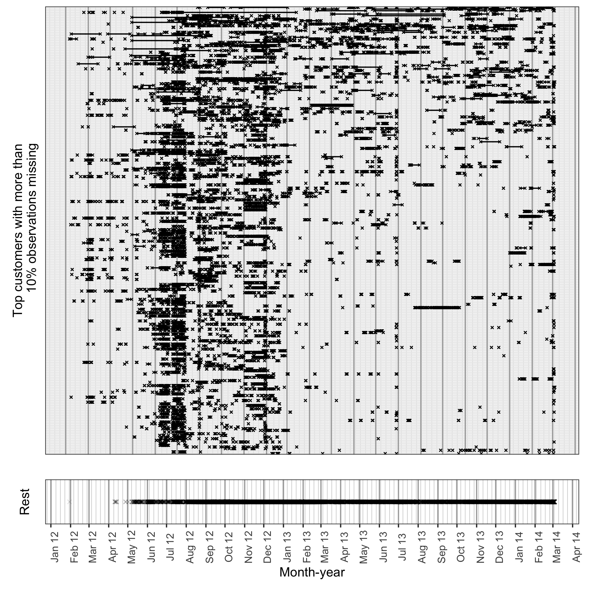

```{r setup, include=FALSE}
knitr::opts_chunk$set(echo = FALSE, cache=TRUE, messages=FALSE, warning=FALSE)
# Make sure you have the latest version of rmarkdown and bookdown
#devtools::install_github("rstudio/rmarkdown")
#devtools::install_github("rstudio/bookdown")
library(ggplot2)
library(gravitas)
library(gracsr)
library(ggdendro)
library(dplyr)
library(readr)
library(visdat)
library(ggplot2)
library(tidyverse)
library(naniar)
library(here)
library(tsibble)
library(knitr)
```

```{r external, include = FALSE, cache = FALSE}
knitr::read_chunk(here('script/smart_meter.R'))
```

# Introduction

<!-- Description of data available -->
The Smart Grid, Smart City (SGSC) project, which rolled out Australia's first commercial-scale smart grid was implemented across eight local government areas in New South Wales (NSW). Data from more than 13,000 household electricity smart meters is obtained as part of that project. It provides half-hourly energy usage and demographic data for Australia, as well as detailed information on appliance use, climate, retail and distributor product offers, and other related factors. The trials were based in Newcastle, New South Wales, but also covered areas in Sydney CBD, Newington, Ku-Ring-Gai, and the rural township of Scone. The load time series is asynchronous as it is observed for these households for unequal time lengths and consists of missing observations.

\noindent The massive amount of data generated in such projects could be overwhelming for analysis. Electricity utilities can utilize the consumption patterns of customers to develop targeted tariffs for individual groups and alleviate the problem of volatility in production by capitalizing on the flexibility of consumers. Beyea (2010) has pointed out, there has been little discussion or exploration of the full potential of these data bases and their benefits can reach beyond the original intentions for collecting these data. Thus, there is a scope to investigate and analyze these data in various ways for a greater understanding of consumption patterns and how they correlate with other economic, physical or geographical factors. In this work, we are interested to see how we can utilize this dataset to group different customers with similar periodic behavior. Towards this goal, this chapter aims to: (a) describe the contents of the data set in SGSC database that we can utilize, and (b) propose a clustering algorithm to group customers with similar periodic behaviors. The distance metric introduced in Chapter 2 will be the inputs for this cluster analysis. One of the advantages of using our 
approach is that the technique is based on probability distributions instead of raw data. Many clustering approaches are limited by the type of noisy, patchy, and unequal time-series common in residential data sets. Since the distance measure considered is based on differences in probability distribution of time series, it is likely to be less sensitive to missing or noisy data.


The following contributions are made through the following chapter:

 * Present a cluster analysis of SGSC dataset to group households with similar periodic behavior
 * Cluster validation by relating to external data


## Common load clustering techniques of smart meter data

The foundation for this study is Tureczek2017-pb, which conducts a systematic review of the current state of the art in smart meter data analytics, which evaluates approximately 2100 peer-reviewed papers and summarizes the main findings. None of the 34 selected papers which focus on clustering consumption are based on Australian smart meter data. The clustering is frequently applied directly to the raw data without scrutinizing for auto correlation and periodicity. The algorithm most ubiquitously employed is K-Means. But the omission of the time series structure or correlation in the analysis while employing K-Means leads to inefficient clusters. Principal Component Analysis or Self-Organizing Maps removes correlation structures and transitions the data to a reduced feature space, but it comes at a cost of interpretability of the final results. @Tureczek2018-ha has shown that a transformation of data to incorporate autocorrelation before K-Means clustering can improve performance and enable K-Means to deliver smaller clusters with less within-cluster variance. However, it does not explain the cluster composition by combining it with external data. Some papers present pre-processing of the smart-meter data before clustering through principal component analysis or factor analysis for dimensionality reduction or self-organizing maps for 2-Dimensional representation of the data (@Ndiaye2011-pf). Other algorithms used in the literature include k-means variations, hierarchical methods and k-medoids based on a greedy algorithm have been designed to select typical periods in the time series. As the methods are often situation specific, 
it makes sense to compare them on the performance rather than any standard performance metric. A type of clustering based on information theory such as Shannon or Renyi entropy and their variants are addressed in , which differs from typical methods adopted for electricity consumer classification, based on the Euclidean distance notion. @Motlagh2019-yj presents strategy to address the problems on patchy, and unequal time-series common in residential data sets by converting load time series into map models. Most time-series clustering models are limited to handling time domain with same start and end date and time. Most of the solutions to handle this like longest common subsequence, dynamic time warping are prone to computational limit with increased length of the series.


<!-- Electricity smart meter technology is increasingly being deployed in residential and commercial buildings. For example, in the state of Victoria, Australia, it is a state government policy that all households have a smart meter fitted (Victoria State Government, 2015), which has resulted in 97% of the approximately 2.1 million households in Victoria having a smart meter installed in their home. These smart meters collect energy usage information at half-hourly intervals, resulting in over 35 billion half-hourly observations per year across all households in the state. Clustering electricity consumption patterns can enable electricity utilities to develop targeted tariffs for individual groups alleviating the problem of volatility in production by capitalizing on the flexibility of consumers. -->

<!-- Clustering households using only smart meter consumption data could also provide value in a societal setting by combining the findings and external data like weather conditions, socio-economic or other demographic factors of those households. -->

<!-- Background literature and shortcomings -->


# Preliminary exploratoration

## Electricity demand data

<!-- _Electricity use interval reading data_   -->
<!-- The data from [SGSC consumer trial data](https://data.gov.au/data/dataset/smart-grid-smart-city-customer-trial-data) is available through [Department of the Environment and Energy](https://data.gov.au/data/organization/doee). -->


### Getting data
The entire data is procured from CSIRO. A subset of this data is also available from [SGSC consumer trial data](https://data.gov.au/data/dataset/smart-grid-smart-city-customer-trial-data) is available through [Department of the Environment and Energy](https://data.gov.au/data/organization/doee). It consists of the following data sets. 
_1. CustomerData:_ 78720 customers with 62 variables about them 
_2. EUDMData:_ 300 billion half-hourly consumption level data  
_3. OffersData:_ Method of contact to customer to join SGSC customer trial, either door-to-door (D2D) or via Telesales  
_4. PEResponseData:_ Peak Events response customer wise  
_5. PETimesData:_ Peak Events time stamps  

Only _CustomerData_ and _EUDMData_ are relevant for the clustering goals of this paper. _EUDMData_ contains half-hourly general supply in KwH for 13,735 customers, resulting in 344,518,791 observations in total. `CustomerData` provides demographic data for 78,720 customers with information on their Local Government Area amongst others.


### Missing Data

Electricity usage for some customers may become unavailable due to power outage or not recording their usage properly, thus resulting in implicit missing values in the database. It is interesting to explore where missing-ness occurs or if there is a relationship between the underlying missing patterns. We use the R package `tsibble` to do this. 

```{r, out.width="100%"}

```


## LGA and weather

Since the smart meters have been installed at different dates for each household, it is reasonable to assume that the records are obtainable for different time lengths
for each household. Since, general supply is available for only 13,735 customers, we will restrict ourselves to look at the LGA information for these customers only. We find that there are only 26 LGA that is covered for these customers.


_Weather data_  
This data is obtained through [Australian Government Bureau of Meteorology](BOM)(http://www.bom.gov.au/) and provides hourly data for nearest weather stations for all the LGAs


This section familiarizes the 13,000 SGSC households through visualization and provide a detailed layout of data structures (like missing observations/number of customers/number of observations) and also the external data that needs to be utilized for validating the clustering process. The [ABS TableBuilder](https://www.abs.gov.au/websitedbs/censushome.nsf/home/tablebuilder) has census data from 2011 and 2016. The data is at SA2 and LGA levels. However, some of the LGA in NSW changed between 2011 and 2016 and hence there would not be a one-to-one correspondence between the LGAs. Weather, notably temperature (and humidity) can be the main driver(s) for energy usage. In NSW many households have electric heaters so their use can impact winter energy use and air-conditioners can impact summer energy use. Relevant weather data could be obtained from the [Bureau of Meteorology](www.bom.gov.au). Some weather stations have 30 minute (sometimes even smaller interval) weather data. Potentially, there could be lag effects of weather on energy usage which should be considered.

\noindent A dataset of 100 SGSC homes has been used to lay out the structure to be used for analyzing the big dataset. The smaller dataset contains half-hourly kwh values form 2012 to 2014 and has asynchronous time series distributed evenly over the observation period (Figure \ref{fig:elec-raw}), similar to the bigger data set. Figure \ref{fig:count-gaps} can be used to interpret missingness in the data, where the customers are arranged from maximum to minimum missing. It looks like data is most missing before 2013 and for a particular date in 2014.

```{r load-elec, message = FALSE, warning=FALSE}

```

```{r miss-data}
empty_as_na <- function(x){
    if("factor" %in% class(x)) x <- as.character(x) ## since ifelse wont work with factors
    ifelse(as.character(x)!="", x, NA)
}

```

```{r vismiss, eval = FALSE}
## transform all columns
customer_data <- customer_data %>% mutate_each(funs(empty_as_na)) 


vis_miss(customer_data, warn_large_data = FALSE) + 
  theme(axis.text.x = element_text(angle = 90, size = 5))
```


```{r miss-var, eval = FALSE}
gg_miss_var(customer_data) + theme_bw() +
  theme(axis.text.y = element_text(size = 4))
```

```{r,eval=FALSE}
elec_ts <- read_rds("data/elec_ts.rds")
```


```{r raw-50, fig.height = 8, fig.cap="The raw data for 50 households are shown. It looks like there is a lot of missing values and unequal length of time series along with asynchronous periods for which data is observed.", eval = FALSE}

```

# Clustering methodology


<!-- In contrast to models, a feature-based strategy is used to explicitly define or automatically extract the curves’ key time features, for instance by application of PCA on the daily curves [ -->


<!-- Most papers discussed in Tureczek2017-pb fail to accept smart meter readings as time series data, a data type which contains a temporal component. The omission of the essential time series features in the analysis leads to the application of methods that are not designed for handling temporal components. K-Means ignores autocorrelation, unless the input data is pre-processed. The clusters identified in the papers are validated by a variety of indices, with the most prevalent -->
<!-- being the cluster dispersion index (CDI) [22–24], the Davies–Bouldin index (DBI) [25,26] and the mean index adequacy (MIA) [8,13]. -->


## The proposed load-clustering technique

The existing work on clustering probability distributions assumes we have an iid sample $f_1(v),\dots,f_n(v)$, where $f_i(v)$ denotes the probability distribution from observation $i$ over some random variable $v = \{v_t: t = 0, 1, 2, \dots, T-1\}$ observed across $T$ time points. In our work, we are using $i$ as denoting a household and the underlying variable as the electricity demand. So $f_i(v)$ is the distribution of household $i$ and $v$ is electricity demand.

We want to cluster distributions of the form $f_{i,j,k}(v)$, where $i$ and $j$ denote 


Consider a harmony table consisting of many harmonies, each of the form $(A, B)$, such that $A = \{ a_j: j = 1, 2, \dots, J\}$ and $B = \{ b_k: k = 1, 2, \dots, K\}$. Each household consists of a $J*K$ distributions one harmony. We compute the distributional difference
between $(A, B)$ for the $s^{th}$ household using $wpd_{{s}}(A,B)$.
$wpd_{{s}}(A,B)$ denotes the normalized weighted-pairwise distributional distances between $(A, B)$ and is a feature which measures distributional difference between harmonies. If we have $H_{N_C}$ harmonies in the harmony table, then for each household we have a vector of $wpd_{{s}}$ of $H_{N_C}$ elements with each element corresponding to one harmony. We aim to have pockets of households showing similar periodic behavior by conidering $wpd$ vlaues for different harmonies and some time series features. The features should also characterize probability distributions of different household.

<!-- grouping probability distributions across a harmony. This clustering algorithm is adopted to remove or appropriately adjust for auto correlation and unequal length in the data. The method could be further extended by clustering probability distributions conditional on one or more cyclic granularities. The following are some of the advantages of our proposed method. -->

<!-- Trend and seasonality are common features of time series, and it is natural to characterize a time series by its degree of trend and seasonality. By considering the probability distributions through the use of $wpd_{norm_{s,t}}(A,B)$, these features of the time series are lost and hence there is no need to de-trend or de-seasonalize the data before performing the clustering algorithm. -->

 - Dimension reduction: If each $P_{i, j, k}$ be considered to be a point in the space, key $i$ would have $mp$ dimensions as opposed to $n_i$ dimensions in case of considering raw data. Hence for a large number of observations ($n_i>>mp$), this approach benefits by transitioning to a lower dimension.
 
 - Avoid loss of information due to aggregation: This approach ensures key characteristic information of the data is not lost due to averaging or aggregation measures in an attempt to transition to a lower dimension. Hence, this approach could be thought to somehow balance the drawback of considering raw data or aggregated data.

- Robustness to outliers: This approach could be adapted to be robust to outliers and extreme behaviors by trimming the tails of the probability distributions.

- Non-synchronized observed time periods: Considering probability distribution would imply the clustering process can handle keys that are observed over periods of time that are overlapping but don't necessarily coincide.

- Similar periodic behavior: Since cyclic granularities are considered instead of linear granularities, clustering would group keys that have similar behavior across these cyclic granularities. This implies they will be grouped according to their periodic behavior and not on the linear stretch of time over which they are observed.

The methodology is again applied to the 100 households and some preliminary results are presented. Figure \ref{fig:mds} show the multidimensional scaling of the 100 households with colors representing groups presented by hierarchical clustering method. The clusters have very different size and are far apart with no overlapping. They should be distinct from each other in terms of their periodic patterns. Figure \ref{fig:cyclic-cluster} shows the cyclic presentation of time where it could be viewed in details how these clusters are different with respect to the periodic pattern (day-of-week, hour-of-day). Distribution of energy demand across day-of-week and hour-of-day for three groups clustered through the proposed methodology is shown. For group-1, the morning peak looks very sharp, for group-2 the morning and evening peaks are rounded and spread over few hours, for group-3 peaks are less rounded. They differ in their relationship between 75th and 90th percentile. Also, the 75th and 90th percentile of group 2 are quite close, implying the behavior of this group is more regular.

 <!-- - Handling autocorrelation: Autocorrelation in the time series is likely to get removed from considering probability distributions and cyclic granularities in the clustering algorithm. -->


```{r,warning=FALSE, message=FALSE,eval = FALSE}
library(readr)
library(here)
library(dplyr)
library(tsibble)
library(gravitas)
library(purrr)


set.seed(7777)
all_data <- read_rds(here("../paper-hakear/paper/sim_table/all_data_scalar.rds"))
sm_cust_data <- read_rds(here("../paper-hakear/paper/data/sm_cust_data.rds"))

sm_list <- sm_cust_data %>%
  filter(customer_id == "10006414") %>% 
  create_gran("day_week") %>% 
  tibble() %>% 
  ungroup() %>% 
  group_split(day_week)


p <- seq(0.01, 0.99,0.01)

dist_list <- purrr::map(sm_list, function(x){
    map(p, function(y){
       quantile(x$general_supply_kwh, probs = y)
    }) %>% unlist()
}) %>% bind_rows(.id = "gran_id")
# 
# lag <- dist_list[2,][-1] %>% t() %>% 
#   tibble() %>% 
#   lag() %>% acf()
  
```


```{r mds, warning=FALSE, message=FALSE, fig.cap="Multidimensional scaling of the 100 households is shown along with the groups formed by the hierarchical clustering.", eval = FALSE}
set.seed(7777)
sm_unique_cust <- sm_cust_data %>% distinct(customer_id)
sm_cust_samp <- sm_cust_data %>% 
  #filter(customer_id %in% sm_30) %>% # for demo show 30 customers
  #filter(year(reading_datetime) == 2012) %>% #for demo just show one column
  as_tsibble(index = reading_datetime,
             key = customer_id) %>% 
  create_gran("day_week") %>% 
  create_gran("hour_day")

#all_data <- write_rds(all_data, "paper/sim_table/all_data.rds")

facet_variable = "day_week"
x_variable = "hour_day"

one_harmony_data <- all_data %>%
  #filter(customer_id %in% sm_30) %>% # for demo show 30 customers
  filter(facet_variable == "day_week",
         x_variable == "hour_day") %>% 
  mutate(customer_id = as.character(customer_id))

mds<- one_harmony_data %>%
  select(customer_id, facet_variable, x_variable, wpd_norm) %>% 
  dist() %>%          
  cmdscale() %>%
  as_tibble()

colnames(mds) <- c("Dim.1", "Dim.2")
rownames(mds) <- unique(one_harmony_data$customer_id)
mds <- mds %>%
  mutate(customer_id = as.character(unique(one_harmony_data$customer_id))) %>%
  select((customer_id)
         , Dim.1, Dim.2)

# ggpubr::ggscatter(mds,
#                   x = "Dim.1",
#                   y = "Dim.2", 
#                   label = rownames(mds),
#                   size = 1,
#                   repel = TRUE) 

# clustering as well

d = one_harmony_data %>%
  select(customer_id, facet_variable, x_variable, wpd_norm) %>% 
  dist()

hc = stats::hclust(d,method="complete")
#plot(hc)
groups<-cutree(hc, k=3)

all_data_cluster <- cbind(one_harmony_data, groups) %>% 
  left_join(mds, by = "customer_id") %>% 
  mutate(groups = as.factor(groups))


# q2 <- ggpubr::ggscatter(all_data_cluster,
#                   x = "Dim.1",
#                   y = "Dim.2", 
#                   label = rownames(mds),
#                   color = "groups",
#                   size = 1,
#                   repel = TRUE)

q2 <- all_data_cluster %>% 
  ggplot() +
  geom_point(aes(x = Dim.1, y = Dim.2, color = groups)) +
  scale_color_viridis_d()


 q2
```

```{r linear-cluster, eval = FALSE}
group1 <- all_data_cluster %>% 
  filter(groups == 1)

group2 <- all_data_cluster %>% 
  filter(groups == 2)

group3 <- all_data_cluster %>% 
  filter(groups == 3)


g1 <- sm_cust_samp %>% 
  filter(customer_id %in% group1$customer_id) %>% 
   ggplot(aes(x=reading_datetime, 
             y= general_supply_kwh), alpha = 0.5) + 
  geom_line() +
  scale_fill_gradient2() +
  facet_wrap(~customer_id, nrow = 1) +
  theme(strip.text.x = element_blank()) +
  theme_void() +
  ylab("group 1")

g2 <- sm_cust_samp %>% 
  filter(customer_id %in% group2$customer_id) %>% 
   ggplot(aes(x=reading_datetime, 
             y= general_supply_kwh), alpha = 0.5) + 
  geom_line() +
  scale_fill_gradient2() +
  facet_wrap(~customer_id, nrow= 1) +
  theme(strip.text.x = element_blank()) +
  theme_void() +
  ylab("group 2")


g3 <- sm_cust_samp %>% 
  filter(customer_id %in% group3$customer_id) %>% 
   ggplot(aes(x=reading_datetime, 
             y= general_supply_kwh), alpha = 0.5) + 
  geom_line() +
  scale_fill_gradient2() +
  theme(strip.text.x = element_blank()) +
  theme_void() +
  ylab("group 3")


# g1/g2 + g3
  
```


```{r cyclic-cluster, warnings = FALSE, message = FALSE, fig.cap = "Distribution of energy demand across day-of-week and hour-of-day for three groups clustered through the proposed methodology. For group-1, the morning peak looks very sharp, for group-2 the morning and evening peaks are rounded and spread over few hours, for group-3 peaks are less rounded. They differ in their relationship between 75th and 90th percentile.", eval = FALSE}
cg1 <- sm_cust_samp %>% 
  filter(customer_id %in% group1$customer_id) %>% 
  prob_plot("day_week", "hour_day", response = "general_supply_kwh",
            plot_type = "quantile", symmetric = TRUE, quantile_prob = c(0.1, 0.25, 0.5, 0.75, 0.9)) +
  scale_color_brewer(palette = "RdPu") + ggtitle("group 1") +
  scale_x_discrete(breaks = seq(0, 23, 5))


cg2 <- sm_cust_samp %>% 
  filter(customer_id %in% group2$customer_id) %>% 
  prob_plot("day_week", "hour_day", response = "general_supply_kwh",
            plot_type = "quantile", symmetric = TRUE, quantile_prob = c(0.1, 0.25, 0.5, 0.75, 0.9)) +
  scale_color_brewer(palette = "RdPu") + ggtitle("group 2") +
  scale_x_discrete(breaks = seq(0, 23, 5))


cg3 <- sm_cust_samp %>% 
  filter(customer_id %in% group3$customer_id) %>% 
  prob_plot("day_week", "hour_day", response = "general_supply_kwh",
            plot_type = "quantile", symmetric = TRUE, quantile_prob = c(0.1, 0.25, 0.5, 0.75, 0.9)) +
  scale_color_brewer(palette = "RdPu") + ggtitle("group 3") +
  scale_x_discrete(breaks = seq(0, 23, 5))

cg1 
cg2
cg3

```


###  Distinction, repeatability, and robustness metrics

We will also determine if any identified clusters or patterns are indeed statistically meaningful in the sense that they actually exist and are not a random allocation. Hence, the robustness of this methodology is tested through simulations. This section will contain the data structure and detailed methodology to be employed for the cluster analysis. The cluster validation indexes like average silhouette width (ASW) is to be employed here to check how homogeneous these clusters are. At this stage, we need to define the aim of clustering as there could be various aims of clustering like between-cluster separation, within cluster homogeneity: low distances, within-cluster homogeneous distributional shape, good representation of data by centroids, little loss of information, high density without cluster gaps, uniform cluster sizes, stability and others. Finally, how distinct they are and how can we summarize the main features of the cluster would be discussed here.

## Cluster validation

**Internal cluster validation** uses the internal information of the clustering process to evaluate the goodness of a clustering structure without reference to external information. It can be also used for estimating the number of clusters and the appropriate clustering algorithm without any external data.  

**External cluster validation** consists in comparing the results of a cluster analysis to an externally known result, such as externally provided class labels. It measures the extent to which cluster labels match externally supplied class labels. Since we know the “true” cluster number in advance, this approach is mainly used for selecting the right clustering algorithm for a specific data set.  

**Relative cluster validation** evaluates the clustering structure by varying different parameter values for the same algorithm (e.g.,: varying the number of clusters k). It’s generally used for determining the optimal number of clusters.  

Interval validation includes
_Compactness or cluster cohesion:_ Measures how close are the objects within the same cluster. A lower within-cluster variation is an indicator of a good compactness (i.e., a good clustering). The different indices for evaluating the compactness of clusters are base on distance measures such as the cluster-wise within average/median distances between observations.

_Separation:_ Measures how well-separated a cluster is from other clusters. The indices used as separation measures include:
distances between cluster centers
the pairwise minimum distances between objects in different clusters

_Connectivity:_ corresponds to what extent items are placed in the same cluster as their nearest neighbors in the data space. The connectivity has a value between 0 and infinity and should be minimized.

Generally most of the indices used for internal clustering validation combine compactness and separation measures.


## Combining findings with external data

The robustness of this clustering method is provided through practical explanation of the formed clusters, visualizing how they relate to any weather, socio-economic or geographical conditions. 
<!-- Furthermore, we ensure that a cross-validation algorithm is employed leading to robust clusters.  -->
<!-- We will present how matching other data like geography, census and weather would help us in validating our clustering approach. -->

<!-- ### Geography -->

<!-- We will present how mapping the customers to their respective LGA's and reflect on the clusters obtained in the earlier section. The data is at SA2 and LGA levels. However, some of the LGAs in NSW changed between 2011 and 2016 and hence there would not be a one-to-one correspondence between the LGAs. -->

<!-- ### Census -->

<!-- We will present how mapping the customers to their respective income and population level reflect on the clusters obtained in the earlier section. The [ABS TableBuilder](https://www.abs.gov.au/websitedbs/censushome.nsf/home/tablebuilder) has census data from 2011 and 2016.  -->

<!-- ### Weather -->

<!-- Weather, notably temperature (and humidity) can be the main driver(s) for energy usage.  In NSW many households have electric heaters so their use can impact winter energy use and air-conditioners can impact summer energy use. Relevant weather data could be obtained from the [Bureau of Meteorology](www.bom.gov.au). Some weather stations have 30 minute (sometimes even smaller interval) weather data. Potentially, there could be lag effects of weather on energy usage which should be considered. -->

## Conclusion

This section will cover some drawback of this clustering method and potential extensions of this work.


# R packages

The implementation for our framework for the first paper is available in the R package [`gravitas`](https://github.com/Sayani07/gravitas) and that for the second paper is made available in the package [`hakear`](https://github.com/Sayani07/hakear) for ease of use in other applications.


# Discussion

The final chapter of my thesis will consist of the concluding remarks of the whole thesis and possible future extensions.


<!-- <Earlier write up> -->
<!-- ## Introduction -->


<!-- <!-- Description of data available --> -->
<!-- The Smart Grid, Smart City (SGSC) project, which rolled out Australia's first commercial-scale smart grid was implemented across eight local government areas in New South Wales (NSW). Data from more than 13,000 household electricity smart meters is obtained as part of that project. It provides half-hourly energy usage and demographic data for Australia, as well as detailed information on appliance use, climate, retail and distributor product offers, and other related factors. The trials were based in Newcastle, New South Wales, but also covered areas in Sydney CBD, Newington, Ku-Ring-Gai, and the rural township of Scone. The load time series is asynchronous as it is observed for these households for unequal time lengths and consists of missing observations. -->

<!-- The massive amount of data generated in such projects could be overwhelming for analysis. Electricity utilities can utilize the consumption patterns of customers to develop targeted tariffs for individual groups and alleviate the problem of volatility in production by capitalizing on the flexibility of consumers. Beyea (2010) has pointed out, there has been little discussion or exploration of the full potential of these data bases and their benefits can reach beyond the original intentions for collecting these data. Thus, there is a scope to investigate and analyze these data in various ways for a greater understanding of consumption patterns and how they correlate with other economic, physical or geographical factors. In this work, we are interested to see how we can utilize this dataset to group different customers with similar periodic behavior. Towards this goal, this chapter aims to: (a) describe the contents of the data set in SGSC database that we can utilize, and (b) propose a clustering algorithm to group customers with similar periodic behaviors. The distance metric introduced in Chapter 2 will be the inputs for this cluster analysis. One of the advantages of using our  -->
<!-- approach is that the technique is based on probability distributions instead of raw data. Many clustering approaches are limited by the type of noisy, patchy, and unequal time-series common in residential data sets. Since the distance measure considered is based on differences in probability distribution of time series, it is likely to be less sensitive to missing or noisy data. -->


<!-- The following contributions are made through the following chapter: -->

<!--  * Present a cluster analysis of SGSC dataset to group households with similar periodic behavior -->
<!--  * Cluster validation by relating to external data -->


<!-- ## Introduction -->


<!-- In Australia, the federal government and fourteen partners, electricity distribution and transmission companies, technology companies, universities and CSIRO, invested AUD 490 million in the Smart Grid Smart City (SGSC) field trial. One of the largest commercial-scale smart grid technology assessment projects worldwide, SGSC is implemented across eight local government areas in New South Wales (NSW), covering 30,000 dwellings since 2009. -->
<!-- The SGSC database is publicly available through the Information Clearing House (ICH) (Ausgrid 2014). It is a massive database covering most physical aspects of the smart grid, as well as, aspects of users’ demographics. -->


<!-- Customer Sale and Half-Hour Power Consumption -->
<!-- and Generation Datasets -->

<!-- This is a big portion of the data from about 5900 households who accepted a -->
<!-- product out of about 24,000 offers made to the target population. Spatial resolution -->
<!-- down to anonymous individual dwellings [Customer Sales: Households: -->
<!-- Customer_Key] is also given based on {[Postcode], [Local Government Area], or -->
<!-- [Suburb Name]}. In order to make these datasets easily understandable, here we -->
<!-- present a new narrative approach to explain the available data fields and their -->
<!-- interdependencies in a brief yet logical and memorisable way as follows: -->

<!-- The [Half-Hour Consumption and Generation] data provide kWh readings of -->
<!-- the actual flow of energy. This includes the electricity supply imported from the -->
<!-- grid [General Supply] which is the main source of energy under any of the applied -->
<!-- tariffs, import during off-peak or for a control load [Off Peak], gross or net values of -->


<!-- domestic (often solar) electricity that is exported back to the grid [Generation]. The -->
<!-- [Peak Events] data field gives the details of every event [Event Key] including its -->
<!-- [Type], [Date], [Start Time], and [End Time]. Accordingly, the entire sequence of -->
<!-- user demand responses to any of the cost-reflective products is available in the -->
<!-- dataset to evaluate the project objectives as previously discussed. -->


<!-- Electricity smart meter technology is increasingly being deployed in residential and commercial buildings. For example, in the state of Victoria, Australia, it is a state government policy that all households have a smart meter fitted (Victoria State Government, 2015), which has resulted in 97% of the approximately 2.1 million households in Victoria having a smart meter installed in their home. These smart meters collect energy usage information at half-hourly intervals, resulting in over 35 billion half-hourly observations per year across all households in the state. Clustering electricity consumption patterns can enable electricity utilities to develop targeted tariffs for individual groups alleviating the problem of volatility in production by capitalizing on the flexibility of consumers. Clustering households using only smart meter consumption data should provide value in a societal setting by combining the findings and external data like weather conditions, socio-economic or other demographic factors of those households. -->

<!-- <!-- Description of data available --> -->
<!-- Data from more than 13,000 household electricity smart meters is obtained as part of the Smart Grid Smart City (SGSC) project (2010-2014). It provides one of the few linked sets of customer time of use (half-hour increments) and demographic data for Australia, as well as detailed information on appliance use, climate, retail and distributor product offers, and other related factors. The trials were based in Newcastle, New South Wales, but also covered areas in Sydney CBD, Newington, Ku-Ring-Gai, and the rural township of Scone. This data set includes electricity use interval readings for each customer for every 30 minutes and demographic data for Australia, as well as detailed information on appliance use, climate, peak events; peak events response and retail and distributor product offers. The load time series is asynchronous as it is observed for these households for unequal time lengths and consists of missing observations. -->


<!-- <!-- Background literature and shortcomings --> -->
<!-- The foundation for this study is Tureczek2017-pb, which conducts a systematic review of the current state of the art in smart meter data analytics. The paper evaluates approximately 2100 unique peer-reviewed papers and presents three main findings related to clustering methods, data and cluster validation. None of the 34 selected papers which focus on clustering consumption are based on Australian smart meter data. The clustering is frequently applied directly to the raw data without investigating time series features like auto correlation and periodicity. The application of smart meter data to cluster electricity consumption using K-Means is ubiquitous. But the omission of the time series structure or correlation in the analysis while employing K-Means leads to inefficient clusters. Principal Component Analysis or Self-Organizing Maps removes correlation structures and transitions the data to a reduced feature space, but it comes at a cost of interpretability of the final results. @Tureczek2018-ha has shown that the clever transformation of data before K-Means clustering can improve performance and enable K-Means. However, it does not explain the cluster composition by combining it with external data. We propose the following for the study of the Australian smart meter data. -->

<!-- Analysis for more than 13,000 household -->
<!-- electricity smart meters are included in this chapter. The following contributions are made through the following chapter: -->

<!-- - Presenting a cluster analysis of Australian residential electricity consumption data. -->

<!-- - Transformation and extraction of input data features enabling K-Means to account for other time series features in the clustering. This can easily be extended to include other data structures. -->

<!-- - Cluster validation by relating to external data -->


<!-- ## Preliminary exploratoration -->

<!-- This section familiarizes the 13,000 SGSC households through visualization and provide a detailed layout of data structures (like missing observations) and also the external data that needs to be utilized for validating the clustering process. -->

<!-- ## Common load clustering techniques of smart meter data -->

<!-- This section will discuss some literature on clustering techniques that were applied to smart meter customers in the past. -->

<!-- ## The proposed load-clustering technique -->

<!-- We employ a cluster analysis technique to obtain pockets of households showing similar periodic behavior by grouping probability distributions across a cyclic granularity. This clustering algorithm is adopted to remove or appropriately adjust for auto correlation and unequal length in the data. The method could be further extended by clustering probability distributions conditional on one or more cyclic granularities. Further, we elaborate on the effect of missing data and how it is handled in the clustering process. -->

<!-- ### Methodology, results, and discussions -->

<!-- This will contain the data structure and detailed methodology to be employed for the cluster analysis. -->

<!-- ### Distinction, repeatability, and robustness metrics -->

<!-- This section will cover the homogeneity and heterogeneity of the clusters, how distinct they are and summarize the main features of the cluster. -->

<!-- <!-- ## Comparison with traditional load clustering methods --> -->

<!-- <!-- This section will cover the homogeneity and heterogeneity of the clusters, how distinct they are and summarize the main features of the cluster. --> -->


<!-- ## Combining findings with external data -->

<!-- We will also determine if any identified clusters or patterns are indeed statistically meaningful in the sense that they actually exist and are not a random allocation. We aim to do this by providing a practical explanation of the formed clusters, visualizing how they relate to any weather, socio-economic or geographical conditions. Furthermore, we ensure that a cross-validation algorithm is employed leading to robust clusters.  -->
<!-- We will present how matching other data sources might help us in validating our clustering approach. -->

<!-- ### Geography -->

<!-- We will present how mapping the customers to their respective LGA's and reflect on the clusters obtained in the earlier section. -->

<!-- ### Census -->

<!-- We will present how mapping the customers to their respective income and population level reflect on the clusters obtained in the earlier section. -->


<!-- ## Conclusion -->

<!-- This section will cover some drawback of this clustering method and potential extensions of this work. -->

<!-- There are many cluster analysis methods that can produce quite different clusterings on the same dataset. Cluster validation is about the evaluation of the quality of a clustering; “relative cluster validation” is about using such criteria to compare clusterings. This can be used to select one of a set of clusterings from different methods, or from the same method ran with different parameters such as different numbers of clusters. There are many cluster validation indexes in the literature. Most of them attempt to measure the overall quality of a clustering by a single number, but this can be inappropriate. There are various different characteristics of a clustering that can be relevant in practice, depending on the aim of clustering, such as low within-cluster distances and high between-cluster separation. In this paper, a number of validation criteria will be introduced that refer to different desirable characteristics of a clustering, and that characterise a clustering in a multidimensional way. In specific applications the user may be interested in some of these criteria rather than others. A focus of the paper is on methodology to standardise the different characteristics so that users can aggregate them in a suitable way specifying weights for the various criteria that are relevant in the clustering application at hand. -->