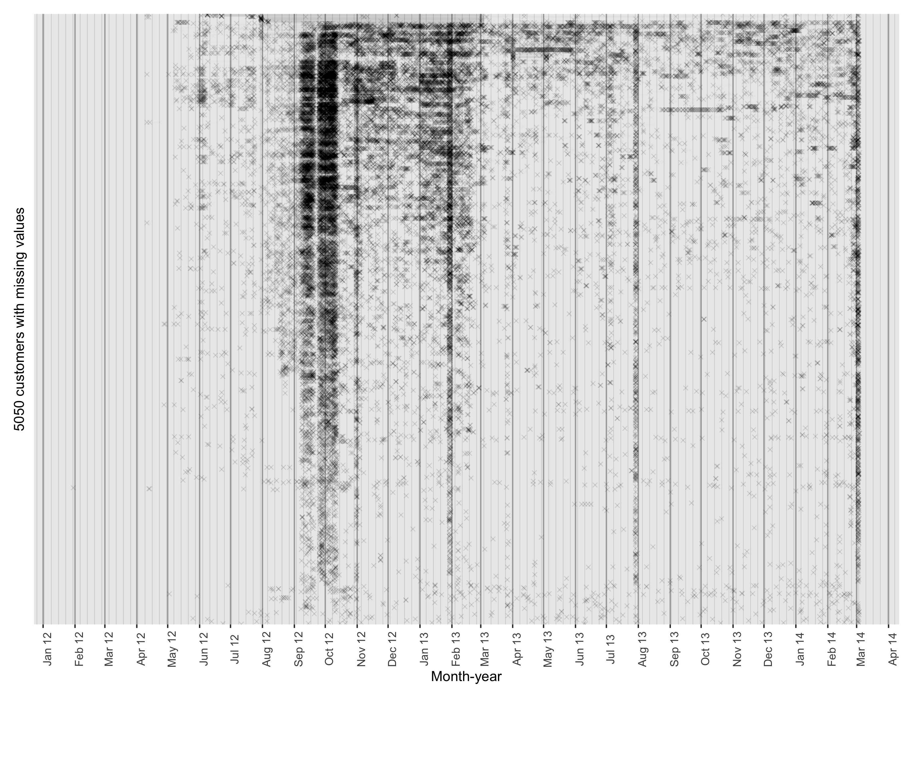
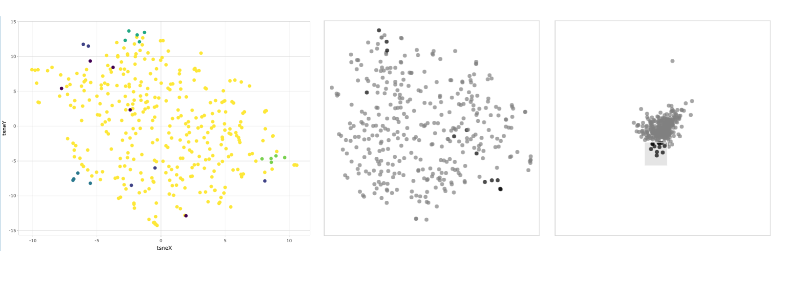

```{r initial, echo = FALSE, cache = FALSE, include = FALSE}
# knitr::opts_chunk$set(echo = FALSE, cache=TRUE, messages=FALSE, warning=FALSE)
# Make sure you have the latest version of rmarkdown and bookdown
#devtools::install_github("rstudio/rmarkdown")
#devtools::install_github("rstudio/bookdown")
options("knitr.graphics.auto_pdf" = TRUE,
    tinytex.verbose = FALSE)
library(knitr)
opts_chunk$set(
 echo = FALSE, warning = FALSE, message = FALSE, comment = "#>",
 fig.path = "figure/", fig.align = "center", fig.show = "hold",
 cache = TRUE, cache.path = "cache/",
 out.width = ifelse(is_html_output(), "100%", "\\textwidth")
)
knitr::opts_knit$set(root.dir = here::here())
```


```{r external, include = FALSE, cache = FALSE}
knitr::read_chunk('script/main.R')
```


```{r load-lib}

```


```{r mytheme-application}
```

```{r theme_characterisation}
```

```{r theme-validation}

```


```{r raw-data-50, out.width = "100%", fig.cap=" The raw half-hourly energy usage for $50$ sampled households is plotted along the y-axis versus time in a linear scale.  Each of these series is associated with a single customer. It looks like there is a lot of missing values and unequal length of time series along with asynchronous periods for which data is observed. No insightful behavioral pattern could be discerned from this view other than when the customer is not at home."}

knitr::include_graphics("figs/raw_plot_cust.png") # look at smart-meter.R for the code
```


(ref:missing-data) Investigating the temporal location of missing values for customers who have implicit missing values. There are $13,735$ customers in the data set, with 8,685 having no missing values and the remaining $5,050$ having at least one missing value. Each cross represents a missed observation in time, while the line connecting two dots represents continuous missingness over time. Missing values occur at random times and do not appear to follow a pattern, although there is a higher concentration of missing values in September and October 2012 for the majority of customers. This plot is inspired by @wang2020tsibble.

```{r missing-data, fig.cap="(ref:missing-data)"}

```


_Prototype selection method_

S1. Robust scaling is applied to each customer.

S2. $50^{th}$ percentile for each category for each granularity is obtained for each customers. So we have a data structure with  $356$ rows and $(24 + 12 + 2)$ variables corresponding to $50^{th}$ percentile for each hour-of-day, month-of-year and weekend-weekday.

S3. Apply principal components and restrict the results down to the first six principal components (which makes up approximately 85% of the variance explained in the data) to use with the grand tour.

S4. Run t-SNE using the default arguments on the complete data (sets the perplexity to equal 30 and performs random initialisation). We then create a linked tour with t-SNE layout with liminal as shown in Figure 4.

S5. We inspect of the subspace generated by the set of low-dimensional projections in tour by looking for a simplex shape while the visualization moves from one basis to another. When we brush the corners of the simplex, we find they fall on the edge of the t-SNE point cloud.
Hall, Marron, and Neeman (2005) have shown that in the extreme case of high-dimension, low-sample size data, observations are on the vertices of a simplex.

This is because in high-dimensional data analysis the curse of dimensionality reasons that points tend to be far away from the center of the distribution and on the edge of high-dimensional space. Contrary to this, is that projected data tends to clump at the center.

S6. These points should ideally correspond to different behavior with respect to all the variables considered while running PCA. 


```{r mds, out.width="100%", fig.cap="Instance selection using tours and projecting the points in a lower dimensional tsne cloud."}

```

```{r prototype-data-pick}
```


```{r assemble}
```


```{r data-pick}
```


```{r all-data}

```


```{r clustering}
```


```{r groups-24}

```


```{r tsne-fit}
```


```{r tsne-plot-supplementary, fig.cap="t-SNE summary of selected $24$ prototype customers. Each ellipse corresponds to a group after clustering using our methodology. Few customers are not enclosed inside an ellipse as they are from mixed groups and there are too few points to calculate an ellipse around them. It is important to note that the selection of prototypes is based on only $50$ percentiles, whereas, the clustering is based on all the deciles."}

```

<!-- From this set we select $4$ "anchor" customers which are far apart from each other and $5$ neighboring customers for each of these anchors. These selections were done using the granularity $hod$ space. It is important to note that when we use our proposed methodologies, it is based on all dimensions `hod`, `moy` and `wkndwday`.Fig \ref{fig:mds} shows the MDS of these 356 customers in a 2D space basis their distance on individual granularities and when all of them are combined. Our methodolgies are run on these $24$ customers, which act as a way to evaluate the proposed methodologies.  -->


<!-- . Instances may be distributed in the representation space in a reasonable manner, revealing their similarities, using this instance wise discriminative learning. A dual-level progressive similar instance selection (DPSIS) approach could also be used -->

<!-- ### Interaction of granularities -->

<!-- Consider a case in which there are only two interacting granularities of interest, $g1$ and $g2$. In contrast to the previous situation, when we could study distributions across $n_{g_1} + n_{g_2} = 5$ separate categories, with interaction, we must evaluate the distribution of the $n_{g_1}*n_{g_2}=6$ combination of categories. Consider the $4$ designs in Figure \ref{fig:interaction-gran}, where various distributions are assumed for different combinations of categories, resulting in different designs. Design $D1$ exhibits no change in distributions across $g1$ or $g2$, whereas Designs $D2$ and $D3$ alter across only $g1$ and $g2$, respectively. D4 varies across both $g1$ and $g2$ categories. D3 and D4 appear similar based on their relative differences across consecutive categories, but $D4$ also changes across facets, unlike $D3$, which has all facets look the same. -->

```{r interaction-gran, fig.cap = "The distribution of simulated variable across $g1$ conditional on $g2$ is shown through boxplots for 4 designs to extend the proposed validation designs when two granularities of interest interact. D1 has no change in distributions across different categories of $g1$ or $g2$, while D2 and D3 change across only $g1$ and $g2$ respectively. D4 changes across categories of both $g1$ and $g2$."}

```


```{r data-load-entire}
# Read the nqt distances

wkndwday <- read_rds(here("data/dist_gran_wkndwday_356cust_nqt.rds")) %>% broom::tidy()

moy <- read_rds(here("data/dist_gran_moy_356cust_nqt.rds")) %>% broom::tidy()

hod <- read_rds(here("data/dist_gran_hod_356cust_nqt.rds")) %>% broom::tidy()


# Make the distance metrics

distance <- wkndwday %>% 
  left_join(moy, by = c("item1", "item2")) %>% 
  left_join(hod, by = c("item1", "item2")) %>% 
  rename("wkndwday" ="distance.x",
         "moy" = "distance.y",
         "hod" = "distance") %>%
  mutate(item1 = as.integer(as.character(item1)),
         item2 = as.integer(as.character(item2))) 

filtered_distance <- distance %>%
  filter(!(item1 %in% c(8196183, 8508008, 8680538))) %>% 
  filter(!(item2 %in% c(8196183, 8508008, 8680538)))

total_distance <- filtered_distance %>% 
  mutate(total = wkndwday/2 + moy/12 + hod/24) 


total_distance_wide <- total_distance %>% pivot_wider(-c(2:5), 
                                                      names_from = item2,
                                                      values_from = total)


rownames(total_distance_wide) <- total_distance_wide$item1

mds_data <- total_distance_wide %>% 
  mutate_all(~replace(., is.na(.), 0)) %>%
  tibble::rownames_to_column() %>%  
  dplyr::select(-item1) %>% 
  pivot_longer(-rowname) %>% 
  pivot_wider(names_from=rowname, values_from=value) 

rownames(mds_data) <- total_distance_wide$item1

df <- mds_data[-1] %>% as.matrix()
DM <- matrix(0, ncol(mds_data), ncol(mds_data))
DM[lower.tri(DM)] = df[lower.tri(df, diag=TRUE)] # distance metric
f = as.dist(DM)


first_lot <- mds_data %>% names()

id <- c(first_lot[-1], mds_data$name[nrow(mds_data)])
```


```{r opt-clust-350, fig.cap = "Cluster separation for the 353 customers across the number of clusters is shown. When the cluster size changes from 17 to 18, the separation index drops sharply and then flattens out, resulting in the appearance of the elbow. Hence, when grouping the 353 customers, the number of clusters is taken to be 17."}

# Find optimal number of clusters

k = array()
for(i in 5:50)
{
  group <- f %>% hclust (method = "ward.D") %>% cutree(k=i)
  p <- cluster.stats(f, clustering = group, silhouette = TRUE)
  k[i]=p$sindex
}

ggplot(k %>% as_tibble %>% mutate(k = row_number()), aes(x=k, y = value)) + geom_line() + scale_x_continuous(breaks = seq(2, 50, 2), minor_breaks = 1) + xlab("number of clusters") + ylab ("separation index")
```


```{r group-353}

# plot(k, type = "l")
# 6 coming as the number of clusters with maximum silwidth

group <- f %>% hclust (method = "ward.D") %>% cutree(k=17)

cluster_result <- bind_cols(customer_id = id, group = group) %>%
  arrange(group)
# %>% 
#   mutate(divide_cust = c(rep(1, 177), rep(2, 176)))

# cluster_result %>% group_by(group) %>% count()

```


```{r data-heatmap-hod-group-entire}
legend_title <- "group"

data_pick <- read_rds(here::here("data/elec_nogap_2013_clean_356cust.rds")) %>%
  mutate(customer_id = as.character(customer_id)) %>%
  gracsr::scale_gran( method = "robust",
                      response = "general_supply_kwh")

data_group <- data_pick  %>% 
  mutate(customer_id = as.character(customer_id)) %>% 
   gracsr::scale_gran( method = "robust",
                       response = "general_supply_kwh") %>% 
  left_join(cluster_result, by = c("customer_id"))

data_heatmap_hod_group <- quantile_gran(data_group,
                                  gran1="hour_day",
                                  quantile_prob_val = c(0.25, 0.5, 0.75),
                                  group="group") %>% 
  pivot_wider(names_from = quantiles, values_from = quantiles_values) 

  
data_heatmap_hod_group$category <- factor(data_heatmap_hod_group$category, levels = 0:23)

# data_heatmap_hod_group$group <- paste("group", data_heatmap_hod_group$group, sep = "-")

hod_group_entire1 <- data_heatmap_hod_group %>% 
  filter(group<9) %>% 
  ggplot(aes(x = category)) + 
  geom_ribbon(aes(ymin = `25%`, 
                  ymax = `75%`,
                  group=group,
                  fill = as.factor(group), alpha = 0.5),
              alpha = 0.5) +
  geom_line(aes(y = `50%`,
                group=group, 
                color = as.factor(group)), size = 1)+
  facet_wrap(~group, 
             scales = "free_y",  
             nrow = 8,labeller = "label_both") + 
              #labeller = labeller(xfacet = c(`1` = "Group 2", `2` = "Group 4",`3` = "Group 1",`4` = "Group 3"))
    theme(strip.text = element_text(size = 10, margin = margin(b = 0, t = 0))) + xlab("hour-of-day") + 
  ylab("demand (in Kwh)") + 
  theme_bw()  +
  scale_x_discrete(breaks = seq(1, 24, 3))+ 
  #theme(strip.text = element_text(size = 8, margin = margin(b = 0, t = 0)))+
  theme_application() +
  scale_fill_manual(values=as.vector(okabe(n = 8)))+
  scale_color_manual(values=as.vector(okabe(n = 8)))+
  theme(legend.position = "bottom")

hod_group_entire2 <- data_heatmap_hod_group %>% 
  filter(group>=9) %>% 
  ggplot(aes(x = category)) + 
  geom_ribbon(aes(ymin = `25%`, 
                  ymax = `75%`,
                  group=group,
                  fill = as.factor(group), alpha = 0.5),
              alpha = 0.5) +
  geom_line(aes(y = `50%`,
                group=group, 
                color = as.factor(group)), size = 1)+
  facet_wrap(~group, 
             scales = "free_y",  
             nrow = 9,labeller = "label_both") + 
              #labeller = labeller(xfacet = c(`1` = "Group 2", `2` = "Group 4",`3` = "Group 1",`4` = "Group 3"))
    theme(strip.text = element_text(size = 10, margin = margin(b = 0, t = 0))) + xlab("hour-of-day") + 
  ylab("demand (in Kwh)") + 
  theme_bw()  +
  scale_x_discrete(breaks = seq(1, 24, 3))+ 
  #theme(strip.text = element_text(size = 8, margin = margin(b = 0, t = 0)))+
  theme_application() +
  scale_fill_manual(values=as.vector(tableau20(20)))+
  scale_color_manual(values=as.vector(tableau20(20)))+
  theme(legend.position = "bottom")

```

```{r data-heatmap-moy-group-entire}
data_heatmap_moy_group <- quantile_gran(data_group,
                                  gran1="month_year",
                                  quantile_prob_val = c(0.25, 0.5, 0.75),
                                  group="group") %>% 
  pivot_wider(names_from = quantiles, values_from = quantiles_values) 

data_heatmap_moy_group$category <- factor(data_heatmap_moy_group$category, levels = c("Jan", "Feb", "Mar", "Apr", "May", "Jun", "Jul", "Aug", "Sep", "Oct", "Nov", "Dec"))


# data_heatmap_moy_group$group <- paste("group", data_heatmap_moy_group$group, sep = "-")


moy_group_entire1 <- data_heatmap_moy_group %>% 
  filter(group<9) %>% 
  ggplot(aes(x = category)) + 
  geom_ribbon(aes(ymin = `25%`, 
                  ymax = `75%`, group=group, fill = as.factor(group)), alpha = 0.5) +
  geom_line(aes(y = `50%`, group=group, color = as.factor(group)), size = 1 ) +
  facet_wrap(~group, 
             scales = "free_y", 
             labeller = "label_both",
             nrow = 8) +
    theme(strip.text = element_text(size = 10, margin = margin(b = 0, t = 0))) + xlab("month-of-year") + 
  ylab("demand (in Kwh)") +
  theme_bw() + theme_application() +
  scale_fill_manual(values=as.vector(okabe(n = 8)))+
  scale_color_manual(values=as.vector(okabe(n = 8)))+
  theme(legend.position = "bottom")


moy_group_entire2 <- data_heatmap_moy_group %>% 
  filter(group>=9) %>% 
  ggplot(aes(x = category)) + 
  geom_ribbon(aes(ymin = `25%`, 
                  ymax = `75%`, group=group, fill = as.factor(group)), alpha = 0.5) +
  geom_line(aes(y = `50%`, group=group, color = as.factor(group)), size = 1 ) +
  facet_wrap(~group, 
             scales = "free_y", 
             labeller = "label_both",
             nrow =  9) +
    theme(strip.text = element_text(size = 10, margin = margin(b = 0, t = 0))) + xlab("month-of-year") + 
  ylab("demand (in Kwh)") +
  theme_bw() + theme_application() +
  scale_fill_manual(values=as.vector(tableau20(20)))+
  scale_color_manual(values=as.vector(tableau20(20)))+
  theme(legend.position = "bottom")
```


```{r data-wnwd-group-entire}
wkndwday_data <- data_group %>%
  create_gran("wknd_wday") 
# wkndwday_data$group <- as.factor(wkndwday_data$group)
# %>% 
#   create_gran("hour_day")

ylim1 = boxplot.stats(wkndwday_data$general_supply_kwh)$stats[c(1, 5)]

wkndwday_group_entire1 <- wkndwday_data%>% 
  filter(group<9) %>% 
  mutate(group = as.factor(group)) %>% 
  ggplot(aes(x=wknd_wday, y = general_supply_kwh)) +
  #lvplot::geom_lv(aes(fill = as.factor(group)), k=5) +
  geom_boxplot(aes(fill = group, color = group),alpha = 0.5, outlier.alpha = 0.05)+
  #geom_boxplot(outlier.size = 1) + 
  coord_cartesian(ylim = ylim1*1.05)+
  #ggridges::geom_density_ridges2(aes(x = general_supply_kwh, y = wknd_wday,fill = as.factor(group))) + coord_flip() +
#geom_boxplot(aes(fill = as.factor(group))) +
  #scale_fill_lv() +
 xlab("wknd-wday") + 
  ylab("demand (in Kwh)") +
   facet_wrap(~group, 
             scales = "free_y", 
             labeller = "label_both",
             nrow = 8) + 
  theme_bw() + theme_application() +
  scale_fill_manual(values=as.vector(okabe(n = 8)))+
  scale_color_manual(values=as.vector(okabe(n = 8)))+
  theme(legend.position = "none")

wkndwday_group_entire2 <- wkndwday_data%>% 
  filter(group>=9) %>% 
  mutate(group = as.factor(group)) %>% 
  ggplot(aes(x=wknd_wday, y = general_supply_kwh)) +
  #lvplot::geom_lv(aes(fill = as.factor(group)), k=5) +
  geom_boxplot(aes(fill = group, color = group),alpha = 0.5, outlier.alpha = 0.05)+
  #geom_boxplot(outlier.size = 1) + 
  coord_cartesian(ylim = ylim1*1.05)+
  #ggridges::geom_density_ridges2(aes(x = general_supply_kwh, y = wknd_wday,fill = as.factor(group))) + coord_flip() +
#geom_boxplot(aes(fill = as.factor(group))) +
  #scale_fill_lv() +
 xlab("wknd-wday") + 
  ylab("demand (in Kwh)") +
   facet_wrap(~group, 
             scales = "free_y", 
             labeller = "label_both",
             nrow = 9) + 
  theme_bw() + theme_application() +
  scale_fill_manual(values=as.vector(tableau20(20)))+
  scale_color_manual(values=as.vector(tableau20(20)))+
  theme(legend.position = "none")
```


```{r combined-groups-js-entire, fig.cap = "The distribution of electricity demand for the clusters across hod, moy and wkndwday for the $17$ groups from $353$ customers. Wknd-wday variations across groups are not distinguishable, but ideally each group should have an unique combination of hod and moy.", fig.height=6}


group_entire1 <- (hod_group_entire1 + moy_group_entire1 + wkndwday_group_entire1)&theme_characterisation()& theme(legend.position = 'none')

group_entire2 <- (hod_group_entire2 + moy_group_entire2 + wkndwday_group_entire2)&theme_characterisation()& theme(legend.position = 'none')

ggpubr::ggarrange(group_entire1, group_entire2)
 #  
 #  
 #  plot_annotation(tag_levels = 'a', tag_prefix = '(', tag_suffix = ')')+
 #  plot_layout(guides = "collect")& theme(legend.position = 'none')
 # 
 # 
 # (hod_group_entire/moy_group_entire/ wkndwday_group_entire) +
 #  plot_annotation(tag_levels = 'a', tag_prefix = '(', tag_suffix = ')')+
 #  plot_layout(guides = "collect")& theme(legend.position = 'none')
```


